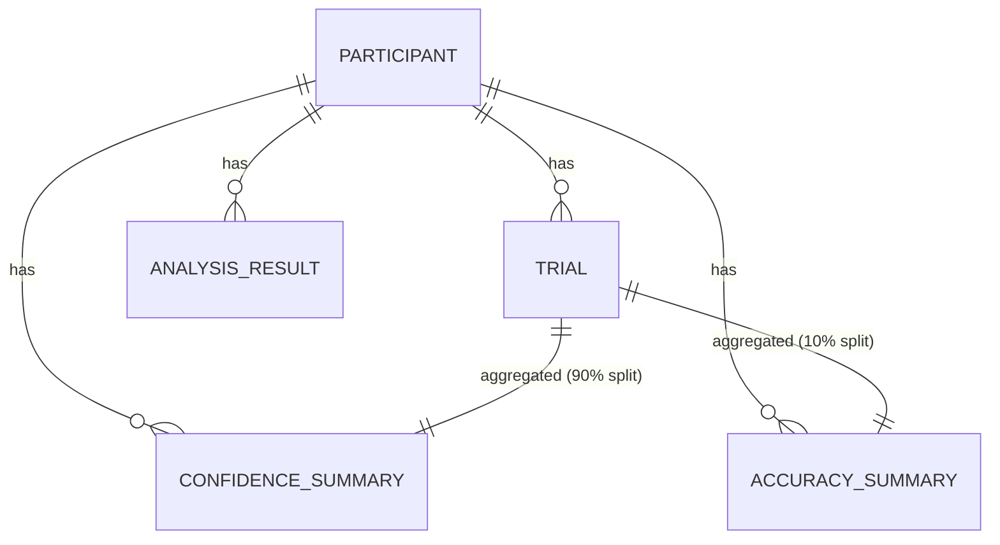

# Data Model: The Influence of Metacognitive Awareness on Reality Testing

## Entity-Relationship Overview

The data model consists of three core entities: `Participant`, `Trial`, and `AnalysisResult`. Data flows from raw dataset → derived trial-level summaries → participant-level aggregates → analysis outputs.

**Note**: The `Trial` entity requires fields (`confidence_rating`, `source_label`) that are **missing** from the current dataset (ds003386). The pipeline will fail to populate these entities.



## Entity Definitions

### Participant
Represents a study subject.

| Attribute | Type | Description | Source |
|-----------|------|-------------|--------|
| participant_id | string | Unique identifier | OpenNeuro |
| age | integer | Age in years | OpenNeuro |
| gender | string | Gender (one-hot encoded later) | OpenNeuro |
| working_memory_score | float | Working memory span (if available) | OpenNeuro (optional) |
| metacognitive_score | float | Type-2 AUC (sensitivity) on [deferred] training split | Derived |
| source_monitoring_accuracy | float | d' on [deferred] held-out test split | Derived |
| d_prime | float | Signal detection d' (overall) | Derived (for reporting) |
| criterion | float | Signal detection criterion (overall) | Derived (for reporting) |

### Trial
Represents a single source-monitoring trial.

| Attribute | Type | Description | Source |
|-----------|------|-------------|--------|
| trial_id | string | Unique trial identifier | OpenNeuro |
| participant_id | string | Foreign key to Participant | OpenNeuro |
| stimulus_modality | string | "visual" or "auditory" | OpenNeuro |
| source_label | string | "imagined" or "perceived" (true source) | OpenNeuro |
| participant_response | string | Participant's response ("imagined" or "perceived") | OpenNeuro |
| confidence_rating | float | Confidence (0–100%) | OpenNeuro |
| reaction_time | float | Response time in ms (optional) | OpenNeuro |

### AnalysisResult
Represents a statistical output.

| Attribute | Type | Description | Source |
|-----------|------|-------------|--------|
| analysis_type | string | "correlation", "regression", "modality_split" | Computed |
| correlation_coefficient | float | Pearson r (Type-2 AUC vs d') | Computed |
| p_value | float | p-value (corrected if applicable) | Computed |
| confidence_interval | list | [lower, upper] | Computed |
| sample_size | integer | n | Computed |
| delta_r_squared | float | Incremental R² (for regression) | Computed |
| f_change | float | F-change statistic | Computed |

## File Structure

```text
data/
├── raw/
│   └── ds003386/               # Unmodified OpenNeuro dataset (Structural MRI)
├── derived/
│   ├── trial_summary.csv       # One row per trial (if data exists)
│   ├── confidence_summary.csv  # One row per participant (Type-2 AUC)
│   └── accuracy_summary.csv    # One row per participant (d' on test set)
└── processed/
    ├── participant_level.csv   # Merged participant + confidence + accuracy
    └── analysis_results.json   # All statistical outputs
```

## Data Flow

1.  **Download**: `download.py` fetches OpenNeuro ds003386 → `data/raw/ds003386/`.
2.  **Validate**: `validate_data.py` checks for `confidence_rating` and `source_label`. **If missing, pipeline halts with error.**
3.  **Preprocess**: `preprocess.py` (if data exists):
    - Parses trial logs → `trial_summary.csv`.
    - Splits trials (90/10) per participant.
    - Computes Type-2 AUC on 90% → `confidence_summary.csv`.
 - Computes d' on [deferred] → `accuracy_summary.csv`.
4.  **Merge**: `participant_level.csv` joins all participant-level data.
5.  **Analyze**: `analysis.py`:
    - Correlation → `analysis_results.json`.
    - Regression → `analysis_results.json`.
    - Modality splits → `analysis_results.json`.
6.  **Report**: `report.py` generates `report.md` from `analysis_results.json`.

## Constraints

- **No in-place modification**: Raw data is immutable; all derivations create new files.
- **Checksums**: Every file in `data/` is checksummed; hashes recorded in `state/`.
- **PII**: No personally identifying information; participant IDs are anonymized.
- **Data Availability**: The pipeline is **blocked** if the dataset lacks the required behavioral fields.