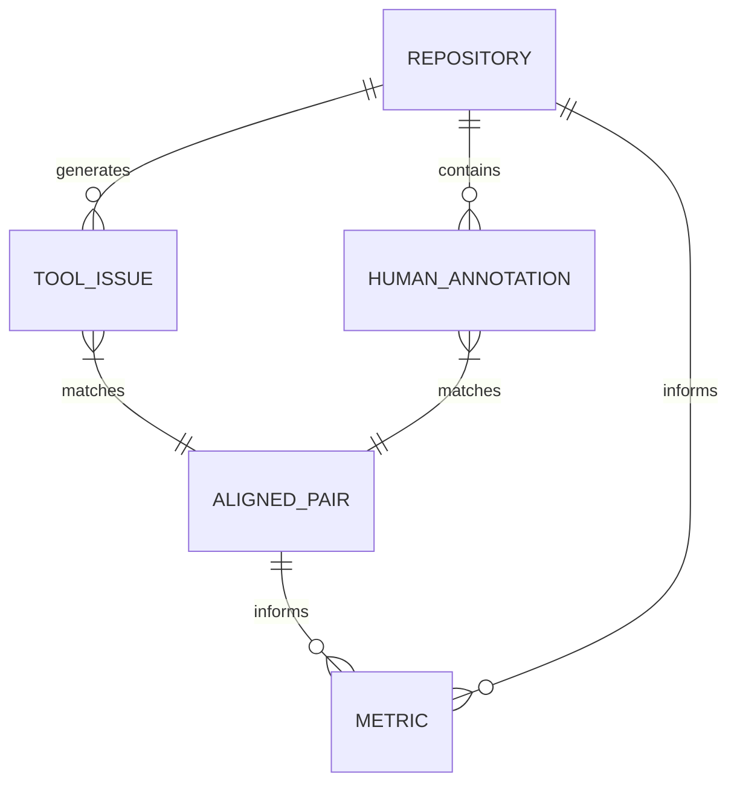

# Data Model: Evaluating Automated Code Review Tools Effectiveness

## Overview

This document defines the data schemas and relationships for the project. All data is stored in `data/` and processed through `code/`. The model supports the pipeline stages: Data Acquisition, Human Annotation, Alignment, Metrics, and Regression.

## Entity-Relationship Diagram

## Core Entities

### Repository

Represents a GitHub repository.

| Field | Type | Description | Constraints |
| :--- | :--- | :--- | :--- |
| `repo_id` | string | Unique identifier (owner/name) | Primary Key |
| `owner` | string | GitHub owner | Not Null |
| `name` | string | Repository name | Not Null |
| `language` | string | Primary language (Java, Python, JS, Go) | Enum |
| `stars` | integer | Star count | ≥ 0 |
| `commits_last_year` | integer | Commit count in last 12 months | ≥ 0 |
| `license` | string | License type | Not Null |
| `clone_url` | string | Git clone URL | Not Null |
| `cloned_at` | timestamp | Timestamp of clone | Not Null |

### Tool Issue

Represents a finding from a static analysis tool.

| Field | Type | Description | Constraints |
| :--- | :--- | :--- | :--- |
| `issue_id` | string | Unique identifier | Primary Key |
| `repo_id` | string | Foreign key to Repository | Not Null |
| `tool_name` | string | Tool name (SonarQube, DeepSource, CodeClimate) | Enum |
| `issue_type` | string | Type (bug, security, style) | Not Null |
| `severity` | string | Severity (critical, major, minor, info) | Not Null |
| `file_path` | string | Relative file path | Not Null |
| `line_number` | integer | Line number | ≥ 1 |
| `description` | string | Issue description | |
| `raw_report_path` | string | Path to raw JSON report | Not Null |

### Human Annotation

Represents a defect annotation extracted from a PR comment.

| Field | Type | Description | Constraints |
| :--- | :--- | :--- | :--- |
| `annotation_id` | string | Unique identifier | Primary Key |
| `repo_id` | string | Foreign key to Repository | Not Null |
| `comment_id` | string | GitHub comment ID | Not Null |
| `file_path` | string | Relative file path | Not Null |
| `line_number` | integer | Line number | ≥ 1 |
| `defect_type` | string | Extracted type (bug, security, style) | Not Null |
| `comment_text` | string | Original comment text | |
| `validation_status` | string | Status (pending, validated, rejected) | Default: "pending" |
| `validated_by` | string | Expert identifier | |
| `validated_at` | timestamp | Timestamp of validation | |
| `source_type` | string | Source of annotation: "heuristic" or "random" | Not Null |

### Aligned Pair

Represents a matched tool issue and human annotation.

| Field | Type | Description | Constraints |
| :--- | :--- | :--- | :--- |
| `pair_id` | string | Unique identifier | Primary Key |
| `tool_issue_id` | string | Foreign key to Tool Issue | Not Null |
| `annotation_id` | string | Foreign key to Human Annotation | Not Null |
| `alignment_method` | string | Method used (AST, diff, tolerance) | Not Null |
| `confidence_score` | float | Alignment confidence (0–1) | 0.0 ≤ score ≤ 1.0 |
| `match_status` | string | Status (matched, unmatched, ambiguous) | Not Null |

### Metric

Represents aggregated performance metrics.

| Field | Type | Description | Constraints |
| :--- | :--- | :--- | :--- |
| `metric_id` | string | Unique identifier | Primary Key |
| `repo_id` | string | Foreign key to Repository | Not Null |
| `tool_name` | string | Tool name | Not Null |
| `defect_category` | string | Category (security, bug, style) | Not Null |
| `precision` | float | Precision score | 0.0 ≤ p ≤ 1.0 |
| `recall` | float | Recall score | 0.0 ≤ r ≤ 1.0 |
| `f1_score` | float | F1 score | 0.0 ≤ f1 ≤ 1.0 |
| `total_issues` | integer | Total issues detected | ≥ 0 |
| `total_annotations` | integer | Total human annotations | ≥ 0 |
| `matched_pairs` | integer | Number of aligned pairs | ≥ 0 |

## Data Flow

1.  **Raw Data**: `data/raw/repo_list.json`, `data/raw/tool_reports/`, `data/raw/pr_comments/`
2.  **Processed Data**: `data/processed/annotations.json`, `data/processed/aligned_pairs.json`, `data/processed/metrics.csv`
3.  **Results**: `results/metrics.csv`, `results/regression_table.csv`, `results/plots/`

## Schema Validation

All data files are validated against the schemas defined in `contracts/`. Validation is enforced via `pytest` contract tests.