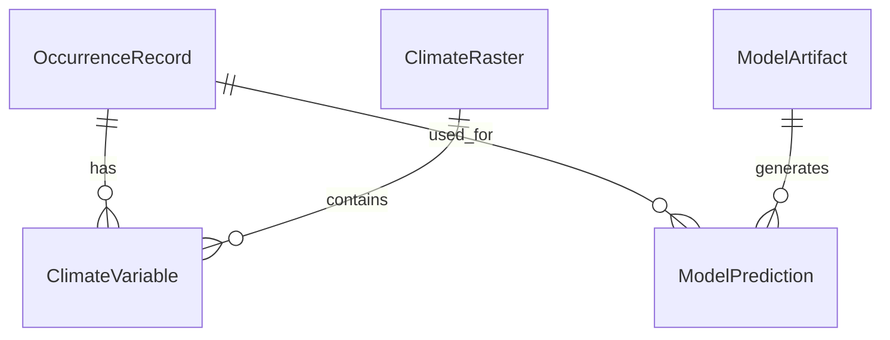

# Data Model: Predicting Species Distribution Shifts

## 1. Entity Relationship Overview

The data model consists of three primary entities: `OccurrenceRecord`, `ClimateRaster`, and `ModelArtifact`. These entities are linked via spatial coordinates and temporal metadata.

## 2. Data Entities

### 2.1 OccurrenceRecord
Represents a single species sighting.
- **Source**: GBIF / eBird
- **Timeframe**: 1970-2000 (Training), 2005-2020 (Testing)
- **Attributes**:
  - `id`: UUID (generated)
  - `species_name`: String (Latin name)
  - `latitude`: Float
  - `longitude`: Float
  - `event_date`: Date (YYYY-MM-DD)
  - `source_id`: String (GBIF key or eBird ID)
  - `download_timestamp`: ISO8601
  - `breeding_season`: Boolean (derived)
  - `thinned`: Boolean (derived)
  - `dataset_name`: String (Original dataset name from GBIF, required by Constitution Principle VI)

### 2.2 ClimateVariable
Derived environmental data point for an occurrence.
- **Source**: WorldClim v2 (Historical), CMIP6 (Future)
- **Attributes**:
  - `record_id`: Foreign Key (OccurrenceRecord)
  - `variable_name`: String (e.g., "bio1", "bio12")
  - `value`: Float
  - `raster_source`: String (URL/Version)
  - `year`: Integer (1970-2000 or 2050)

### 2.3 ModelArtifact
Serialized trained model.
- **Attributes**:
  - `model_id`: UUID
  - `algorithm`: String ("RF", "Bioclim", "MaxEnt")
  - `species`: String
  - `training_period`: String ("1970-2000")
  - `file_path`: String (relative to `models/`)
  - `checksum`: String (SHA-256)
  - `hyperparameters`: JSON

### 2.4 ModelMetrics
Performance evaluation results.
- **Attributes**:
  - `metric_id`: UUID
  - `model_id`: Foreign Key
  - `test_set_period`: String ("2005-2020")
  - `auc`: Float
  - `tss`: Float
  - `threshold`: Float
  - `sample_size`: Integer
  - `status`: String ("PASS", "INSUFFICIENT_DATA")
  - `delta_suitability`: Float (Mean Suitability Shift)

### 2.5 DataSufficiency
Log of data sufficiency checks.
- **Attributes**:
  - `species`: String
  - `period`: String ("1970-2000" or "2005-2020")
  - `recordCount`: Integer (Specific count of records)
  - `status`: String ("SUFFICIENT", "INSUFFICIENT_DATA")
  - `power_value`: Float (Calculated power for Cohen's h=0.50)

## 3. File Formats

### 3.1 CSV (Occurrence Data)
- **Delimiter**: `,`
- **Encoding**: `utf-8`
- **Standard**: Darwin Core (DwC-A) or GBIF API schema.
- **Columns**: `id, species_name, latitude, longitude, event_date, source_id, download_timestamp, breeding_season, thinned, dataset_name`

### 3.2 JSON (Metrics & Config)
- **Structure**: Standard JSON.
- **Validation**: Validated against `contracts/model_metrics.schema.yaml` and `contracts/data_sufficiency.schema.yaml`.

### 3.3 GeoTIFF (Climate Rasters)
- **Format**: Uncompressed GeoTIFF (or LZW compressed).
- **Projection**: WGS84 (EPSG:4326).
- **Resolution**: 30 arc-seconds (~1km).

## 4. Data Flow

1.  **Ingestion**: `download.py` fetches raw CSV/GeoTIFF -> `data/raw/`.
2.  **Transformation**: `preprocess.py` reads raw, applies thinning, extracts climate -> `data/processed/features.csv`.
3.  **Training**: `train.py` reads features -> trains models -> writes `models/`.
4.  **Evaluation**: `evaluate.py` reads models + future climate -> calculates metrics -> writes `metrics/model_performance.json`.

## 5. Constraints & Validations

- **Coordinates**: Latitude [-90, 90], Longitude [-180, 180].
- **Dates**: Must be within specified timeframes (1970-2000 or 2005-2020).
- **Missing Values**: Climate variables must not be null; if null, the record is excluded.
- **Uniqueness**: `id` must be unique per record.
- **Data Sufficiency**: `recordCount` must be logged for every species, regardless of status.
