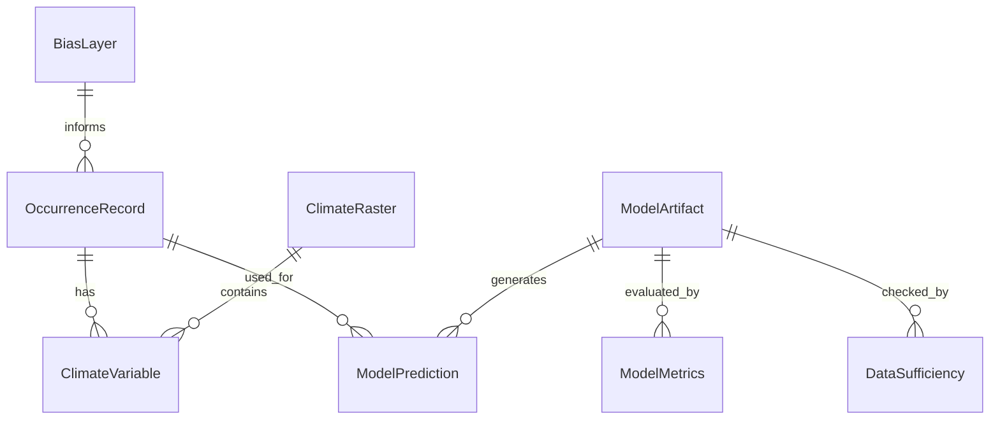

# Data Model: Predicting Species Distribution Shifts

## 1. Entity Relationship Overview
The model comprises six primary entities: `OccurrenceRecord`, `ClimateVariable`, `BiasLayer`, `ModelArtifact`, `ModelMetrics`, and `DataSufficiency`. Relationships are anchored on spatial coordinates and temporal metadata.

```mermaid
erDiagram
    OccurrenceRecord ||--o{ ClimateVariable : "has"
    OccurrenceRecord ||--o{ ModelPrediction : "used_for"
    ModelArtifact ||--o{ ModelPrediction : "generates"
    ClimateRaster ||--o{ ClimateVariable : "contains"
    ModelArtifact ||--o{ ModelMetrics : "evaluated_by"
    ModelArtifact ||--o{ DataSufficiency : "checked_by"
    BiasLayer ||--o{ OccurrenceRecord : "informs"
```

## 2. Data Entities

### 2.1 OccurrenceRecord
| Field | Type | Description |
|-------|------|-------------|
| `id` | UUID (string) | Unique identifier generated during preprocessing. |
| `species_name` | string | Latin name of the bird species. |
| `latitude` | float | WGS84 latitude (‑90 → 90). |
| `longitude` | float | WGS84 longitude (‑180 → 180). |
| `event_date` | date (YYYY‑MM‑DD) | Observation date. |
| `source_id` | string | Original GBIF/eBird identifier. |
| `download_timestamp` | datetime (ISO‑8601) | Timestamp of data download (Constitution VI). |
| `breeding_season` | boolean | True if record falls within species‑specific breeding months. |
| `thinned` | boolean | True if the record survived spatial thinning. |
| `bias_weight` | float | Weight from the bias‑layer raster (higher where observer effort is higher). |
| `dataset_name` | string | Name of the original dataset (e.g., “GBIF”). |

### 2.2 ClimateVariable
| Field | Type | Description |
|-------|------|-------------|
| `occurrence_id` | string (FK → `OccurrenceRecord.id`) | Link to occurrence. |
| `variable_name` | string (e.g., `bio1`) | Bioclim variable name. |
| `value` | float | Extracted climate value. |
| `raster_source` | string (URL/identifier) | Provenance of the raster. |
| `year` | integer | Year of the climate data (e.g., 2000, 2050). |

### 2.3 BiasLayer
| Field | Type | Description |
|-------|------|-------------|
| `layer_id` | string | Unique identifier. |
| `description` | string | Kernel‑density raster of observation effort used for bias‑corrected background sampling. |
| `file_path` | string | Relative path to the raster file. |
| `checksum_sha256` | string | SHA‑256 checksum for integrity verification. |

### 2.4 ModelArtifact
| Field | Type | Description |
|-------|------|-------------|
| `model_id` | string | Unique model identifier. |
| `species` | string | Target species name. |
| `algorithm` | string (`RF`, `Bioclim`, `MaxEnt`) | Algorithm used. |
| `train_period` | string | Temporal window of training data. |
| `test_period` | string | Temporal window of validation data (always `2005-2020`). |
| `file_path` | string | Relative path under `models/`. |
| `checksum` | string (SHA‑256) | File integrity hash. |
| `hyperparameters` | JSON object | Algorithm‑specific settings. |
| `seed` | integer | Random seed for reproducibility. |

### 2.5 ModelMetrics
| Field | Type | Description |
|-------|------|-------------|
| `model_id` | string (FK → `ModelArtifact.model_id`) | Associated model. |
| `species` | string | Target species. |
| `algorithm` | string (`RF`, `Bioclim`, `MaxEnt`) | Algorithm used. |
| `test_set_period` | string (`2005-2020`) | Validation period. |
| `auc` | float (0 → 1) | Area Under the ROC Curve. |
| `tss` | float (‑1 → 1) | True Skill Statistic. |
| `threshold` | float | Probability cutoff used for TSS. |
| `sample_size` | integer | Number of validation records. |
| `status` | string (`PASS` / `INSUFFICIENT_DATA`) | Sufficiency flag per FR‑006. |
| `delta_auc` | float | Difference in AUC between historical and future projection. |
| `calibration_brier` | float | Brier score on recent test set. |
| `mop_proportion` | float | Proportion of future pixels within analogous climate space (MOP). |
| `composite_stability` | float | Weighted combination of calibrated ΔAUC and MOP proportion. |
| `p_value` | float (0 → 1) | From hierarchical bootstrap (FR‑010). |
| `effect_size` | float | Cohen’s h (effect size = 0.50, source verified). |
| `corrected_p_value` | float (0 → 1) | After Benjamini‑Hochberg correction (FR‑005). |

### 2.6 DataSufficiency
| Field | Type | Description |
|-------|------|-------------|
| `species` | string | Species name. |
| `period` | string (`1970-2000` or `2005-2020`) | Temporal window. |
| `recordCount` | integer | Number of records after thinning. |
| `status` | string (`SUFFICIENT` / `INSUFFICIENT_DATA`) | Flag per FR‑006. |
| `power_value` | float | Calculated power to detect a minimum AUC difference of 0.05 (source: statistical power analysis). |

## 3. File Formats

| Artifact | Format | Validation |
|----------|--------|------------|
| Raw occurrence CSVs | UTF‑8, comma‑separated, Darwin Core fields | `contracts/occurrence.schema.yaml` |
| Processed features CSV | UTF‑8, comma‑separated (one row per thinned occurrence + selected climate vars) | `contracts/occurrence_record.schema.yaml` |
| Climate rasters | GeoTIFF (LZW compressed) | `contracts/climate_raster.schema.yaml` |
| Bias layer raster | GeoTIFF | `contracts/climate_raster.schema.yaml` (re‑used for metadata) |
| Model files | Pickle (`.pkl`) | `contracts/model_artifact.schema.yaml` |
| Metric JSONs | JSON | `contracts/model_metrics.schema.yaml` |
| Data sufficiency JSON | JSON | `contracts/data_sufficiency.schema.yaml` |
| Data acquisition completeness JSON | JSON | **SC‑004** metric (no separate schema needed). |
| Logging counts YAML | YAML | `contracts/log_counts.schema.yaml` |
| Logging configuration | YAML (`logging.config.dictConfig`) | Stored as `logs/logging_config.yaml`; validated by the implementation against the schema. |

## 4. Data Flow
1. **Download** (`code/download.py`) → `data/raw/` (occurrence CSVs, climate GeoTIFFs).  
2. **Preprocess** (`code/preprocess.py`) → `data/processed/features.csv`, `metrics/data_sufficiency.json`, `metrics/data_acquisition_completeness.json`, `logs/preprocess_counts.yaml`, `data/processed/bias_layer.tif`.  
3. **Train** (`code/train.py`) → `models/*.pkl`.  
4. **Evaluate** (`code/evaluate.py`) → `metrics/model_performance.json`, `results/summary_table.csv`.  
5. **Report** (`code/report.py`) → `reports/findings.md`.  

All intermediate files are immutable; new derivations receive fresh filenames and are logged with checksums (Constitution III).

---

