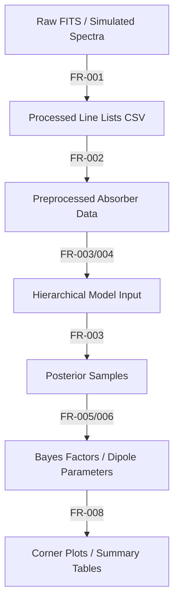

# Data Model: Exploring the Statistical Significance of Fine‑Structure Constant Variations

## Overview

This document defines the data structures, schemas, and transformations used in the pipeline. All data is stored in CSV/Parquet formats with checksums recorded in `state/`. The model adheres to the hierarchical Bayesian structure (Constitution Principle VI).

## Data Flow

## Entity Definitions

### Absorber

Represents a single quasar absorption system.

| Attribute | Type | Description | Source |
|-----------|------|-------------|--------|
| `absorber_id` | str | Unique identifier (e.g., "QSO_J1234+5678") | FITS header / simulated |
| `redshift` | float | Absorber redshift (z) | FITS header |
| `ra` | float | Right Ascension (degrees) | FITS header |
| `dec` | float | Declination (degrees) | FITS header |
| `snr` | float | Signal-to-noise ratio | FITS header / derived |
| `systematic_error` | float | Estimated calibration drift (Å) | Derived / HalfCauchy prior |
| `line_list` | list[Line] | List of absorption lines for this absorber | Extracted |

### Line

Represents a single absorption line within an absorber.

| Attribute | Type | Description | Source |
|-----------|------|-------------|--------|
| `transition` | str | Metal species (e.g., "Fe II", "Mg II") | NIST lookup |
| `rest_wavelength` | float | Laboratory wavelength (Å) | NIST |
| `obs_wavelength` | float | Observed wavelength (Å) | Extracted |
| `obs_error` | float | Measurement uncertainty (Å) | Extracted |
| `snr_line` | float | Line-specific S/N | Extracted |

### Δα/α Estimate

Posterior distribution for fractional variation.

| Attribute | Type | Description | Source |
|-----------|------|-------------|--------|
| `absorber_id` | str | Reference to absorber | Model output |
| `mean` | float | Posterior mean of Δα/α | PyMC |
| `std` | float | Posterior standard deviation | PyMC |
| `ci_95_lower` | float | 95% credible interval lower bound | PyMC |
| `ci_95_upper` | float | 95% credible interval upper bound | PyMC |
| `rhat` | float | Convergence diagnostic (R-hat) | ArviZ |

### Global Trend Model

Parameters for the redshift-dependent or dipole model.

| Attribute | Type | Description | Source |
|-----------|------|-------------|--------|
| `beta_0` | float | Intercept (mean variation) | PyMC |
| `beta_1` | float | Temporal slope (dΔα/α/dz) | PyMC |
| `amplitude` | float | Dipole amplitude | PyMC |
| `direction` | float | Dipole direction (RA, Dec) | PyMC |
| `ln_bf` | float | Log Bayes factor vs. null | Bridge sampling |

## Data Schemas

### `data/processed/line_list.csv`

| Column | Type | Description |
|--------|------|-------------|
| `absorber_id` | str | Absorber ID |
| `transition` | str | Metal species |
| `rest_wavelength` | float | Laboratory wavelength |
| `obs_wavelength` | float | Observed wavelength |
| `obs_error` | float | Measurement error |
| `snr_line` | float | Line S/N |

### `data/interim/absorber_data.csv`

| Column | Type | Description |
|--------|------|-------------|
| `absorber_id` | str | Absorber ID |
| `redshift` | float | Redshift |
| `ra` | float | RA |
| `dec` | float | Dec |
| `snr` | float | Overall S/N |
| `systematic_error` | float | Systematic error estimate |
| `n_lines` | int | Number of lines used |

### `data/results/posterior_samples.nc`

NetCDF file containing full posterior samples (PyMC `az.from_pymc`).

| Variable | Description |
|----------|-------------|
| `delta_alpha_alpha` | Per-absorber Δα/α samples |
| `beta_0` | Global intercept samples |
| `beta_1` | Temporal slope samples |
| `amplitude` | Dipole amplitude samples |
| `direction` | Dipole direction samples |
| `systematic_error` | Nuisance parameter samples |

## Transformations

1. **Raw → Processed**:
   - Input: FITS files (raw)
   - Output: `line_list.csv`
   - Transformation: Extract lines using `specutils`; match to NIST; filter S/N <5.
   - Checksum: `sha256` of output file stored in `state/`.

2. **Processed → Interim**:
   - Input: `line_list.csv`
   - Output: `absorber_data.csv`
   - Transformation: Group lines by absorber; compute mean S/N; derive systematic error.
   - Checksum: `sha256` of output file stored in `state/`.

3. **Interim → Results**:
   - Input: `absorber_data.csv`
   - Output: `posterior_samples.nc`, `bayes_factors.csv`
   - Transformation: Fit hierarchical model; compute Bayes factors.
   - Checksum: `sha256` of output files stored in `state/`.

## Data Hygiene

- **Checksums**: All files in `data/` have `sha256` recorded in `state/artifact_hashes.yaml`.
- **Immutability**: Raw data is never modified; derivations produce new files.
- **PII**: No personally identifiable information in any data file.
- **Versioning**: Each run produces timestamped output files (e.g., `line_list_20260627.csv`).
