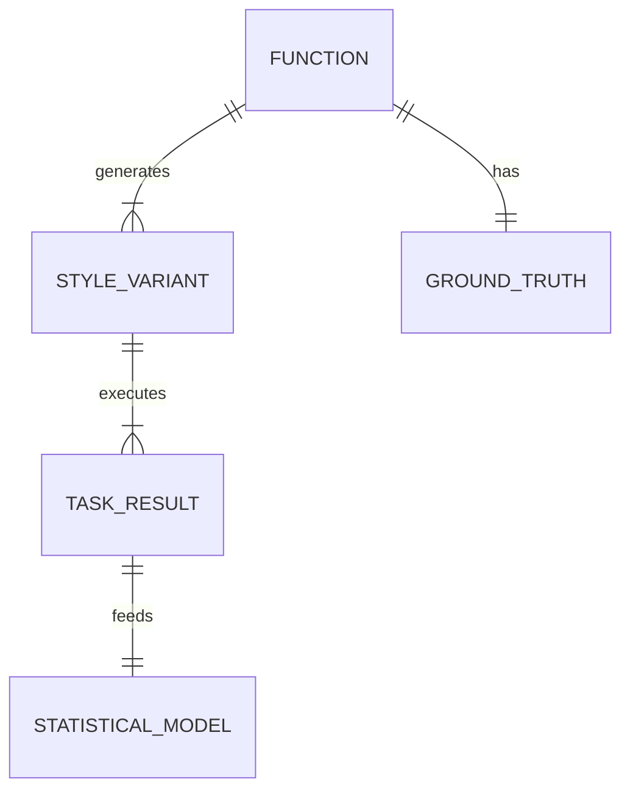

# Data Model: Evaluating the Impact of Code Style on LLM Code Understanding and Generation

## Overview
This document defines the data structures used to store raw inputs, transformed variants, task results, and statistical outputs. All data is stored in the `data/` and `results/` directories.

## Entity Relationships

## Entities

### 1. Function (Base Unit)
Represents a single function from the CodeSearchNet dataset.
- `function_id`: Unique identifier (hash of original code + path).
- `source_file`: Relative path in original dataset.
- `original_code`: Raw Python code string.
- `original_docstring`: Ground truth docstring (preserved for summarization GT).
- `metadata`: JSON blob containing original token count, line count, etc.

### 2. StyleVariant
A transformed version of a Function.
- `variant_id`: Unique ID (function_id + style_hash).
- `function_id`: FK to Function.
- `formatting`: Enum ["black", "minified"].
- `naming`: Enum ["meaningful", "generic"].
- `commenting`: Enum ["present", "stripped"].
- `code`: The transformed code string.
- `is_valid`: Boolean (result of syntax check).
- `token_count`: Number of tokens in this variant.
- `transform_seed`: Integer (Seed used for identifier replacement, for reproducibility).

### 3. TaskResult
Output of an LLM execution on a StyleVariant.
- `result_id`: Unique ID.
- `variant_id`: FK to StyleVariant.
- `task_type`: Enum ["completion", "bug_detection", "summarization"].
- `input_prompt`: The prompt sent to the LLM.
- `generated_output`: The text generated by the LLM.
- `ground_truth`: The reference output (completion string, bug label, or original docstring).
- `metrics`: JSON object containing:
  - `exact_match`: float (0 or 1).
  - `codebleu`: float (0-1).
  - `precision`: float (0-1).
  - `recall`: float (0-1).
  - `f1`: float (0-1).
  - `rouge_l`: float (0-1).
  - `bleu`: float (0-1).
- `status`: Enum ["success", "timeout", "error"].
- `mutation_type`: String (only for bug_detection, e.g., "variable_swap").
- `token_count`: Number of tokens in the input prompt (copied from StyleVariant for modeling).

### 4. StatisticalModel
Aggregated analysis results.
- `model_id`: Unique ID.
- `method`: String (e.g., "LMM-Gaussian", "GLMM-Binomial").
- `fixed_effects`: List of strings (e.g., "formatting", "naming", "interaction").
- `random_effects`: List of strings (e.g., "function_id").
- `covariates`: List of strings (e.g., "token_count").
- `coefficients`: JSON table (Factor, Estimate, SE, t-value, p-value).
- `effect_sizes`: JSON table (Factor, eta_squared or odds_ratio).
- `normality_test`: JSON (Shapiro-Wilk statistic, p-value).
- `correction_method`: String (e.g., "Bonferroni").
- `covariate_token_count`: Boolean (True if token_count was included as a covariate).

## Data Flow

1. **Ingestion**: Raw CodeSearchNet parquet -> `data/raw/`.
2. **Transformation**: `Function` -> 8 `StyleVariant` -> `data/derived/variants/`.
3. **Inference**: `StyleVariant` -> `TaskResult` -> `data/derived/results/`.
4. **Analysis**: `TaskResult` -> `StatisticalModel` -> `results/analysis/`.

## Constraints

- **Immutability**: Raw data is never modified. Derived data is written to new files with checksums.
- **Schema Validation**: All JSON/Parquet outputs must conform to the schemas defined in `contracts/`.
- **PII**: No user emails or names are stored; only code and synthetic IDs.