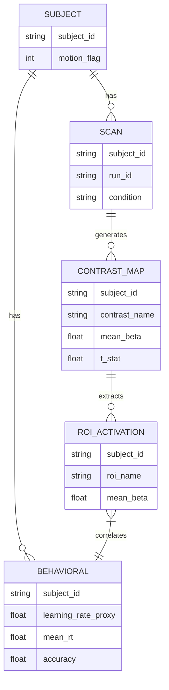

# Data Model: Examining the Impact of Auditory Feedback on Motor Sequence Learning

## Entities & Relationships

## Data Flow

1. **Raw Data**: OpenNeuro `ds000246` (BIDS) → `data/raw/`.
2. **Preprocessed**: `fmriprep` derivatives → `data/derivatives/`.
3. **Contrast Maps**: GLM outputs (`perturbed > normal`) → `data/processed/contrast_maps/`.
4. **Behavioral**: RTs from events → `data/processed/behavior.csv`.
   - *Note*: `learning_rate_proxy` is the slope of RT over **all** trials (global learning), independent of condition labels.
5. **Results**: Statistical maps, correlation tables → `data/processed/results/`.

## Schema Definitions

- **Subject**: `subject_id` (string), `motion_flag` (int, 0/1).
- **Contrast Map**: `subject_id` (string), `contrast_name` (string, "perturbed > normal"), `nifti_path` (string).
- **Behavioral**: `subject_id` (string), `learning_rate_proxy` (float, global RT slope), `mean_rt` (float), `accuracy` (float).
- **ROI Activation**: `subject_id` (string), `roi_name` (string), `mean_beta` (float, from "perturbed > normal" contrast).

## Assumptions & Constraints

- **BIDS Compliance**: All raw and derivative data follows BIDS spec (VI).
- **File Formats**: NIfTI for images, CSV for behavioral data, JSON for event files.
- **Storage**: Temporary files cleaned after processing; final artifacts ≤14 GB.
- **Construct Validity**: The `learning_rate_proxy` is defined as a global metric to ensure independence from the condition-specific GLM contrast used for `ROI_ACTIVATION`.