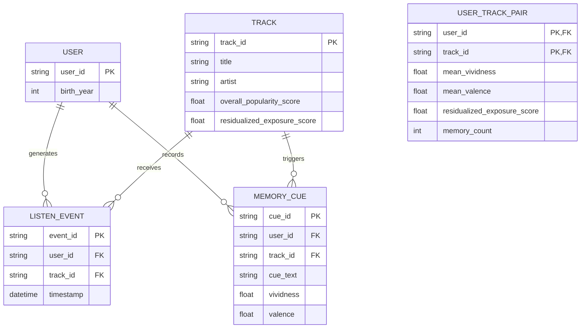

# Data Model: The Impact of Incidental Music on Autobiographical Memory Retrieval

## 1. Entity Relationship Diagram (Conceptual)

## 2. Data Dictionary

### 2.1 Raw Input Schemas

**MSD Listening Log (JSONL)**
| Field | Type | Description | Constraints |
| :--- | :--- | :--- | :--- |
| `user_id` | String | Unique user identifier | Required |
| `track_id` | String | Unique track identifier | Required |
| `timestamp` | DateTime | Time of listen | Required |
| `birth_year` | Integer | User's birth year | Optional (Critical for FR-001) |

**AMT Memory Cues (JSONL/Parquet)**
| Field | Type | Description | Constraints |
| :--- | :--- | :--- | :--- |
| `user_id` | String | Unique user identifier | Required |
| `cue_text` | String | Free-text memory description | Required |
| `vividness` | Float | Memory vividness (0-100) | Range: [0, 100] |
| `valence` | Float | Emotional valence (-5 to +5) | Range: [-5, 5] |

### 2.2 Derived Schemas

**Track Exposure Profile (Intermediate)**
| Field | Type | Description |
| :--- | :--- | :--- |
| `track_id` | String | Primary Key |
| `total_listens` | Integer | Total listens from valid users (>= 10 threshold) |
| `adolescent_listens` | Integer | Listens from users aged 12-18 |
| `raw_exposure_score` | Float | `adolescent_listens / total_listens` |
| `residualized_exposure_score` | Float | Residuals of `raw_exposure_score` ~ `log(popularity)` |
| `overall_popularity_score` | Float | Log-scaled total listens |

**User-Track Aggregation (Final Analysis Dataset)**
| Field | Type | Description |
| :--- | :--- | :--- |
| `user_id` | String | User ID (Random Effect) |
| `track_id` | String | Matched Track ID |
| `residualized_exposure_score` | Float | Predictor (0-1, adjusted) |
| `overall_popularity_score` | Float | Covariate |
| `mean_vividness` | Float | Outcome 1 (Mean per pair) |
| `mean_valence` | Float | Outcome 2 (Mean per pair) |
| `memory_count` | Integer | Number of cues for this pair |
| `match_distance` | Integer | Levenshtein distance used |

## 3. Data Flow

1. **Ingest**: Raw JSONL/Parquet → Filtered/Validated CSVs (Minimum Listen Threshold applied).
2. **Enrich**: Calculate `residualized_exposure_score` per track.
3. **Match**: AMT cues → MSD tracks (Levenshtein ≤ 4).
4. **Aggregate**: Group by `user_id` + `track_id` → Compute means (User-Track Pair).
5. **Filter**: Remove rows with missing values or zero variance.
6. **Model**: Feed Final Analysis Dataset into `statsmodels`.

## 4. Data Integrity & Hygiene

- **Checksums**: All raw files under `data/raw/` must have SHA-256 checksums recorded.
- **PII**: No raw birth years or user IDs will be exposed in final outputs; only hashed or aggregated.
- **Immutability**: Raw data is never modified. All transformations create new files in `data/processed/`.