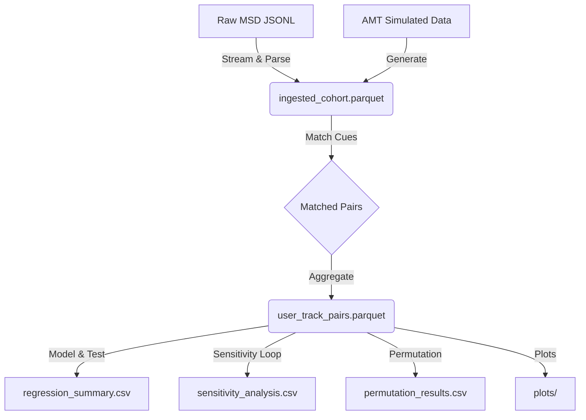

# Data Model: The Impact of Incidental Music on Autobiographical Memory Retrieval

## 1. Data Flow Diagram

```mermaid
graph TD
    A[Raw MSD JSONL] -->|Stream & Parse| B(ingested_cohort.parquet)
    C[AMT Simulated Data] -->|Generate| B
    B -->|Match Cues| D{Matched Pairs}
    D -->|Aggregate| E(user_track_pairs.parquet)
    E -->|Model & Test| F[regression_summary.csv]
    E -->|Sensitivity Loop| G[sensitivity_analysis.csv]
    E -->|Permutation| H[permutation_results.csv]
    E -->|Plots| I[plots/]
```

## 2. Schema Definitions

### 2.1 `ingested_cohort.parquet`
*Intermediate dataset combining MSD metadata and simulated AMT cues.*

| Column | Type | Description |
| :--- | :--- | :--- |
| `user_id` | string | Unique user identifier. |
| `track_id` | string | Unique track identifier (from MSD). |
| `birth_year` | int | User's birth year (may be null). |
| `cue_text` | string | Free-text memory cue from AMT. |
| `vividness` | int | Rating 1-7. |
| `valence` | int | Rating 1-7. |
| `track_release_year` | int | Year track was released. |
| `popularity` | float | Track popularity score. |
| `listen_timestamp` | datetime | Simulated listen timestamp. |
| `is_adolescent_listen` | bool | True if listen occurred between `birth_year` and `birth_year + 15`. |

### 2.2 `user_track_pairs.parquet`
*Final analysis dataset (One row per User-Track Pair).*

| Column | Type | Description |
| :--- | :--- | :--- |
| `user_id` | string | User identifier. |
| `track_id` | string | Track identifier. |
| `total_listens` | int | Total listens for this pair. |
| `adolescent_listens` | int | Listens during adolescence. |
| `adolescent_exposure_ratio` | float | `adolescent_listens / total_listens`. |
| `logit_ratio` | float | Logit transformation of `adolescent_exposure_ratio`. |
| `mean_vividness` | float | Average vividness rating. |
| `mean_valence` | float | Average valence rating. |
| `track_popularity` | float | Popularity score (control). |
| `match_threshold_used` | int | Levenshtein threshold used for matching. |
| `n_cues` | int | Number of memory cues for this pair. |
| `global_exposure_proxy` | float | Population-level proxy for missing birth years (used in sensitivity only). |

### 2.3 `regression_summary.csv`
*Model coefficients and statistics.*

| Column | Type | Description |
| :--- | :--- | :--- |
| `term` | string | Variable name (e.g., `logit_ratio`). |
| `estimate` | float | Coefficient estimate. |
| `std_error` | float | Standard error. |
| `t_value` | float | t-statistic. |
| `p_value` | float | P-value (from permutation test). |
| `vif` | float | Variance Inflation Factor. |

### 2.4 `sensitivity_analysis.csv`
*Results across matching thresholds.*

| Column | Type | Description |
| :--- | :--- | :--- |
| `threshold` | int | Levenshtein threshold (1-5). |
| `match_rate` | float | Percentage of cues matched. |
| `coef_estimate` | float | Coefficient for `logit_ratio`. |
| `p_value` | float | P-value. |

### 2.5 `permutation_results.csv`
*Null distribution and observed statistic.*

| Column | Type | Description |
| :--- | :--- | :--- |
| `iteration` | int | Permutation iteration ID. |
| `coef_null` | float | Coefficient from permuted data. |
| `coef_observed` | float | (Repeated) Observed coefficient. |

## 3. Data Hygiene & Versioning

- **Checksums**: All parquet and CSV files are checksummed (SHA-256) upon creation.
- **State Tracking**: `state.yaml` maintains `artifact_hashes` for all generated files.
- **Immutability**: Raw data in `data/raw/` is never modified. All transformations produce new files in `data/processed/` or `data/final/`.
- **File Existence**: The pipeline explicitly writes `data/processed/ingested_cohort.parquet` and `data/processed/user_track_pairs.parquet` to these exact paths. A validation step (T050) verifies their existence and non-empty status before proceeding.
