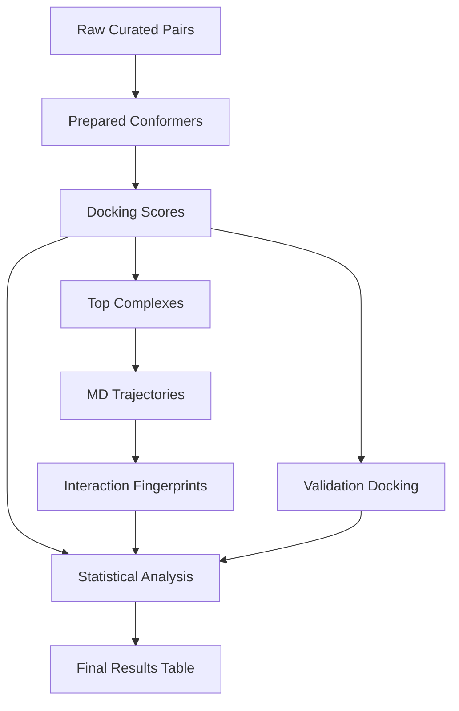

# Data Model: Predicting the Impact of Molecular Chirality on Flavor Perception

## Overview

This document defines the data structures, schemas, and relationships for the molecular chirality flavor perception project. All data flows from raw downloads to processed analysis tables, with checksums and versioning enforced.

## Entity Definitions

### Enantiomeric Pair
- **Compound ID**: Unique identifier (e.g., `CHEMBL12345`)
- **SMILES**: Canonical SMILES for one enantiomer
- **Enantiomer SMILES**: Mirror-image SMILES
- **Chiral Center**: Atom index of chirality
- **Sensory Rating**: Intensity/pleasantness from curated list (nullable)
- **Molecular Weight**: MW (for covariate control)
- **LogP**: Hydrophobicity (for covariate control)

### Receptor Complex
- **Receptor ID**: AlphaFold model identifier (e.g., `AF-A0A024R1R8-F1`)
- **PDB File**: Path to receptor structure
- **pLDDT**: Confidence score (average in pre-defined pocket)
- **Pocket Definition**: List of residues in orthosteric site (pre-defined)

### Docking Result
- **Complex ID**: Unique ID for ligand-receptor pair
- **Ligand ID**: Compound ID
- **Receptor ID**: Receptor model ID
- **Binding Affinity**: kcal/mol (negative = favorable)
- **RMSD**: Ångströms (pose quality)
- **Threshold Applied**: 0.5 kcal/mol (or swept value)
- **Stereoselective**: Boolean (|Δaffinity| ≥ threshold)
- **Validation Score**: Score from SMINA/PLANTS (if available)

### MD Result
- **Complex ID**: Same as docking
- **Trajectory File**: Path to `.xtc` or `.dcd`
- **Interaction Frequencies**: Dict of residue-contact frequencies
- **Stability Metric**: RMSD over time (Å)
- **Stability Flag**: "Stable" or "Unstable" (based on RMSD threshold)

### Statistical Result
- **Test Type**: Wilcoxon / Spearman / FDR-corrected / Bayesian
- **P-value**: Raw or adjusted
- **Effect Size**: Cohen's d / ρ / Posterior Mean
- **CI Lower/Upper**: 95% confidence interval bounds
- **Covariates Included**: Boolean (True if MW/LogP used)
- **Success Metric**: Boolean (|ρ| > 0.3)

## Data Flow

## File Formats

- **Raw Data**: CSV (curated pairs), PDB (receptors)
- **Processed**: CSV (docking, MD, stats), XTC/DCD (trajectories)
- **Intermediate**: MOL2/SDF (conformers), JSON (interaction maps)

## Checksums & Versioning

- All files in `data/raw` checksummed (SHA256) and recorded in state YAML.
- Derived files in `data/processed` checksummed on creation.
- Versioning: `data/processed/v1.0/`, `data/processed/v1.1/` etc., with manifest.
