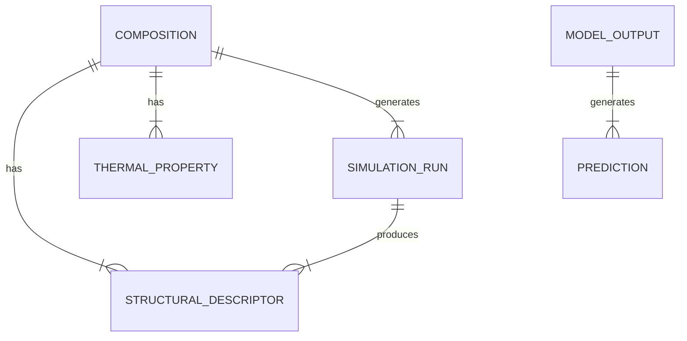

# Data Model: Predicting Phase Transitions in Amorphous Solids

## Entity Relationship Diagram (Conceptual)

## Schema Definitions

### 1. Composition
Represents a unique chemical formula.
- `composition_id`: String (Unique ID, e.g., "SiO2_001")
- `formula`: String (e.g., "SiO2")
- `family`: String (Enum: "oxide", "sulfide", "organic")
- `element_fractions`: JSON (e.g., {"Si": 0.33, "O": 0.67})
- `avg_atomic_radius`: Float
- `electronegativity_variance`: Float

### 2. StructuralDescriptor
Quantitative metrics derived from MD.
- `descriptor_id`: String
- `composition_id`: String (FK)
- `rdf_peak_position`: Float (Angstroms)
- `rdf_peak_width`: Float (Angstroms)
- `bond_angle_variance`: Float
- `coordination_number`: Float
- `is_truncated`: Boolean (True if sim was cut)
- `source`: String ("LAMMPS", "OpenMM")
- `cooling_rate`: Float (K/s, recorded for invariance check)

### 3. ThermalProperty
Experimental ground truth.
- `property_id`: String
- `composition_id`: String (FK)
- `Tg`: Float (Kelvin)
- `Tx`: Float (Kelvin)
- `crystallization_label`: Integer (0 or 1)
- `source_database`: String ("Glass Data", "NIST", "Simulated")
- `data_quality_flag`: String (Enum: "verified", "missing", "simulated", "unverified")
  - **Note**: Rows with `data_quality_flag` = "missing", "simulated", or "unverified" are **excluded** from hypothesis testing (Phase 1, Step 2). They may be used for Pipeline Validation only.

### 4. ModelOutput
Results of training and inference.
- `model_id`: String
- `metric_rmse`: Float
- `metric_roc_auc`: Float
- `feature_importance`: JSON (Map of feature name to score)
- `shap_values`: JSON (Compressed representation)
- `timestamp`: ISO8601

## Data Flow

1. **Raw Input**: `data/raw/compositions.csv` (List of 500 formulas).
2. **Simulation**: `code/data/simulate.py` -> `data/raw/trajectories/` (LAMMPS dumps).
3. **Extraction**: `code/data/extract.py` -> `data/processed/descriptors.csv`.
4. **Labeling**: `code/data/download.py` (Fetches Tg/Tx) -> `data/processed/labels.csv`.
5. **Merge**: `code/data/merge.py` -> `data/processed/final_dataset.parquet`.
6. **Modeling**: `code/models/train.py` -> `models/` and `data/processed/metrics.json`.

## Constraints

- **Missing Data**: Rows with `data_quality_flag` != "verified" are dropped for hypothesis testing.
- **Truncation**: `is_truncated=True` rows are included but flagged in analysis.
- **Units**: All temperatures in Kelvin; distances in Angstroms.
- **Verification**: The pipeline MUST reject any row with `data_quality_flag` = "unverified" from the training set.