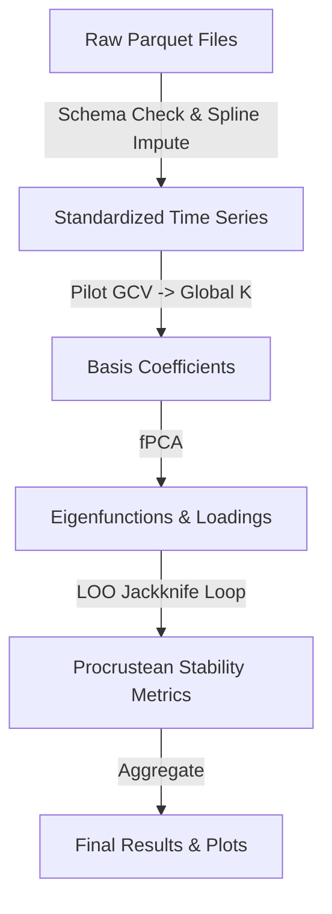

# Data Model: Statistical Analysis of Publicly Available Climate Model Output Ensembles

## 1. Data Flow Diagram

## 2. Entity Definitions

### 2.1 Raw Ensemble Member
*   **Definition**: A single time-series of a climate variable (e.g., temperature) from one CMIP6 model.
*   **Source**: HuggingFace Parquet files.
*   **Transformation**: Missing values imputed via spline; standardized (z-score) across time.

### 2.2 Functional Ensemble Member
*   **Definition**: A mathematical function $x(t)$ approximated by B-spline coefficients.
*   **Representation**: Vector of coefficients $\beta$ of length $K$ (determined by Pilot GCV).
*   **Usage**: Input for fPCA.

### 2.3 Dominant Mode (Eigenfunction)
*   **Definition**: A spatial-temporal pattern $\phi_k(t)$ extracted by fPCA.
*   **Properties**: Orthogonal to other modes; represents a primary source of variance.

### 2.4 Stability Metric (Procrustean Distance)
*   **Definition**: The Procrustes distance (or subspace correlation) between the eigenfunctions of a reduced ensemble (LOO) and the full ensemble.
*   **Aggregation**: Mean $\mu_d$ and Standard Deviation $\sigma_d$ across all LOO iterations.

## 3. File Schema & Paths

| Path | Description | Format |
| :--- | :--- | :--- |
| `data/raw/cmip6_*.parquet` | Original downloaded files | Parquet |
| `data/processed/coefficients.pkl` | B-spline coefficients for all members | Pickle / Parquet |
| `data/processed/fpca_results.pkl` | Eigenvalues, eigenfunctions, loadings | Pickle |
| `data/processed/jackknife_metrics.json` | Stability metrics (Procrustes distance) | JSON |
| `artifacts/plots/modes.png` | Visualization of dominant modes | PNG |
| `artifacts/plots/stability_hist.png` | Histogram of stability metrics | PNG |

## 4. Data Constraints

* **Missing Data**: Max allowed gap for spline imputation is [deferred] of time steps. Larger gaps trigger a warning and exclusion of that specific model/time segment.
*   **Time Resolution**: All models resampled to a common time grid (e.g., monthly) before basis expansion.
*   **Standardization**: All variables standardized to mean 0, variance 1 across the time dimension before fPCA.
*   **Sampling**: If full data is too large, a **stratified sample** (by model family) is used as the fixed baseline for LOO.