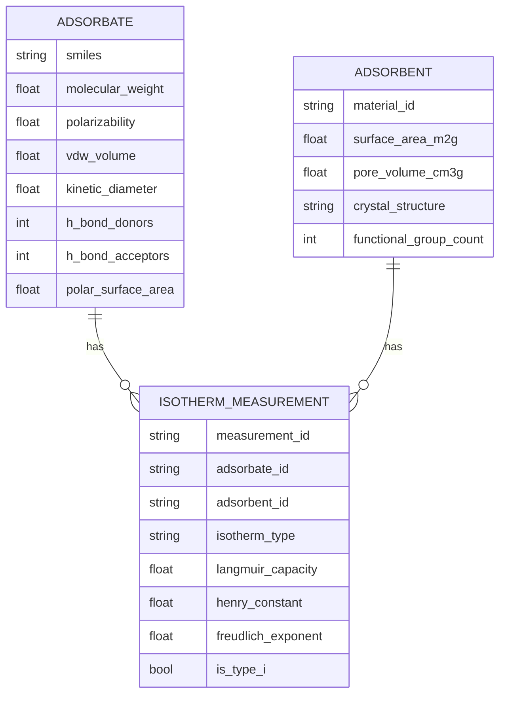

# Data Model: Predicting Adsorption Isotherm Parameters from Molecular Features

## 1. Entity Relationship Overview

The data model consists of three primary entities: `Adsorbate`, `Adsorbent`, and `IsothermMeasurement`. These entities are linked to form the final training dataset.

## 2. Detailed Schema Definitions

### 2.1 Adsorbate
Represents the gas molecule. All descriptors are calculated via RDKit.

| Field | Type | Description | Unit |
| :--- | :--- | :--- | :--- |
| `smiles` | string | Canonical SMILES string | - |
| `molecular_weight` | float | Molecular weight | g/mol |
| `polarizability` | float | Electronic polarizability | ų |
| `vdw_volume` | float | Van der Waals volume | ų |
| `kinetic_diameter` | float | Kinetic diameter | Å |
| `h_bond_donors` | int | Number of H-bond donors | count |
| `h_bond_acceptors` | int | Number of H-bond acceptors | count |
| `polar_surface_area` | float | Topological polar surface area | Ų |

### 2.2 Adsorbent
Represents the porous material (e.g., MOF, Zeolite).

| Field | Type | Description | Unit |
| :--- | :--- | :--- | :--- |
| `material_id` | string | Unique identifier for the material | - |
| `surface_area_m2g` | float | Specific surface area | m²/g |
| `pore_volume_cm3g` | float | Total pore volume | cm³/g |
| `crystal_structure` | string | Crystal system (e.g., cubic, hexagonal) | - |
| `functional_group_count` | int | Count of specific functional groups | count |

### 2.3 Isotherm Measurement
The target variables and filtering flags.

| Field | Type | Description | Unit |
| :--- | :--- | :--- | :--- |
| `measurement_id` | string | Unique ID for the measurement | - |
| `adsorbate_id` | string | Foreign key to Adsorbate | - |
| `adsorbent_id` | string | Foreign key to Adsorbent | - |
| `isotherm_type` | string | Classification (I, II, IV, etc.) | - |
| `is_type_i` | boolean | Filter flag (True if Type I) | - |
| `langmuir_capacity` | float | Langmuir capacity (Q_max) | mmol/g |
| `henry_constant` | float | Henry's constant (K_H) | mmol/kg/bar |
| `freudlich_exponent` | float | Freundlich exponent (n) | - |

## 3. Data Pipeline Flow

1.  **Ingestion**: Raw data (or synthetic generation) -> `raw_data.parquet`.
2.  **Verification Audit**: If raw data fetch fails, `verification_log.json` is written.
3.  **Filtering**: `is_type_i == True` AND `langmuir_capacity` not null AND `henry_constant` not null.
4.  **Descriptor Calculation**: `smiles` -> `rdkit` -> `polarizability`, `vdw_volume`, etc.
5.  **Normalization**: `surface_area` converted to `m²/g`; `pore_volume` to `cm³/g`.
6. **Splitting**: Group by `material_id` -> Train ([deferred]) / Test ([deferred]).
7.  **Output**: `train.csv`, `test.csv` with all features and targets.

## 4. Missing Data Strategy

-   **Target Variables**: Rows with missing `langmuir_capacity` or `henry_constant` are **excluded** (FR-002).
-   **Descriptor Variables**: If a descriptor cannot be calculated (e.g., invalid SMILES), the row is **excluded**.
-   **Adsorbent Properties**: If `pore_volume` is missing, the row is **excluded** or imputed with the mean of the same `crystal_structure` group (logged). Default strategy: **Exclude** to maintain data integrity (FR-002).

## 5. Verification Audit Log

A `verification_log.json` file is generated in `data/` to satisfy Constitution Principle II.
-   **Structure**: `{"sources": [{"name": "NIST", "status": "UNVERIFIED", "rationale": "..."}]}`.
-   **Trigger**: Generated if `download.py` fails to fetch NIST/MOF-1000.
-   **Usage**: Used by the `main.py` to decide whether to switch to synthetic generation.