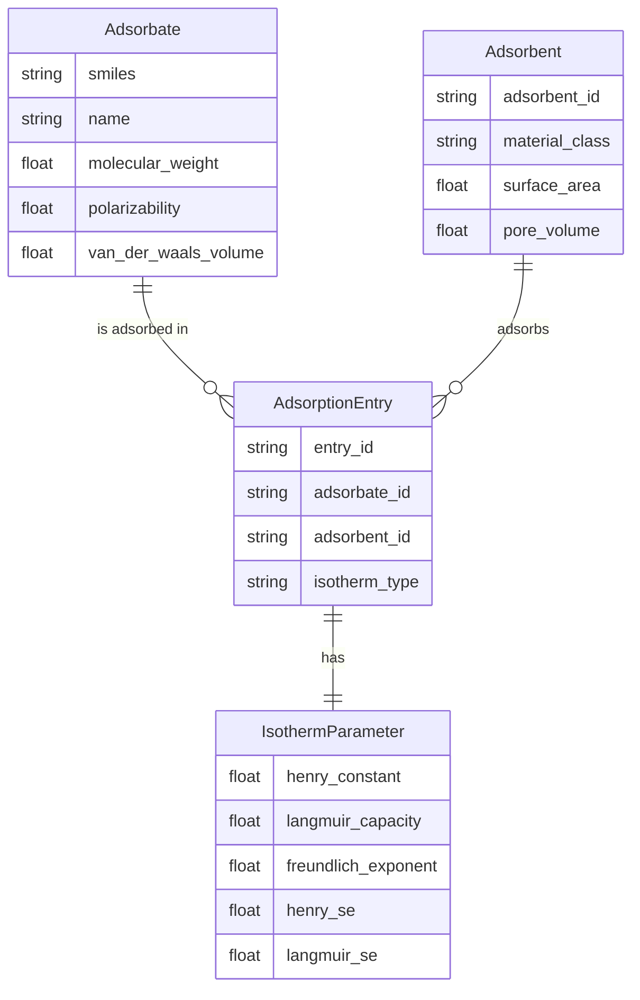

# Data Model: Predicting Adsorption Isotherm Parameters from Molecular Features

## 1. Entity Relationship Overview
The data model revolves around the `AdsorptionEntry`, linking an `Adsorbate` (gas) and an `Adsorbent` (material) to specific `IsothermParameters`.

```mermaid
erDiagram
    Adsorbate ||--o{ AdsorptionEntry : "is adsorbed in"
    Adsorbent ||--o{ AdsorptionEntry : "adsorbs"
    AdsorptionEntry ||--|| IsothermParameter : "has"
    
    Adsorbate {
        string smiles
        string name
        float molecular_weight
        float polarizability
        float van_der_waals_volume
    }
    
    Adsorbent {
        string adsorbent_id
        string material_class
        float surface_area
        float pore_volume
    }
    
    AdsorptionEntry {
        string entry_id
        string adsorbate_id
        string adsorbent_id
        string isotherm_type
    }
    
    IsothermParameter {
        float henry_constant
        float langmuir_capacity
        float freundlich_exponent
        float henry_se
        float langmuir_se
    }
```

## 2. Schema Definitions

### 2.1 Raw Input Schema
*Source: matsci/qmof*
*   **Columns**: `entry_id`, `adsorbate_smiles`, `adsorbent_id`, `surface_area`, `pore_volume`, `isotherm_type`, `henry_constant`, `langmuir_capacity`, `henry_se`, `langmuir_se`, `unit_surface`, `unit_capacity`.

### 2.2 Processed Schema (Intermediate)
*After filtering, normalization, and descriptor calculation*
*   **Columns**:
    *   `entry_id` (str)
    *   `adsorbent_id` (str) - Key for grouping.
    *   `molecular_weight` (float)
    *   `polarizability` (float)
    *   `van_der_waals_volume` (float)
    *   `polar_surface_area` (float)
    *   `h_bond_donors` (int)
    *   `h_bond_acceptors` (int)
    *   `surface_area_m2_g` (float)
    *   `pore_volume_cm3_g` (float)
    *   `target_henry` (float)
    *   `target_langmuir` (float)
    *   `target_henry_se` (float) - Uncertainty weight.
    *   `target_langmuir_se` (float) - Uncertainty weight.
    *   `is_valid` (bool) - Flag for imputation/exclusion.

### 2.3 Model Input Schema
*Features (X) and Targets (y)*
*   **Features**: All numeric descriptors + engineered interaction terms.
*   **Target**: `target_henry` or `target_langmuir` (single column).
*   **Weights**: `target_henry_se` or `target_langmuir_se` (inverse variance).

### 2.4 Output Schema
*   **Metrics**: `model_type`, `r2`, `rmse`, `mae`, `cv_score_mean`, `cv_score_std`.
*   **SHAP**: `feature_name`, `mean_abs_shap`, `shap_values` (array).
*   **Null Model**: `fold_id`, `rmse`.

## 3. Data Flow
1.  **Ingest**: `fetch.py` -> `data/raw/`
2.  **Clean**: `preprocessing.py` -> `data/processed/target_filtered.parquet`
3.  **Impute**: `imputation.py` -> `data/processed/imputed_dataset.parquet`
    - *Input*: `data/processed/target_filtered.parquet`
    - *Output*: `data/processed/imputed_dataset.parquet`, `data/validation/exclusion_log.json`
4.  **Split**: `split.py` -> `data/processed/train.parquet`, `data/processed/test.parquet`
5.  **Model**: `train.py` -> `data/results/model_metrics.json`
6.  **Interpret**: `shap_analysis.py` -> `data/results/shap_summary.json`
    - *Input*: `data/processed/train.parquet`, `data/processed/test.parquet`
    - *Output*: `data/results/shap_summary.json`, `data/results/permutation_pvalues.json`
7.  **Null Model**: `null_model.py` -> `data/results/null_model_fold_rmses.json`, `data/results/null_model_comparison.json`
    - *Output*: `data/results/null_model_top3_rmses.json`, `data/results/reduced_model_metrics.json`
8.  **Consensus**: `consensus.py` -> Final Report
9.  **Logging**: `logging.py` -> `data/benchmarks/runtime_log.json`

## 4. Schema Authority
**Single Source of Truth (SSoT)**: `contracts/dataset.schema.yaml`.
*   All code (fetch, preprocessing, imputation, split) MUST validate against `contracts/dataset.schema.yaml`.
*   `contracts/dataset_schema.yaml` is deprecated and contains conflicting field names (e.g., `adsorbate_name` vs `entry_id`). It must not be used for validation.
