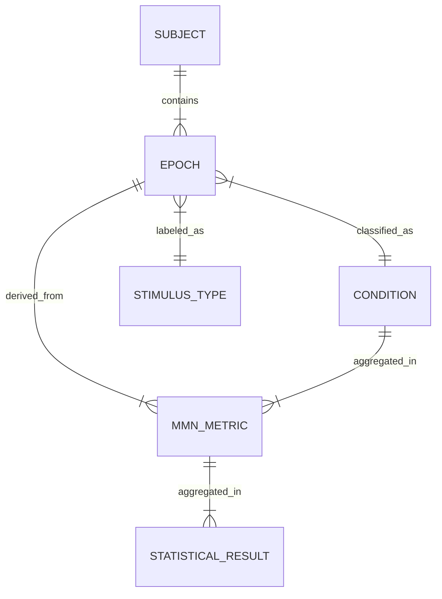

# Data Model: Neural Correlates of Temporal Prediction Errors in Auditory Scene Analysis

## Overview

This document defines the data structures, schemas, and relationships used throughout the project. It ensures that the implementation adheres to the **Data Hygiene** and **Single Source of Truth** principles of the project constitution.

## Entity Relationship Diagram (Conceptual)

## Core Entities

### 1. Subject
Represents a single participant in the EEG study.
- **Attributes**:
  - `subject_id` (string): Unique identifier (e.g., "sub-01").
  - `exclusion_reason` (string, optional): Reason for exclusion (e.g., "excessive artifacts").
  - `artifact_rejection_rate` (float): Percentage of epochs rejected.

### 2. Epoch
A segmented time-series of EEG data centered on a stimulus.
- **Attributes**:
  - `epoch_id` (string): Unique identifier (e.g., "sub-01_cond-simple_type-deviant").
  - `subject_id` (string): Foreign key to Subject.
  - `condition_label` (string): "simple" or "complex".
  - `stimulus_type` (string): "standard" or "deviant".
  - `time_window` (list[float]): Start and end time in seconds (e.g., [-0.2, 0.5]).
  - `data` (array): Multi-dimensional array (channels x timepoints).
  - `is_valid` (boolean): True if no NaNs and within artifact thresholds.

### 3. MMN Metric (Aggregated Output)
Derived quantitative measures of the MMN component, including statistical results. This entity unifies the metric and statistical result entities.
- **Attributes**:
  - `metric_id` (string): Unique identifier.
  - `subject_id` (string): Aggregated subject ID.
  - `condition_label` (string): "simple" or "complex".
  - `electrode` (string): Channel name (e.g., "Fz").
  - `amplitude_diff` (float): Mean voltage difference (deviant - standard) in µV.
  - `latency_diff` (float): Peak latency difference in ms.
  - `window_start` (float): Start of analysis window (ms).
  - `window_end` (float): End of analysis window (ms).
  - `snr_ratio` (float): Signal-to-Noise Ratio (`|mean| / std_baseline`).
  - `signal_validity` (boolean): True if SNR >= 2.0.
  - `t_statistic` (float): T-statistic from interaction test (or paired t-test if only one condition).
  - `p_value` (float): Raw p-value.
  - `p_value_fdr` (float): FDR-corrected p-value.
  - `cohen_d` (float): Effect size (Cohen's d).
  - `benchmark_reference` (string): Source of the effect size benchmark (e.g., "Näätänen et al., 2007").
  - `practical_significance` (boolean): True if `cohen_d` >= 0.5 (or benchmark threshold).
  - `topographic_correlation` (float): Pearson r vs. canonical template (or null).
  - `significant` (boolean): True if `p_value_fdr` < 0.05.

## Data Flow

1.  **Ingestion**: Raw BIDS data -> `raw/` (checksummed).
2.  **Preprocessing**: `raw/` -> `processed/epochs.fif` (MNE format).
3.  **Feature Extraction**: `epochs.fif` -> `results/metrics.csv` (MMN metrics).
4.  **Statistical Analysis**: `metrics.csv` -> `results/stats.json` (Interaction test results).
5.  **Visualization**: `stats.json` + `epochs.fif` -> `results/figures/`.

## Constraints & Validations

- **No NaNs**: All epoch data must pass `np.isnan(data).any() == False`.
- **Time Window**: All epochs must be strictly within -200ms to 500ms.
- **Condition Labels**: Must be exactly "simple" or "complex" (independent experimental variables).
- **Stimulus Types**: Must be exactly "standard" or "deviant".
- **Circular Logic Check**: `condition_label` MUST NOT be derived from `stimulus_type`.
- **Checksums**: Every file in `data/` must have a corresponding entry in `state/projects/PROJ-250-neural-correlates-of-temporal-prediction.yaml` with a valid SHA-256 hash.