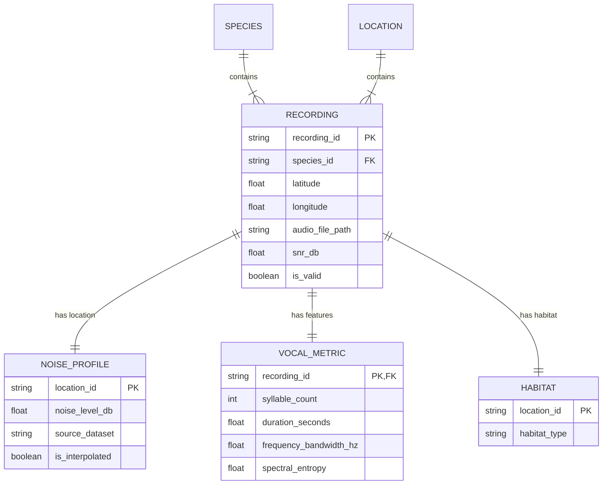

# Data Model: Predicting Avian Vocal Complexity

## 1. Entity Relationship Diagram (Conceptual)

## 2. Data Dictionary

### 2.1 Input Data (`data/raw`)

| Field | Type | Description | Source |
| :--- | :--- | :--- | :--- |
| `recording_id` | string | Unique Xeno-canto ID | Xeno-canto API |
| `species_id` | string | Bird species code (e.g., "melanocorypha_calandra") | Xeno-canto API |
| `latitude` | float | Recording latitude | Xeno-canto API |
| `longitude` | float | Recording longitude | Xeno-canto API |
| `audio_url` | string | Direct URL to audio file | Xeno-canto API |
| `noise_level_db` | float | Ambient noise level (dB(A)) | NoiseMap / Interpolation |
| `habitat_type` | string | Land cover class (e.g., "Urban", "Forest") | OpenLandMap |
| `is_interpolated` | bool | True if noise was interpolated from neighbors | Derived |

### 2.2 Intermediate Data (`data/interim`)

| Field | Type | Description | Source |
| :--- | :--- | :--- | :--- |
| `syllable_count` | int | Number of distinct syllables | `librosa` extraction |
| `duration_seconds` | float | Total song duration | `librosa` extraction |
| `frequency_bandwidth_hz` | float | Difference between 95th and 5th percentile freq | `librosa` extraction |
| `spectral_entropy` | float | Measure of spectral complexity | `librosa` extraction |
| `snr_db` | float | Signal-to-Noise Ratio | `librosa` calculation |
| `filter_reason` | string | "SNR_LOW", "SPECIES_COUNT_LOW", "MISSING_NOISE" | Derived |
| `species_id` | string | Species code | Input |
| `location_id` | string | Geohash or region ID | Derived |
| `count` | int | Number of recordings per species/location | Derived |

### 2.3 Processed Data (`data/processed`)

| Field | Type | Description | Source |
| :--- | :--- | :--- | :--- |
| `recording_id` | string | Unique ID | Input |
| `species_id` | string | Species code | Input |
| `noise_level_db` | float | Final noise value | Input |
| `habitat_type` | string | Final habitat value | Input |
| `syllable_count` | int | Final metric | Extracted |
| `duration_seconds` | float | Final metric | Extracted |
| `frequency_bandwidth_hz` | float | Final metric | Extracted |
| `spectral_entropy` | float | Final metric | Extracted |
| `location_id` | string | Geohash or region ID | Derived |

### 2.4 Model Results (`data/processed`)

| Field | Type | Description | Source |
| :--- | :--- | :--- | :--- |
| `metric_name` | string | "syllable_count", etc. | Derived |
| `fixed_effect_coefficient` | float | $\beta_{noise}$ | LMM |
| `p_value_raw` | float | Uncorrected p-value | LMM |
| `p_value_corrected` | float | FDR-corrected p-value | Derived |
| `effect_size_cohen_d` | float | Cohen's d | Derived |
| `random_effect_variance_species` | float | Variance of species intercept | LMM |
| `random_effect_variance_location` | float | Variance of location intercept | LMM |
| `r_squared_marginal` | float | Variance explained by fixed effects | LMM |
| `r_squared_conditional` | float | Variance explained by fixed+random | LMM |
| `correlation_coefficient_r` | float | Pearson correlation (r) | Derived |
| `correlation_ci_lower` | float | Lower bound of 95% CI for r | Derived |
| `correlation_ci_upper` | float | Upper bound of 95% CI for r | Derived |
| `n_observations` | int | Number of observations | Derived |
| `n_species` | int | Number of unique species | Derived |
| `loso_stability_score` | float | Stability score from Leave-One-Species-Out check | Derived |

### 2.5 Sensitivity Analysis (`data/processed`)

| Field | Type | Description | Source |
| :--- | :--- | :--- | :--- |
| `snr_threshold` | float | SNR cutoff used (5, 10, 15) | Input |
| `sample_size` | int | Number of valid recordings | Derived |
| `correlation_r` | float | Correlation coefficient at this threshold | Derived |
| `variation_percent` | float | % variation from baseline (10 dB) | Derived |
| `pass_constraint` | bool | True if variation $\le$ [deferred] | Derived |

### 2.6 Log Files (`data/interim`)

| File Name | Columns | Description |
| :--- | :--- | :--- |
| `noise_interpolation_log.csv` | `recording_id`, `source_distance_km`, `interpolated_value_db`, `neighbor_count` | Log of all interpolated noise values. Satisfies FR-009 and SC-006. |
| `filtered_records.csv` | `recording_id`, `filter_reason`, `species_id`, `location_id` | Log of excluded recordings with specific reason. |
| `species_filtered.csv` | `species_id`, `location_id`, `recording_count`, `reason` | Log of excluded species/locations due to low count. |
| `validation_log.csv` | `record_id`, `validation_error`, `schema_name` | Log of schema validation failures. |

## 3. File Naming Conventions

*   `data/raw/xc_metadata_{timestamp}.csv`
*   `data/raw/noise_map_{timestamp}.csv`
*   `data/raw/habitat_map_{timestamp}.csv`
*   `data/interim/extracted_features_{timestamp}.csv`
*   `data/interim/filtered_records_{timestamp}.csv`
*   `data/interim/noise_interpolation_log_{timestamp}.csv`
*   `data/interim/species_filtered_{timestamp}.csv`
*   `data/interim/validation_log_{timestamp}.csv`
*   `data/processed/final_dataset_{timestamp}.csv`
*   `data/processed/model_results_{timestamp}.csv`
*   `data/processed/sensitivity_report_{timestamp}.json`

## 4. Artifacts

*   `data/interim/noise_mapped.csv`: Contains all recordings with noise levels (interpolated or direct).
*   `data/interim/noise_interpolation_log.csv`: Log of all interpolated noise values with coordinates and source distance.
*   `data/interim/species_filtered.csv`: List of species/locations excluded due to low count, with `species_id`, `location_id`, `recording_count`, `reason`.
*   `data/interim/validation_log.csv`: Log of all schema validation failures during preprocessing.
*   `data/processed/final_dataset.csv`: The final dataset used for modeling.
*   `data/processed/model_results.csv`: The final model results.
*   `data/processed/sensitivity_report.json`: The sensitivity analysis report with pass/fail status.