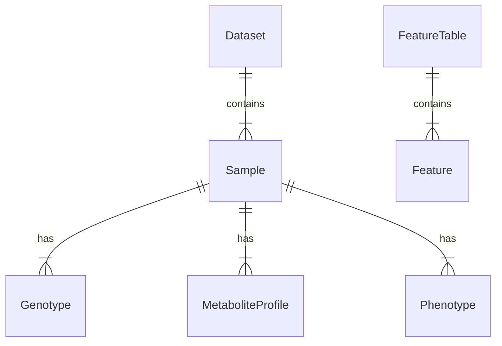

# Data Model: Predict Plant Disease Resistance from Multi‑omics Data

## 1. Entity Relationship Overview

The data model centers on the **Sample**, which links Genomic, Metabolomic, and Phenotypic data.

## 2. Core Entities

### Dataset
Represents a single source of data (REAL only for science; SIMULATED for CI).
*   `id`: Unique identifier (e.g., `SRA_PRJNAXXXX` or `synthetic_ci_001`).
*   `source_type`: `REAL` or `SIMULATED`.
*   `source_url`: URL for real data (NCBI SRA/MetaboLights), or script path if simulated.
*   `retrieval_date`: ISO 8601 timestamp.
*   `sample_count`: Total number of samples.

### Sample
A single plant individual.
*   `sample_id`: Unique string (e.g., `PLT_001`).
*   `dataset_id`: Foreign key to Dataset.
*   `status`: `COMPLETE` (all modalities present) or `EXCLUDED`.
*   `exclusion_reason`: If excluded, why (e.g., `MISSING_METABOLOMICS`).

### Genotype (SNP Matrix)
*   `sample_id`: Foreign key to Sample.
*   `variant_id`: SNP identifier (e.g., `rs12345`).
*   `genotype`: Categorical/Integer (0, 1, 2 for AA, Aa, aa).
*   `chromosome`: String.
*   `position`: Integer.

### MetaboliteProfile
*   `sample_id`: Foreign key to Sample.
*   `metabolite_id`: Compound identifier (e.g., `CMPD_001`).
*   `intensity`: Float (normalized abundance).
*   `platform`: `LC-MS` or `GC-MS`.

### Phenotype
*   `sample_id`: Foreign key to Sample.
*   `resistance_score`: Float (continuous severity) or Categorical (`R`/`S`).
*   `pathogen`: String (pathogen species).

## 3. Derived Artifacts

### FeatureTable
*   `table_id`: UUID.
*   `type`: `SNP`, `METABOLITE`, or `JOINT`.
*   `shape`: `[rows, cols]`.
*   `path`: Relative path to HDF5/Parquet file.
*   `checksum`: SHA-256 hash.

### ModelArtifact
*   `model_id`: UUID.
*   `algorithm`: `ElasticNet` or `GradientBoosting`.
*   `hyperparameters`: JSON dict.
*   `cv_score`: Float (accuracy/AUC/R²).
*   `p_value_permutation`: Float.
*   `vif_flags`: List of feature IDs with VIF > 5.

## 4. Data Flow

1.  **Raw**: `raw/*.csv` (Downloaded from NCBI/MetaboLights or Synthetic for CI).
2.  **Preprocessed**: `processed/aligned_snps.parquet`, `processed/aligned_metabolites.parquet`.
3.  **Feature Selection**: `results/selected_features.csv`.
4.  **Model**: `artifacts/model.pkl`, `results/performance_metrics.json`.
5.  **Manifest**: `data/data_manifest.yaml`.
