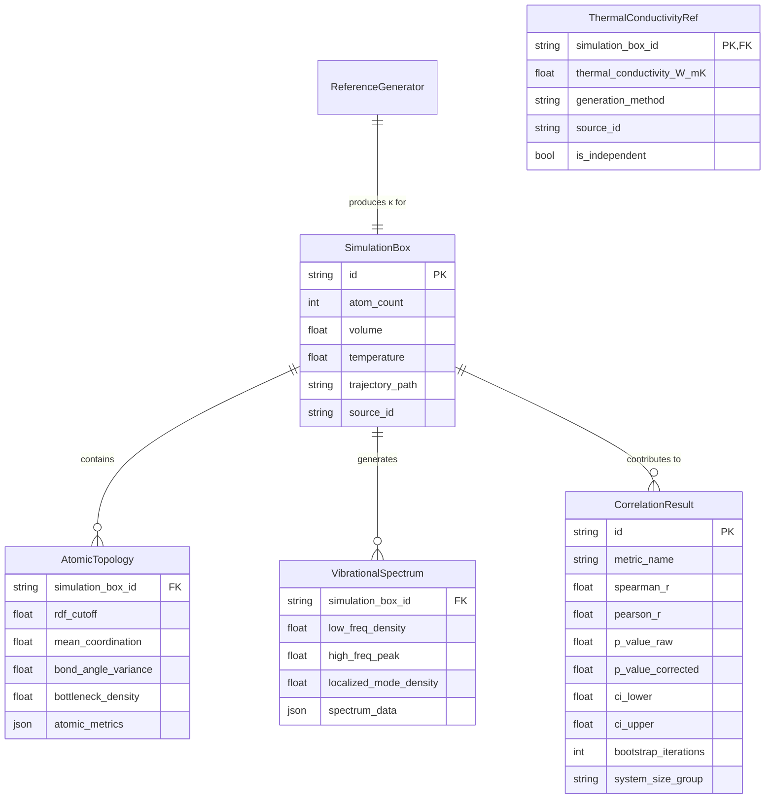

# Data Model: Investigating the Influence of Network Structure on Heat Conduction in Amorphous Solids

## Overview

This document defines the data structures, schemas, and relationships for the amorphous silicon analysis pipeline. The model supports three primary stages: Topology Extraction, Vibrational Analysis, and Statistical Correlation. A new stage, **Reference Generation**, ensures independence of the outcome variable.

## Entity-Relationship Diagram (Conceptual)

## Data Flows

1.  **Ingestion**: Raw trajectory files (`.dump`, `.xyz`) $\rightarrow$ `SimulationBox` metadata.
2.  **Topology**: `SimulationBox` + `RDF` $\rightarrow$ `AtomicTopology` (CSV).
3.  **Vibration**: `SimulationBox` (velocities) $\rightarrow$ `VibrationalSpectrum` (CSV).
4.  **Reference Generation**: `SimulationBox` (structure) $\rightarrow$ `ThermalConductivityRef` (programmatic estimate).
5.  **Analysis**: `AtomicTopology` + `VibrationalSpectrum` + `ThermalConductivityRef` $\rightarrow$ `CorrelationResult` (JSON/CSV).

## File Formats

### 1. Topology Metrics (CSV)
*Derived from `AtomicTopology` entity.*
*   **Columns**: `atom_id`, `coordination_number`, `bond_angle_variance`, `is_bottleneck` (boolean).
*   **Aggregated**: `mean_coordination`, `bottleneck_density`.

### 2. Vibrational Spectrum (CSV)
*Derived from `VibrationalSpectrum` entity.*
*   **Columns**: `frequency_THz`, `density_of_states`, `participation_ratio`.
*   **Aggregated**: `localized_mode_density` (scalar).

### 3. Reference Thermal Conductivity (CSV)
*Derived from `ThermalConductivityRef` entity.*
*   **Columns**: `simulation_box_id`, `thermal_conductivity_W_mK`, `generation_method`, `source_id`, `is_independent`.

### 4. Correlation Results (JSON)
*Derived from `CorrelationResult` entity.*
*   **Structure**: List of objects containing statistical metrics for each test.

## Schema Contracts

Detailed schemas are defined in `contracts/` to ensure data integrity and validation.

*   `contracts/topology.schema.yaml`: Validates atomic metrics and aggregation.
*   `contracts/vdos.schema.yaml`: Validates frequency arrays and participation ratios.
*   `contracts/correlation.schema.yaml`: Validates statistical outputs (r, p, CI).

## Assumptions & Constraints

*   **Atom IDs**: Must be unique within a simulation box.
*   **Frequency Units**: THz (Terahertz).
*   **Distance Units**: Angstroms (Å).
*   **Thermal Conductivity**: Must be provided in W/(m·K) or generated programmatically.
*   **Missing Data**: If velocity data is missing for a box, `VibrationalSpectrum` will be null, but `AtomicTopology` will still be generated (per Edge Cases in spec).
*   **Independence**: The `is_independent` flag in `ThermalConductivityRef` must be true for any data used in correlation analysis.
