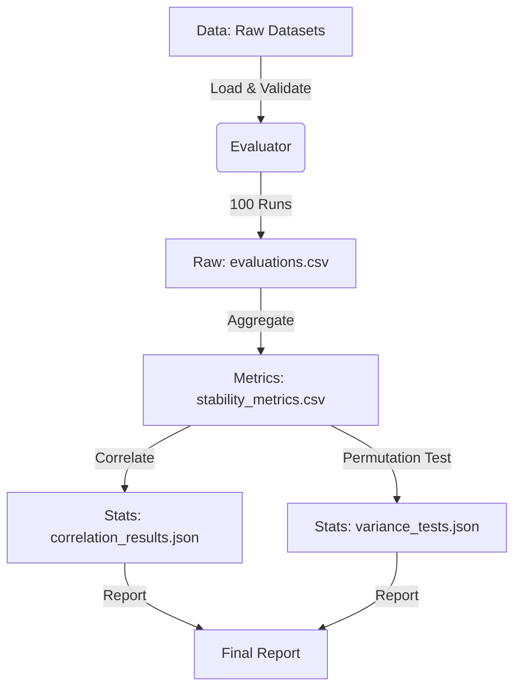

# Data Model: Assessing the Stability of Statistical Model Performance Across Data Subsets

## Overview

This document defines the data structures used to capture the input datasets, the raw evaluation results, and the aggregated statistical metrics. All data flows from `data/raw` -> `results/raw_evaluations.csv` -> `results/aggregated_metrics.csv` -> `results/statistical_tests.json`.

## Entities

### 1. Dataset (Input)
Represents a single binary classification dataset from UCI/OpenML.

| Field | Type | Description |
| :--- | :--- | :--- |
| `dataset_id` | int | Unique OpenML dataset ID. |
| `dataset_name` | str | Human-readable name. |
| `n_samples` | int | Number of rows. |
| `n_features` | int | Number of features (after encoding). |
| `source` | str | "OpenML" or "UCI". |
| `checksum` | str | SHA-256 hash of the raw file. |

### 2. EvaluationRun (Raw Output)
Represents a single model training/testing iteration within a specific fold and repeat.

| Field | Type | Description |
| :--- | :--- | :--- |
| `dataset_id` | int | FK to Dataset. |
| `model_name` | str | "LogisticRegression", "RandomForest", "LinearSVM". |
| `repeat_id` | int | 1-10. |
| `fold_id` | int | 1-10. |
| `accuracy` | float | Classification accuracy (0.0 to 1.0). |
| `f1_score` | float | F1 score (0.0 to 1.0). |
| `seed` | int | Random seed used for this run. |

### 3. StabilityMetric (Aggregated)
Represents the stability summary for a (Dataset, Model) pair.

| Field | Type | Description |
| :--- | :--- | :--- |
| `dataset_id` | int | FK to Dataset. |
| `model_name` | str | Model name. |
| `n_samples` | int | Inherited from Dataset. |
| `n_features` | int | Inherited from Dataset. |
| `mean_accuracy` | float | Mean of 100 accuracy scores. |
| `std_accuracy` | float | Std dev of 100 accuracy scores. |
| `cv_accuracy` | float | Coefficient of Variation (std/mean). |
| `mean_f1` | float | Mean of 100 F1 scores. |
| `std_f1` | float | Std dev of 100 F1 scores. |
| `cv_f1` | float | Coefficient of Variation (std/mean). |

### 4. CorrelationResult
Represents the result of a Pearson correlation test.

| Field | Type | Description |
| :--- | :--- | :--- |
| `test_id` | str | Unique identifier (e.g., "cv_acc_vs_n_samples"). |
| `metric` | str | "cv_accuracy" or "cv_f1". |
| `property` | str | "n_samples" or "n_features". |
| `correlation` | float | Pearson r. |
| `p_value` | float | Raw p-value. |
| `p_value_adj` | float | Benjamini-Hochberg adjusted p-value. |
| `significant` | bool | True if `p_value_adj < 0.05`. |

### 5. VarianceTestResult
Represents the result of the Permutation Test for variance differences.

| Field | Type | Description |
| :--- | :--- | :--- |
| `dataset_id` | int | FK to Dataset. |
| `metric` | str | "accuracy" or "f1". |
| `p_value` | float | Raw p-value from permutation test. |
| `p_value_adj` | float | Benjamini-Hochberg adjusted p-value. |
| `significant` | bool | True if `p_value_adj < 0.05`. |

## Data Flow Diagram

