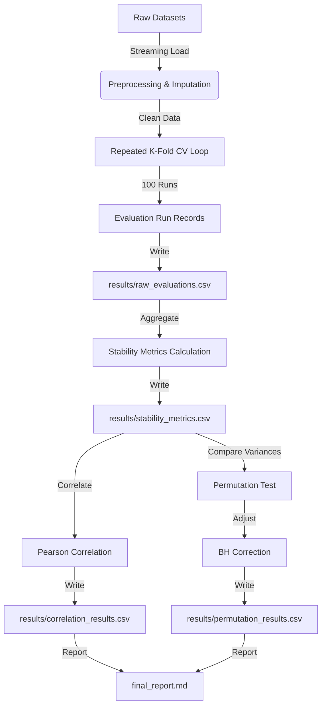

# Data Model: Assessing the Stability of Statistical Model Performance Across Data Subsets

## Overview

This document defines the data structures, schemas, and storage formats used throughout the project. All data artifacts are CSV files (for tabular results) or JSON/Parquet (for raw data), validated against YAML schemas defined in `contracts/`.

## Entity Definitions

### 1. Dataset Metadata
Represents the properties of a loaded dataset.
-   **Attributes**: `dataset_id`, `source_url`, `n_samples`, `n_features`, `target_column`, `checksum`.
-   **Storage**: `data/metadata.json` (derived from download info).

### 2. Evaluation Run (Raw Output)
Represents a single cross-validation fold within a repeat.
-   **Attributes**: `dataset_id`, `model_name`, `fold_id`, `repeat_id`, `accuracy`, `f1_score`.
-   **Storage**: `results/raw_evaluations.csv`.
-   **Schema Reference**: `contracts/evaluation_run.schema.yaml`.

### 3. Stability Metric (Aggregated)
Represents the aggregated performance and stability for a (dataset, model) pair.
-   **Attributes**: `dataset_id`, `model_name`, `mean_accuracy`, `std_accuracy`, `cv_accuracy`, `mean_f1`, `std_f1`, `cv_f1`, `n_evals`.
-   **Storage**: `results/stability_metrics.csv`.
-   **Schema Reference**: `contracts/stability_metric.schema.yaml`.

### 4. Correlation Result
Represents the statistical relationship between stability and dataset properties.
-   **Attributes**: `metric_name` (e.g., `cv_accuracy`), `property_name` (e.g., `n_samples`), `correlation_coefficient`, `p_value`, `method` (Pearson), `log_transformed` (bool).
-   **Storage**: `results/correlation_results.csv`.
-   **Schema Reference**: `contracts/correlation_result.schema.yaml`.

### 5. Permutation Test Result
Represents the outcome of the variance comparison test.
-   **Attributes**: `dataset_id`, `model_pair` (e.g., `LR_vs_RF`), `statistic`, `raw_p_value`, `adjusted_p_value`, `is_significant`.
-   **Storage**: `results/permutation_results.csv`.

## Data Flow Diagram

```mermaid
graph TD
    A[Raw Datasets] -->|Streaming Load| B(Preprocessing & Imputation)
    B -->|Clean Data| C[Repeated K-Fold CV Loop]
    C -->|100 Runs| D[Evaluation Run Records]
    D -->|Write| E[results/raw_evaluations.csv]
    E -->|Aggregate| F[Stability Metrics Calculation]
    F -->|Write| G[results/stability_metrics.csv]
    G -->|Correlate| H[Pearson Correlation]
    H -->|Write| I[results/correlation_results.csv]
    G -->|Compare Variances| J[Permutation Test]
    J -->|Adjust| K[BH Correction]
    K -->|Write| L[results/permutation_results.csv]
    I & L -->|Report| M[final_report.md]
```

## File Formats & Constraints

-   **CSV**: UTF-8 encoded, comma-separated, no quoting unless necessary.
-   **Float Precision**: All floating-point metrics stored with 6 decimal places.
-   **Missing Values**: Not allowed in final output CSVs; handled during aggregation (e.g., if an evaluation fails, it is excluded from the mean/CV, but the row count `n_evals` is updated).
-   **Checksums**: Every file in `data/` and `results/` must have a corresponding `.sha256` file.
