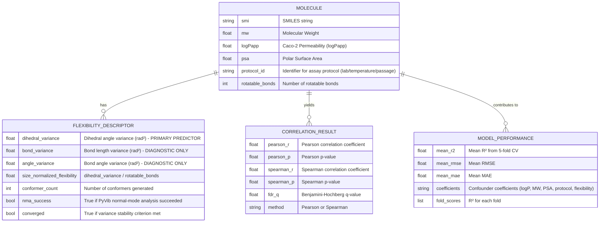

# Data Model: Exploring the Correlation Between Molecular Flexibility and Drug Transport Across Cell Membranes

## Entity‑Relationship Overview

The project models four core entities: `Molecule`, `FlexibilityDescriptor`, `CorrelationResult`, and `ModelPerformance`.

## Data Flow

1. **Raw Data**: `data/raw/chembl_caco2_raw.csv` (SMILES, logPapp, MW, PSA, protocol metadata).  
2. **Processed Data**: `data/processed/cleaned_dataset.csv` (filtered, validated).  
3. **Descriptors**: `data/processed/flexibility_descriptors.csv` (Molecule ID + variance metrics, NMA flag, convergence flag).  
4. **Results**: `data/processed/correlation_results.csv` and `data/processed/model_metrics.csv`.  
5. **Artifacts**: `data/processed/plot.png` (visualization).

## Schema Definitions

### Input Schema (ChEMBL)
- `canonical_smiles`: String (non‑NULL)  
- `standard_value`: Float (logPapp, non‑NULL)  
- `molecular_weight`: Float (optional; can be computed from SMILES)  
- `polar_surface_area`: Float (optional; can be computed)  
- `lab_id`, `temperature`, `passage_number`: Strings/Numbers (optional metadata for protocol heterogeneity)
- `num_rotatable_bonds`: Integer (computed from SMILES)

### Output Schema (Flexibility Descriptors)
- `smiles`: String  
- `dihedral_variance`: Float (rad²) - Primary Predictor  
- `bond_variance`: Float (rad²) - Diagnostic Only  
- `angle_variance`: Float (rad²) - Diagnostic Only  
- `size_normalized_flexibility`: Float  
- `conformer_count`: Integer  
- `nma_success`: Boolean  
- `converged`: Boolean

### Output Schema (Correlation Results)
- `descriptor_name`: String (`dihedral_variance`)  
- `pearson_r`: Float  
- `pearson_p`: Float  
- `spearman_r`: Float  
- `spearman_p`: Float  
- `fdr_q`: Float  

### Output Schema (Model Performance)
- `mean_r2`: Float  
- `mean_rmse`: Float  
- `mean_mae`: Float  
- `coefficients`: String (JSON‑encoded mapping)  
- `fold_scores`: List[Float] (5 values)

## Data Hygiene Rules

- **Immutability**: Raw data never modified; each transformation writes a new file.  
- **Checksums**: Every file in `data/` is checksummed (SHA‑256) by `utils/checksum.py` and recorded in `state/artifact_hashes`.  
- **Seeding**: All stochastic steps use `seed = 42`.  
- **Validation**: Files are validated against the JSON‑Schema contracts in `contracts/`.