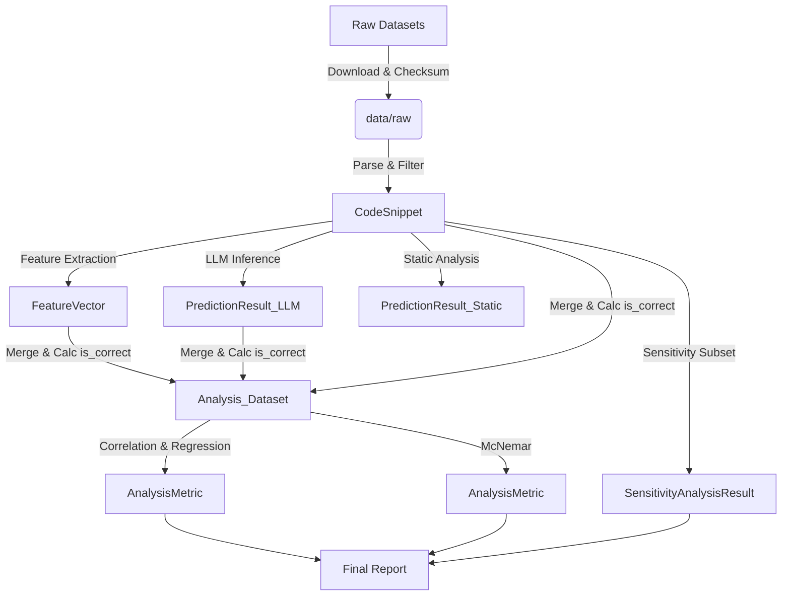

# Data Model: Evaluating the Effectiveness of LLMs for Identifying Security Vulnerabilities

## Entity-Relationship Overview

The data model consists of four primary entities: `CodeSnippet`, `FeatureVector`, `PredictionResult`, and `AnalysisMetric`. Data flows from `raw` (immutable) to `processed` (derived) to `results` (aggregated).

## Schema Definitions

### 1. CodeSnippet
Represents a single unit of source code from the input datasets.
- **Source**: `data/raw/*.parquet` or `*.jsonl`
- **Attributes**:
  - `id`: `string` (UUID or dataset-specific ID)
  - `language`: `enum` (C, Python, JavaScript)
  - `source_code`: `string` (Truncated to 1024 tokens if necessary)
  - `ground_truth_label`: `enum` (Vulnerable, Safe)
  - `ground_truth_category`: `string` (e.g., "SQLi", "Buffer Overflow", "XSS")
  - `dataset_source`: `string` (e.g., "VulDeePecker", "NIST_Juliet", "JSVulnDB")

### 2. FeatureVector
Derived properties of the code snippet used for analysis.
- **Source**: `data/processed/features.parquet`
- **Attributes**:
  - `snippet_id`: `string` (FK to CodeSnippet)
  - `ast_depth`: `float` (Max depth of AST)
  - `node_count`: `integer` (Total AST nodes)
  - `cyclomatic_complexity`: `float` (McCabe complexity)
  - `taint_api_count`: `integer` (Frequency of known taint-source APIs)
  - `sanitization_present`: `boolean` (True if sanitization function detected)
  - `embedding_similarity_score`: `float` (Cosine similarity to NVD CVE reference set)
  - `is_valid`: `boolean` (True if parsing succeeded)
  - `obfuscation_level`: `float` (Optional: if dataset provides obfuscation metric, else null)

### 3. PredictionResult
Output from LLM or Static Analyzer.
- **Source**: `data/processed/predictions_llm.parquet`, `data/processed/predictions_static.parquet`
- **Attributes**:
  - `snippet_id`: `string` (FK to CodeSnippet)
  - `model_type`: `enum` (LLM, Bandit, Cppcheck)
  - `predicted_label`: `enum` (Vulnerable, Safe, Uncertain)
  - `predicted_category`: `string` (Mapped category or "none")
  - `confidence_score`: `float` (If available, else null)
  - `inference_time_ms`: `float` (Per-sample time, required for FR-007)
  - `is_correct`: `boolean` (1 if `predicted_label` == `ground_truth_label`)
  - `truncation_event`: `boolean` (True if input was truncated)

### 4. AnalysisMetric
Aggregated statistical results.
- **Source**: `data/processed/metrics.json`
- **Attributes**:
  - `metric_name`: `string` (e.g., "Pearson_r", "McNemar_p", "McFadden_R2")
  - `feature_name`: `string` (or "LLM_vs_Static")
  - `category`: `string` (Vulnerability category if applicable)
  - `model_type`: `string` (Model type associated with the metric)
  - `value`: `float`
  - `p_value`: `float`
  - `adjusted_p_value`: `float` (Bonferroni corrected)
  - `significance`: `string` (Significant / Not_Significant)
  - `language`: `string` (or "all")
  - `notes`: `string` (Optional commentary)

### 5. SensitivityAnalysisResult (FR-011)
- **Source**: `data/processed/sensitivity_analysis.json`
- **Attributes**:
  - `subset_size`: `integer` (e.g., 100)
  - `primary_metric`: `string` (e.g., "F1_Score")
  - `primary_value`: `float`
  - `secondary_metric`: `string`
  - `secondary_value`: `float`
  - `variance`: `float`
  - `protocol_description`: `string` (Description of the re-labeling protocol)

## Data Flow Diagram

## Storage Constraints

- **Raw Data**: Stored as Parquet/JSONL. Checksums recorded in `state.yaml`.
- **Processed Data**: Parquet format (efficient columnar storage).
- **Logs**: JSON format in `data/logs/`.
- **Max Size**: < 7GB RAM usage via streaming; disk usage < 14GB.