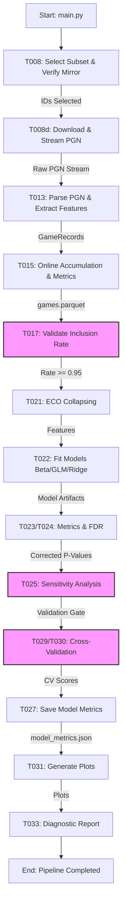

# Statistical Analysis of Publicly Available Chess Game Data for Elo Rating Prediction

This project implements a statistical analysis pipeline to predict Elo rating outcomes based on features extracted from publicly available chess game data (Lichess). The pipeline ingests PGN data, extracts features (ECO codes, move times, material imbalance), and fits regression models (Beta, Gaussian GLM, Ridge) to analyze outcome deviations.

## Project Structure

```
.
├── code/
│ ├── src/
│ │ ├── data/ # Data ingestion, parsing, and processing
│ │ ├── models/ # Model fitting and validation
│ │ ├── reports/ # Plot generation and diagnostics
│ │ ├── validation/ # Contract validation
│ │ ├── config.py # Configuration and constants
│ │ └── main.py # Main orchestration script
│ ├── tests/ # Unit and integration tests
│ └── setup_structure.py # Project initialization
├── data/
│ ├── raw/ # Raw downloaded data
│ ├── processed/ # Processed datasets (games.parquet)
│ └── results/ # Model metrics, plots, and reports
├── specs/
│ └── contracts/ # Schema definitions for data validation
├── README.md # This file
├── requirements.txt # Python dependencies
└── quickstart.md # Quick start guide
```

## Installation

1. **Clone the repository**:
 ```bash
 git clone <repository-url>
 cd PROJ-283-statistical-analysis-of-publicly-availab
 ```

2. **Create a virtual environment** (recommended):
 ```bash
 python -m venv venv
 source venv/bin/activate # On Windows: venv\Scripts\activate
 ```

3. **Install dependencies**:
 ```bash
 pip install -r requirements.txt
 ```

4. **Verify installation**:
 ```bash
 python -c "import chess; import pandas; import statsmodels; print('Dependencies installed successfully.')"
 ```

## Data Flow Architecture

The pipeline follows a strict sequential flow with validation gates at each stage.



**Key Stages**:
1. **Ingestion**: Download and stream Lichess PGN data (T008).
2. **Parsing**: Extract features (ECO, move times, material imbalance) (T013).
3. **Processing**: Online accumulation and inclusion rate validation (T015, T017).
4. **Modeling**: Fit Beta, Gaussian GLM, and Ridge regressions (T022).
5. **Validation**: FDR correction, sensitivity analysis, and cross-validation (T024, T025, T030).
6. **Reporting**: Generate plots and diagnostic reports (T031, T033).

## Usage

### Running the Full Pipeline

Execute the main orchestration script to run the entire pipeline from data download to final report generation:

```bash
python code/src/main.py
```

**Optional**: Run with a small sample for testing:
```bash
python code/src/main.py --sample
```

### Expected Output

Upon successful completion, the pipeline will:
- Generate `data/processed/games.parquet` with extracted game records.
- Generate `data/results/model_metrics.json` with model coefficients and validation scores.
- Generate diagnostic plots in `data/results/` (e.g., `residuals_Beta_*.png`).
- Output `Pipeline completed successfully` to the console.

### Individual Stage Execution

If you need to run specific stages independently:

1. **Download Data**:
 ```bash
 python code/src/data/download.py
 ```

2. **Parse and Process**:
 ```bash
 python code/src/data/process.py
 ```

3. **Fit Models**:
 ```bash
 python code/src/models/fit.py
 ```

4. **Generate Reports**:
 ```bash
 python code/src/reports/generate_plots.py
 ```

### Validation

Validate the processed data against the schema:
```bash
python code/src/validation/validate_contracts.py --data data/processed/games.parquet
```

## Configuration

Configuration options are defined in `code/src/config.py`. Key settings include:
- `RANDOM_SEED`: Seed for reproducibility.
- `USE_MOVE_5`: Flag to toggle between Move 5 and Move 10 for material imbalance (default: False, uses Move 10 per Spec FR-002).
- `SAMPLE_SIZE_ESTIMATE_BYTES_PER_GAME`: Heuristic for estimating dataset size.

## Dependencies

See `requirements.txt` for the full list of dependencies. Key packages include:
- `pandas`, `numpy`: Data manipulation.
- `statsmodels`: Statistical modeling (Beta Regression, GLM).
- `scikit-learn`: Machine learning (Ridge Regression).
- `chess`: PGN parsing and board analysis.
- `matplotlib`, `seaborn`: Visualization.

## License

This project is part of the llmXive automated science pipeline. See the project root for license details.