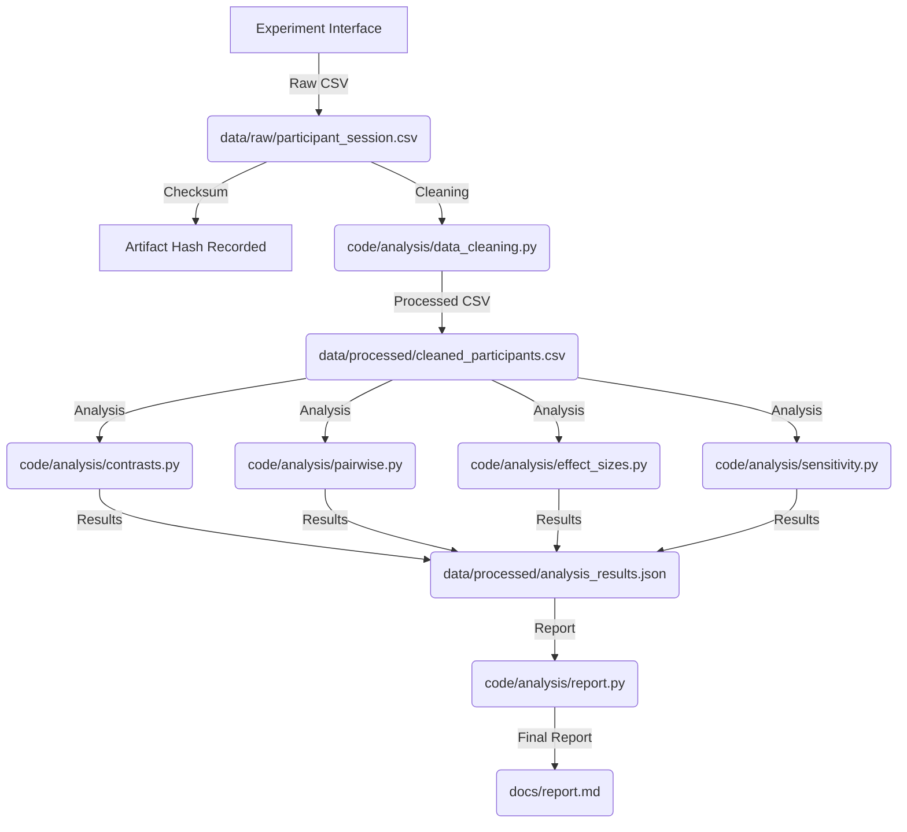

# Data Model: The Influence of Perceived Agency in AI Interactions on Trust

## Overview

This document defines the data model for the experiment, including the schema for raw participant data, cleaned analysis-ready data, and analysis outputs. All data files are stored in `data/` and checksummed for reproducibility.

## Raw Data Schema

### File: `data/raw/participant_session.csv`

| Column | Type | Description | Constraints |
|--------|------|-------------|-------------|
| `participant_id` | String | Unique identifier for each session. | UUID v4; no duplicates. |
| `condition` | String | Experimental condition assigned. | Enum: "High Agency", "Low Agency", "Control". |
| `adherence_rate` | Float | Percentage of AI recommendations followed. | Range: 0.0 to 100.0; 2 decimal places. |
| `trust_score` | Float | Mean score from Lee & See (2004) scale. | Range: 1.0 to 5.0; 2 decimal places. |
| `perceived_agency_score` | Float | Mean score from Langer-style manipulation check. | Range: 1.0 to 5.0; 2 decimal places. |
| `illusion_belief` | Boolean | Debriefing: "Did you believe the sliders changed the recommendation?" | True or False. |
| `attention_check_pass` | Boolean | Whether the participant passed the attention check. | True or False. |
| `completion_time` | Float | Time taken to complete the task (seconds). | Positive; 2 decimal places. |
| `timestamp` | DateTime | Session completion timestamp (UTC). | ISO 8601 format. |
| `raw_trust_items` | String | JSON-encoded list of raw Lee & See (2004) item scores. | JSON array of integers (1-5). |
| `raw_agency_items` | String | JSON-encoded list of raw manipulation check item scores. | JSON array of integers (1-5). |

### Data Collection Notes

- **Randomization**: `condition` is assigned via `code/experiment/randomization.py` using a uniform random distribution.
- **Trust Scale**: `trust_score` is the mean of all Lee & See (2004) items; `raw_trust_items` preserves individual item scores for validation.
- **Manipulation Check**: `perceived_agency_score` is the mean of Langer-style items; `raw_agency_items` preserves individual scores.
- **Attention Check**: `attention_check_pass` is True if the participant correctly answered the attention check question.
- **Debriefing**: `illusion_belief` captures whether the participant believed the sliders had an effect.

## Processed Data Schema

### File: `data/processed/cleaned_participants.csv`

| Column | Type | Description | Derivation |
|--------|------|-------------|------------|
| `participant_id` | String | Unique identifier. | Copied from raw. |
| `condition` | Categorical | Experimental condition. | Copied from raw; encoded as factor. |
| `adherence_rate` | Float | Percentage of AI recommendations followed. | Copied from raw. |
| `trust_score` | Float | Mean score from Lee & See (2004) scale. | Copied from raw. |
| `perceived_agency_score` | Float | Mean score from manipulation check. | Copied from raw. |
| `included` | Boolean | Whether the participant is included in the analysis. | `attention_check_pass == True` AND `completion_time >= threshold`. |

### Data Cleaning Rules

1. **Attention Check Filter**: Exclude participants where `attention_check_pass == False`.
2. **Completion Time Filter**: Exclude participants where `completion_time < threshold` (threshold is configurable; default 60 seconds). **Adherence rate is NOT used as a filter.**
3. **Outlier Handling**: No automatic outlier removal; outliers are retained and flagged in sensitivity analysis.
4. **Manipulation Check**: Participants with `illusion_belief == False` are retained but analyzed separately or flagged in sensitivity analysis.

## Analysis Output Schema

### File: `data/processed/analysis_results.json`

| Field | Type | Description |
|-------|------|-------------|
| `anova_results` | Object | Results of One-Way ANOVA. |
| `planned_contrasts` | Object | Results of planned directional contrasts. |
| `pairwise_comparisons` | Array | Results of Tukey HSD post-hoc tests. |
| `effect_sizes` | Object | Cohen's d for all pairwise comparisons. |
| `power_analysis` | Object | Pre-study and post-hoc power metrics. |
| `sensitivity_analysis` | Object | Results of threshold sensitivity sweep (attention/completion). |
| `manipulation_check` | Object | Results of perceived agency comparison. |

### Sub-schema: `planned_contrasts`

| Field | Type | Description |
|-------|------|-------------|
| `high_vs_low` | Object | Contrast 1: High Agency vs. Low Agency. |
| `combined_vs_control` | Object | Contrast 2: (High + Low) vs. Control. |

### Sub-schema: `high_vs_low`

| Field | Type | Description |
|-------|------|-------------|
| `t_statistic` | Float | t-statistic for the contrast. |
| `p_value` | Float | p-value (two-tailed, adjusted for planned contrast). |
| `degrees_of_freedom` | Integer | Degrees of freedom. |
| `significant` | Boolean | Whether p < 0.05. |

### Sub-schema: `pairwise_comparisons`

| Field | Type | Description |
|-------|------|-------------|
| `comparison` | String | Pairwise comparison label (e.g., "High vs. Low"). |
| `mean_diff` | Float | Mean difference in trust scores. |
| `p_value_adj` | Float | Adjusted p-value (Tukey HSD). |
| `significant` | Boolean | Whether p_adj < 0.05. |

### Sub-schema: `effect_sizes`

| Field | Type | Description |
|-------|------|-------------|
| `comparison` | String | Pairwise comparison label. |
| `cohen_d` | Float | Cohen's d effect size. |
| `interpretation` | String | Small/Medium/Large based on Cohen's thresholds. |

### Sub-schema: `power_analysis`

| Field | Type | Description |
|-------|------|-------------|
| `pre_study_sample_size` | Integer | Required sample size for power ≥ 0.80. |
| `achieved_power` | Float | Post-hoc power given actual sample size. |
| `effect_size_assumed` | Float | Assumed effect size (f=0.25). |

### Sub-schema: `sensitivity_analysis`

| Field | Type | Description |
|-------|------|-------------|
| `threshold_range` | Array | List of thresholds tested (e.g., [0.75, 0.80, 0.85, 0.90]). |
| `p_values` | Array | p-values for primary contrast at each threshold. |
| `effect_sizes` | Array | Cohen's d at each threshold. |
| `stability_metric` | Float | Standard deviation of p-values across thresholds. |

### Sub-schema: `manipulation_check`

| Field | Type | Description |
|-------|------|-------------|
| `high_vs_low` | Object | Comparison of perceived agency scores. |
| `high_vs_control` | Object | Comparison of perceived agency scores. |
| `low_vs_control` | Object | Comparison of perceived agency scores. |

## Data Flow Diagram

## Data Hygiene Requirements

- **Checksumming**: Every file in `data/` is checksummed (SHA-256) and recorded in `state/projects/PROJ-286-*.yaml`.
- **No In-Place Modifications**: Raw data is preserved; derivations written to new files.
- **PII Scan**: No personally identifying information (names, emails, IP addresses) is committed to `data/`.