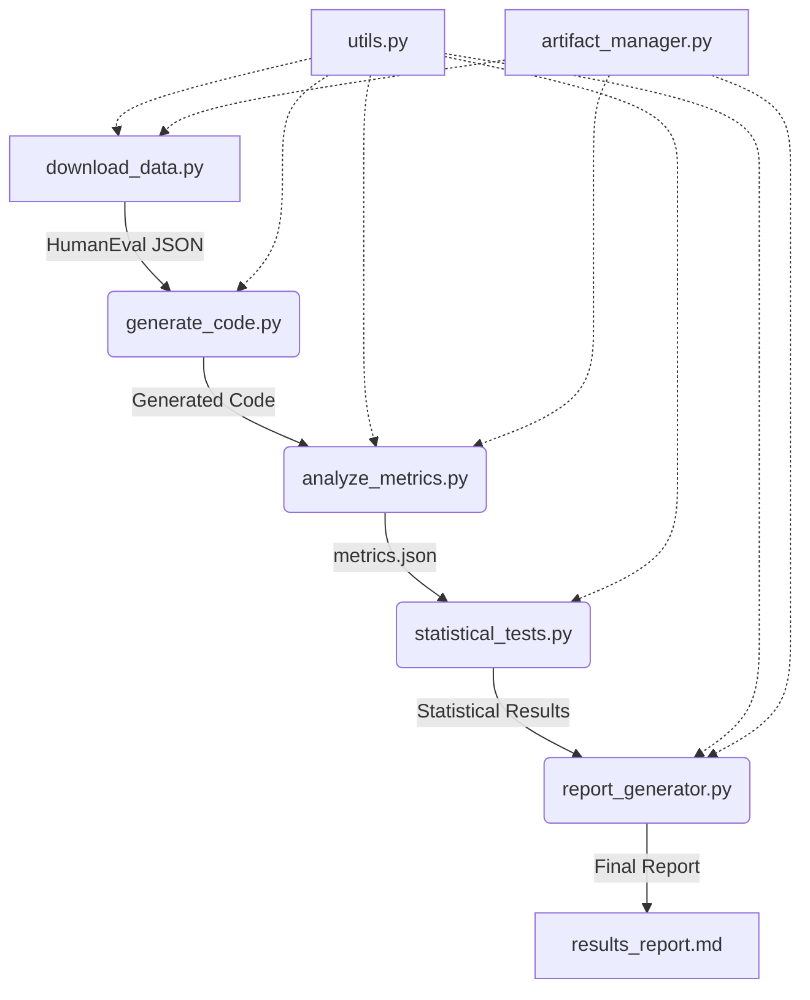

# Architecture Overview

## System Design

The research pipeline is designed as a modular, stage-based workflow. Each stage is an independent Python script that produces specific artifacts consumed by subsequent stages.

### Data Flow

1. **Input**: Raw HumanEval dataset (downloaded from HuggingFace).
2. **Processing**:
 - **Generation**: LLM generates code for each task.
 - **Analysis**: Static analysis and test execution compute metrics.
 - **Statistics**: Hypothesis testing on aggregated metrics.
3. **Output**: `metrics.json`, statistical results, and `results_report.md`.

### Component Interaction

## Error Handling Strategy

- **Fail Loudly**: Data download or integrity verification failures raise exceptions immediately.
- **Graceful Degradation**: Code generation failures are logged, and the sample is marked as missing (not synthetic).
- **Deferred Metrics**: If coverage execution fails, the metric is marked as `[deferred]` but the pass rate is still recorded.

## Reproducibility Mechanisms

- **Hashing**: All inputs and outputs are hashed (SHA256) and stored in `state/artifact_hashes.yaml`.
- **Logging**: Every step logs to `logs/pipeline.log` with timestamps and task IDs.
- **Seeding**: Random seeds are set for sampling and model generation where applicable.

## Scalability

- **Batch Processing**: `analyze_metrics.py` supports batch processing of tasks.
- **Parallelism**: Independent tasks (e.g., generation vs. analysis) can be run in parallel if resources allow.
- **Streaming**: Large datasets can be processed in chunks if memory is constrained.

## Security & Compliance

- **API Keys**: HuggingFace tokens are read from environment variables, never hardcoded.
- **Data Privacy**: No user data is processed; only public benchmark data (HumanEval) is used.
- **Citation Validation**: The `validate_citations.py` agent ensures all generated reports cite sources correctly.
