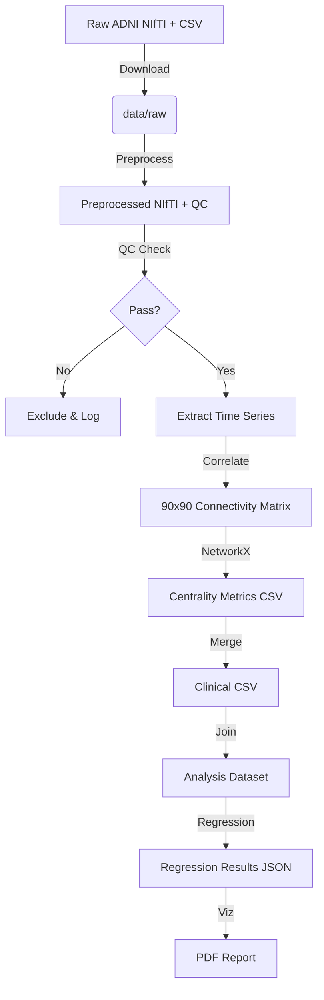

# Data Model: Assessing the Impact of Network Centrality on Age‑Related Cognitive Decline

## 1. Entity Relationship Overview

The data model flows from raw imaging to processed metrics, then to analysis-ready datasets.

1. **Participant**: Core entity linking imaging and clinical data.
2. **ImagingSession**: Derived from raw fMRI; contains preprocessed volume and QC metrics.
3. **CentralityMetrics**: Derived from connectivity matrices; contains ROI-level and network-level metrics.
4. **CognitiveScore**: Clinical assessment data.
5. **RegressionResult**: Final statistical output.

## 2. Data Schema Definitions

### 2.1 Raw Input (ADNI)
- **Format**: NIfTI (.nii/.nii.gz) for imaging; CSV for clinical.
- **Location**: `data/raw/`

### 2.2 Preprocessed Data
- **File**: `data/processed/{participant_id}_preprocessed.nii.gz`
- **QC Log**: `data/processed/{participant_id}_qc.json`
  ```json
  {
    "participant_id": "string",
    "mean_fd": "float",
    "volumes_exceeding_threshold": "int",
    "excluded": "boolean",
    "reason": "string"
  }
  ```

### 2.3 Connectivity & Centrality
- **File**: `data/analysis/centrality_metrics.csv`
- **Schema**:
  | Column | Type | Description |
  | :--- | :--- | :--- |
  | `participant_id` | string | Unique ID |
  | `roi_id` | string | AAL ROI name (e.g., "Precentral_L") |
  | `network` | string | "DMN", "FPN", or "Global" |
  | `degree` | float | Degree centrality |
  | `betweenness` | float | Betweenness centrality |
  | `closeness` | float | Closeness centrality |
  | `mean_fd` | float | Mean framewise displacement |

### 2.4 Analysis Dataset (Merged)
- **File**: `data/analysis/analysis_dataset.csv`
- **Schema**:
  | Column | Type | Description |
  | :--- | :--- | :--- |
  | `participant_id` | string | Unique ID |
  | `age` | int | Age in years |
  | `sex` | string | "M" or "F" |
  | `education_years` | int | Years of education |
  | `diagnosis` | string | "CN", "MCI", "AD" |
  | `adas_cog` | float | ADAS-Cog score |
  | `mmse` | int | MMSE score |
  | `processing_speed` | float | TMT-A or Digit Symbol score |
  | `dmn_degree` | float | Mean degree centrality in DMN |
  | `dmn_betweenness` | float | Mean betweenness in DMN |
  | `dmn_closeness` | float | Mean closeness in DMN |
  | `fpn_degree` | float | Mean degree centrality in FPN |
  | ... | ... | ... (FPN and Global metrics) |

### 2.5 Regression Results
- **File**: `data/analysis/regression_results.json`
- **Schema**:
  ```json
  {
    "model_id": "string",
    "outcome": "string",
    "predictor": "string",
    "beta": "float",
    "se": "float",
    "p_value": "float",
    "q_value": "float",
    "partial_r": "float",
    "vif": {"predictor_name": "float"},
    "assumptions": {
      "linearity": "string",
      "normality": "string",
      "homoscedasticity": "string"
    }
  }
  ```

## 3. Data Flow Diagram


