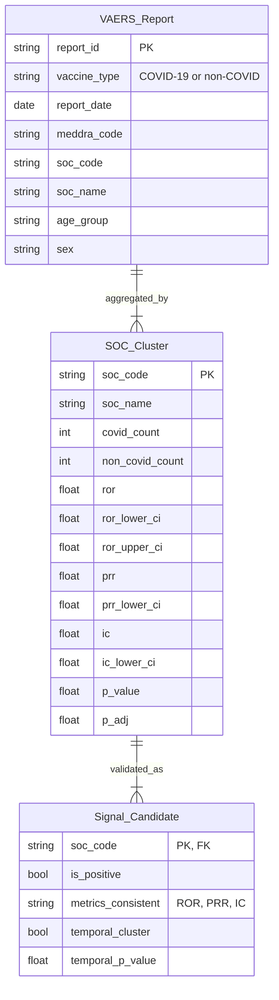

# Data Model: Statistical Analysis of Publicly Available COVID-19 Vaccine Adverse Event Reports

## Entity Relationships

## Schema Definitions

### VAERS_Report (Raw/Processed)

| Column | Type | Description | Constraints |
|--------|------|-------------|-------------|
| report_id | str | Unique report identifier | PK, not null |
| vaccine_type | str | "COVID-19" or "non-COVID" | not null |
| report_date | date | Date of report | not null |
| meddra_code | str | Raw MedDRA code | not null |
| soc_code | str | System Organ Class code | not null |
| soc_name | str | System Organ Class name | not null |
| age_group | str | Age category (e.g., "0-17", "18-64") | nullable |
| sex | str | Sex (M/F/U) | nullable |

> **Data Limitation**: The VAERS dataset **does not** contain `vaccination_date` or `onset_date`. Therefore, the "14-30 days post-vaccination" analysis (FR-007) is **uncomputable**. The plan uses `report_date` (Calendar Week) as a proxy for temporal analysis, acknowledging this limitation.

### SOC_Cluster (Aggregated)

| Column | Type | Description | Constraints |
|--------|------|-------------|-------------|
| soc_code | str | System Organ Class code | PK |
| soc_name | str | System Organ Class name | not null |
| covid_count | int | Count of COVID-19 reports | ≥ 0 |
| non_covid_count | int | Count of non-COVID reports | ≥ 0 |
| ror | float | Reporting Odds Ratio | nullable |
| ror_lower_ci | float | ROR 95% CI lower bound | nullable |
| ror_upper_ci | float | ROR 95% CI upper bound | nullable |
| prr | float | Proportional Reporting Ratio | nullable |
| prr_lower_ci | float | PRR 95% CI lower bound | nullable |
| ic | float | Information Component | nullable |
| ic_lower_ci | float | IC 95% CI lower bound | nullable |
| p_value | float | Raw p-value | [0, 1] |
| p_adj | float | BH-adjusted p-value | [0, 1] |

### Signal_Candidate (Validated)

| Column | Type | Description | Constraints |
|--------|------|-------------|-------------|
| soc_code | str | System Organ Class code | PK, FK → SOC_Cluster |
| is_positive | bool | Signal status (true if FR-006 met) | not null |
| metrics_consistent | str | Comma-separated list of consistent metrics | not null |
| temporal_cluster | bool | True if Poisson regression p < 0.05 | not null |
| temporal_p_value | float | Poisson regression p-value | [0, 1] |

## Data Flow

1. **Ingestion**: Raw VAERS CSV → `data/raw/` (checksummed)
2. **Preprocessing**: Raw CSV → Filtered/Mapped → `data/processed/merged_soc.csv`
3. **Analysis**: `merged_soc.csv` → Disproportionality metrics → `data/outputs/soc_clusters.csv`
4. **Signal Detection**: `soc_clusters.csv` → Validated signals → `data/outputs/signals.csv`
5. **Visualization**: `signals.csv` → Forest plot → `data/outputs/forest_plot.png`

## Constraints

- **Memory**: All intermediate dataframes must fit in ≤ 7GB RAM. Use chunked processing.
- **Time**: Total pipeline ≤ 6 hours.
- **Data Integrity**: No modification of raw data; all derivations produce new files.
- **Data Limitation**: `vaccination_date` and `onset_date` are missing; temporal analysis uses Calendar Weeks.