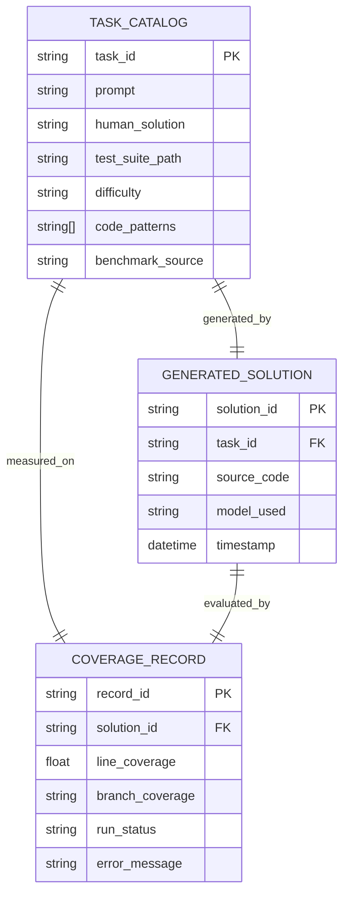

# Data Model: Evaluating the Impact of LLM-Generated Code on Code Coverage

## 1. Entity Relationship Diagram (Conceptual)

## 2. Data Definitions

### 2.1 TaskCatalog
Represents the input programming task.
-   `task_id`: Unique string identifier (e.g., "mbpp_1", "human_eval_0").
-   `prompt`: Natural language description of the task.
-   `human_solution`: Reference Python code string.
-   `test_suite_path`: Relative path to the **transformed** test file in `data/benchmarks/processed/`.
-   `difficulty`: Enum {`Easy`, `Medium`, `Hard`}.
-   `code_patterns`: List of strings (e.g., `["loops", "conditionals"]`).
-   `benchmark_source`: String (e.g., "MBPP", "HumanEval") used as a random effect in statistical models.

### 2.2 GeneratedSolution
Represents the LLM output.
-   `solution_id`: UUID.
-   `task_id`: Foreign key to `TaskCatalog`.
-   `source_code`: The generated Python code string.
-   `model_used`: String (e.g., "gpt-4", "phi-2-4bit").
-   `timestamp`: ISO8601 generation time.
-   `temperature`: Float (fixed at 0.7).

### 2.3 CoverageRecord
Represents the result of the test execution.
-   `record_id`: UUID.
-   `solution_id`: Foreign key to `GeneratedSolution`.
-   `line_coverage`: Float (0.0 to 1.0).
-   `branch_coverage`: Float or `null` (if N/A per FR-009).
-   `run_status`: Enum {`success`, `failure`, `syntax_error`, `timeout`}.
-   `error_message`: String (if status is not `success`).

### 2.4 AggregatedStats
Derived entity for the final report.
-   `task_id`: FK.
-   `diff_line`: Float (LLM - Human).
-   `diff_branch`: Float or `null`.
-   `significance_flag`: Boolean.
-   `effect_size`: Float (Marginal Means Diff or Odds Ratio).
-   `ci_lower`: Float.
-   `ci_upper`: Float.

## 3. Storage Schema

All data is stored in CSV and JSON formats for portability and checksumming.
-   `data/benchmarks/tasks.json`: Normalized `TaskCatalog`.
-   `data/benchmarks/processed/`: Directory containing executable `.py` test files.
-   `generated/solutions.jsonl`: `GeneratedSolution` records.
-   `data/processed/coverage_pairs.csv`: Merged `TaskCatalog` + `GeneratedSolution` + `CoverageRecord`.
-   `data/processed/stats_summary.csv`: Aggregated statistics.

## 4. Data Flow

1.  **Ingest**: `dataset_loader.py` fetches MBPP/HumanEval -> `data/benchmarks/tasks.json`.
2.  **Transform**: `test_transformer.py` converts string tests to `.py` files -> `data/benchmarks/processed/`.
3.  **Generate**: `llm_generator.py` reads `tasks.json`, calls LLM, writes `generated/solutions.jsonl`.
4.  **Execute**: `coverage_runner.py` reads `solutions.jsonl`, runs `pytest`, writes `coverage_reports/*.json`.
5.  **Merge**: `analyzer.py` merges `solutions.jsonl` and `coverage_reports` -> `data/processed/coverage_pairs.csv`.
6.  **Analyze**: `analyzer.py` computes stats (LMM/GLMM + Bootstrap) -> `data/processed/stats_summary.csv`.
