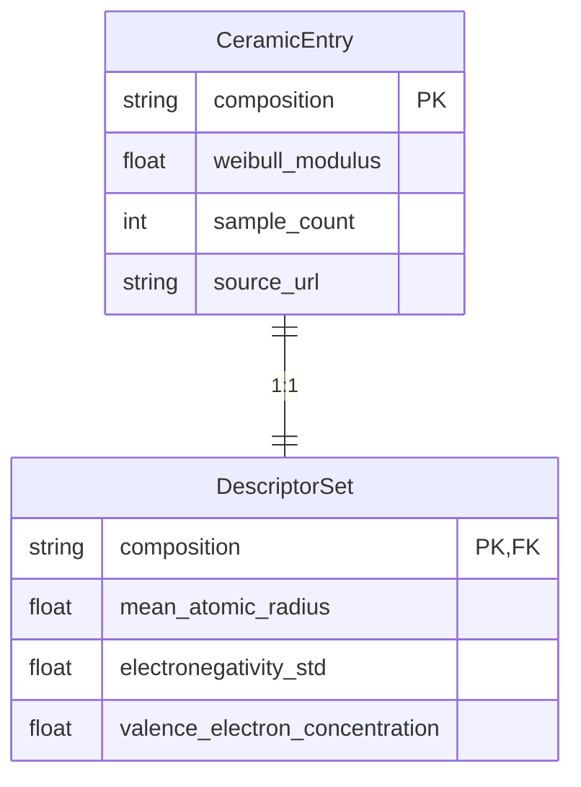

# Data Model Specification: Predicting the Impact of Composition on the Weibull Modulus of Ceramics

This document defines the core data entities, their relationships, and validation rules for the `PROJ-314-predicting-the-impact-of-composition-on-` pipeline. It serves as the contract between the data ingestion, descriptor computation, and modeling stages.

## 1. Entity Definitions

### 1.1 `CeramicEntry`

The `CeramicEntry` represents a single experimental observation of a ceramic material. It contains the raw composition, the target property (Weibull modulus), and metadata regarding the experimental conditions. This entity is the atomic unit of the dataset.

**Source**: Derived from raw data fetched from Materials Project, NIST, and curated literature (arXiv).

**Schema**:

| Field Name | Type | Description | Constraints |
|:--- |:--- |:--- |:--- |
| `composition` | `str` | Chemical formula in standard notation (e.g., "Al2O3", "BaTiO3"). | **Required**. Must be parseable by `chemparse`. |
| `weibull_modulus` | `float` | The measured Weibull modulus ($m$) of the material. | **Required**. Must be > 0. |
| `sample_count` | `int` | Number of samples ($N$) used to derive the Weibull modulus. | **Required**. Used for data gap validation (FR-003). |
| `is_range_flag` | `bool` | Indicates if the original `weibull_modulus` was a range. | Default: `False`. |
| `range_original` | `str` | Original string representation if `is_range_flag` is true (e.g., "5.2-6.1"). | Nullable. |
| `range_uncertainty` | `float` | Calculated uncertainty: $(max - min) / 2$. | Nullable. Computed in T018b. |
| `primary_anion_cation_group` | `str` | Derived grouping feature (e.g., "Group 13 Oxide"). | **Required**. Derived from stoichiometry in T018a. |
| `sintering_temp` | `float` | Sintering temperature in Celsius. | Nullable. Imputed if missing. |
| `is_imputed` | `bool` | Flag indicating if any primary fields were imputed. | Default: `False`. |
| `source_id` | `str` | Unique identifier for the source publication/dataset. | **Required**. |
| `source_url` | `str` | URL or DOI of the source. | **Required**. Validated in T009b. |

**Validation Rules**:
1. **Stoichiometry**: The `composition` field must strictly adhere to stoichiometric ratios. Non-stoichiometric phases are excluded unless the specific class has $\ge 5$ samples (T018a).
2. **Sample Size**: Entries with `sample_count` < 30 are excluded from the primary dataset (T018a, FR-003).
3. **Imputation**: If `sintering_temp` is missing, it is imputed using the group median, then global median if the group is empty. The `is_imputed` flag must be set to `True` in this case.
4. **Range Handling**: If `weibull_modulus` is provided as a range, `is_range_flag` must be `True`, and `range_uncertainty` must be calculated.

---

### 1.2 `DescriptorSet`

The `DescriptorSet` is a computed feature vector associated with a `CeramicEntry`. It contains elemental and structural descriptors derived from the `composition` field. These features are used as inputs for the predictive models.

**Relationship**: One-to-One with `CeramicEntry`. Each `CeramicEntry` maps to exactly one `DescriptorSet`.

**Schema**:

| Field Name | Type | Description | Calculation Logic |
|:--- |:--- |:--- |:--- |
| `composition` | `str` | Foreign key to `CeramicEntry`. | Inherited. |
| `mean_atomic_radius` | `float` | Weighted mean of atomic radii of constituent elements. | $\sum (x_i \cdot r_i)$ where $x_i$ is mole fraction. |
| `electronegativity_std` | `float` | Standard deviation of electronegativity values. | Std dev of Pauling scale values. |
| `cation_size_variance` | `float` | Variance in cation sizes. | Variance of radii for cationic species only. |
| `valence_electron_concentration` | `float` | Average valence electrons per atom. | $\sum (valence_i) / \text{total atoms}$. |
| `mean_atomic_mass` | `float` | Weighted mean atomic mass. | $\sum (x_i \cdot mass_i)$. |
| `packing_fraction` | `float` | Estimated atomic packing factor. | Derived from ionic radii and crystal structure assumptions. |
| `descriptor_vector` | `List[float]` | Vector of all numeric descriptors. | Concatenation of all numeric fields. |

**Validation Rules**:
1. **Completeness**: No field in `DescriptorSet` may contain `NaN` or `None`. Missing values must be imputed or the row excluded (T020).
2. **Primary Predictors**: The fields `mean_atomic_radius`, `electronegativity_std`, and `valence_electron_concentration` are designated as **Primary Predictors**. If any of these are missing after imputation, the entry is invalid (T020).
3. **Range**: All numeric descriptors must be positive (except for potentially signed differences in variance calculations, but typically radii/masses are positive).

---

## 2. Relationships and Data Flow

1. **Ingestion**: Raw data is fetched (T018c/d/e) and converted into a list of `CeramicEntry` objects (raw state).
2. **Cleaning**: `CeramicEntry` objects are filtered and imputed (T018a).
3. **Descriptor Computation**: For each valid `CeramicEntry`, a `DescriptorSet` is computed (T019).
4. **Modeling**: The `DescriptorSet` features are joined with the `CeramicEntry` target (`weibull_modulus`) to form the training matrix.

---

## 3. Data Integrity and Compliance

### 3.1 Constitution Principle II (Source Validation)
Every `CeramicEntry` must have a validated `source_url` or DOI. The `validate_source_citations()` function (T009b) ensures that the title overlap with the source is $\ge 0.7$ and the URL is reachable. Failures are logged to `logs/citation_validation.log`.

### 3.2 Data Gap Protocol
If the total count of valid `CeramicEntry` objects ($N$) is less than 30, the pipeline halts. A `data_availability_report.json` is generated (T017b) before exiting. This ensures that models are not trained on statistically insignificant data.

### 3.3 Leakage Prevention
The `primary_anion_cation_group` (derived in T018a) is used for stratified splitting (T026) but must be verified against the `DescriptorSet` features to ensure it is not a proxy for the target that bypasses physical descriptors (T030).

---

## 4. File Artifacts

The data model is realized in the following file artifacts:

- **Input**: `data/raw/materials_project_raw.json`, `data/raw/nist_raw.json`, `data/raw/arxiv_raw.json`
- **Processed**: `data/processed/cleaned_ceramics.csv` (Contains merged `CeramicEntry` and `DescriptorSet` fields)
- **Reports**: `data/reports/data_availability_report.json`, `data/results/model_metrics.json`

## 5. Versioning

This data model corresponds to **Plan Phase 1, Task 1.5**. Any changes to the schema require an update to this document and a re-run of the ingestion pipeline to ensure consistency.