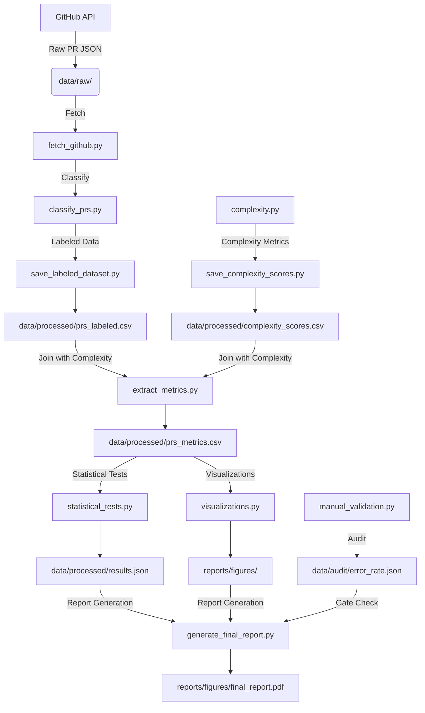

# Evaluating the Impact of Code Generation on Code Review Quality Using LLMs

This project implements an automated scientific pipeline to evaluate the impact of AI-generated code (e.g., GitHub Copilot) on code review quality. It fetches Pull Requests (PRs) from prioritized repositories, classifies them as LLM-generated or human-written, extracts review metrics, performs statistical analysis, and generates a comprehensive research report.

## 📋 Table of Contents

- [Installation](#installation)
- [Usage](#usage)
- [Data Flow](#data-flow)
- [Project Structure](#project-structure)
- [Configuration](#configuration)
- [Testing](#testing)
- [License](#license)

---

## 🔧 Installation

1. **Clone the repository**:
 ```bash
 git clone <repository-url>
 cd <project-directory>
 ```

2. **Set up a virtual environment** (recommended):
 ```bash
 python -m venv venv
 source venv/bin/activate # On Windows: venv\Scripts\activate
 ```

3. **Install dependencies**:
 ```bash
 pip install -r requirements.txt
 ```

 **Required Dependencies**:
 - `requests` - HTTP library for GitHub API
 - `pandas` - Data manipulation and analysis
 - `scipy` - Statistical tests (Mann-Whitney U, t-tests)
 - `networkx` - Graph analysis (if applicable)
 - `matplotlib` - Visualization
 - `seaborn` - Statistical plotting
 - `pyyaml` - Configuration parsing
 - `statsmodels` - Advanced statistical modeling
 - `pytest` - Testing framework
 - `pycodestyle` - Code style checking

4. **Configure GitHub API Access**:
 - Set the `GITHUB_TOKEN` environment variable:
 ```bash
 export GITHUB_TOKEN="your_github_personal_access_token"
 ```
 - Alternatively, configure in `code/utils/config.py` (not recommended for production).

---

## 🚀 Usage

The pipeline is designed to run sequentially through data acquisition, classification, metric extraction, analysis, and reporting.

### 1. Setup Project Directories
Ensure all required directories exist:
```bash
python code/setup_directories.py
```

### 2. Fetch Pull Requests
Download raw PR data from prioritized repositories:
```bash
python code/data/fetch_github.py
```
**Output**: Raw JSON payloads saved to `data/raw/`.

### 3. Classify PRs
Label PRs as `llm` or `human` based on signatures and secondary detectors:
```bash
python code/data/classify_prs.py
```
**Output**: Classified data used for the labeled dataset.

### 4. Save Labeled Dataset
Consolidate classification results:
```bash
python code/data/save_labeled_dataset.py
```
**Output**: `data/processed/prs_labeled.csv`

### 5. Compute Complexity Scores
Calculate Cyclomatic Complexity and Lines of Code for PR diffs:
```bash
python code/analysis/save_complexity_scores.py
```
**Output**: `data/processed/complexity_scores.csv`

### 6. Extract Review Metrics
Calculate comment counts, time-to-merge, and review cycles:
```bash
python code/data/extract_metrics.py
```
**Output**: `data/processed/prs_metrics.csv`

### 7. Perform Statistical Analysis
Run Mann-Whitney U tests (primary) and t-tests (sensitivity):
```bash
python code/analysis/statistical_tests.py
```
**Output**: Statistical results aggregated in `data/processed/results.json`.

### 8. Generate Visualizations
Create boxplots, histograms, and correlation plots:
```bash
python code/analysis/visualizations.py
```
**Output**: Plots saved to `reports/figures/`.

### 9. Manual Validation (Audit)
Execute human-judgment checklist and calculate error rates:
```bash
python code/audit/manual_validation.py
```
**Output**: `data/audit/manual_audit_results.json` and `data/audit/error_rate.json`.

### 10. Generate Final Report
Compile all findings into a comprehensive PDF report:
```bash
python code/analysis/generate_final_report.py
```
**Output**: `reports/figures/final_report.pdf`

---

## 🔄 Data Flow

The following diagram illustrates the data flow through the pipeline:



**Key Artifacts**:
- **Raw Data**: `data/raw/*.json` (SHA-256 checksummed)
- **Labeled Dataset**: `data/processed/prs_labeled.csv`
- **Complexity Scores**: `data/processed/complexity_scores.csv`
- **Metrics**: `data/processed/prs_metrics.csv`
- **Results**: `data/processed/results.json`
- **Audit**: `data/audit/error_rate.json`
- **Final Report**: `reports/figures/final_report.pdf`

---

## 📁 Project Structure

```
.
├── code/
│ ├── analysis/
│ │ ├── complexity.py # Complexity calculation
│ │ ├── statistical_tests.py # Mann-Whitney U & t-tests
│ │ ├── visualizations.py # Plot generation
│ │ └── generate_final_report.py # Report compilation
│ ├── audit/
│ │ └── manual_validation.py # Human audit logic
│ ├── data/
│ │ ├── fetch_github.py # GitHub API client
│ │ ├── classify_prs.py # LLM/Human classification
│ │ ├── save_labeled_dataset.py # Dataset consolidation
│ │ └── extract_metrics.py # Metric extraction
│ ├── utils/
│ │ ├── config.py # Configuration management
│ │ ├── logging.py # Logging infrastructure
│ │ ├── seeds.py # Random seed management
│ │ └── checksum.py # SHA-256 checksumming
│ └── setup_directories.py # Project initialization
├── data/
│ ├── raw/ # Raw JSON from GitHub
│ ├── processed/ # Intermediate CSV/JSON
│ └── audit/ # Audit results
├── reports/
│ └── figures/ # Final PDF and plots
├── tests/
│ ├── unit/ # Unit tests
│ └── integration/ # Integration tests
├── requirements.txt
└── README.md
```

---

## ⚙️ Configuration

Project settings are managed in `code/utils/config.py`. Key configurations include:

- **Repository List**: Prioritized list of GitHub repos (e.g., `psf/requests`, `microsoft/vscode`).
- **API Settings**: Rate limits, timeout, and pagination settings.
- **Classification Thresholds**: Confidence score cutoffs for `llm` vs `human` labeling.
- **Audit Settings**: Sample size rules and error rate thresholds.
- **Complexity Settings**: Memory usage fallback thresholds.

Example configuration override:
```python
# In code/utils/config.py
REPO_LIST = ["psf/requests", "microsoft/vscode"]
CLASSIFICATION_THRESHOLD = 0.6
AUDIT_ERROR_RATE_LIMIT = 0.05
```

---

## 🧪 Testing

Run the test suite to verify pipeline integrity:

```bash
pytest tests/ -v
```

**Key Test Modules**:
- `tests/unit/test_classification.py`: Bot signature and confidence logic.
- `tests/unit/test_detection.py`: Entropy and n-gram anomaly detection.
- `tests/unit/test_metrics.py`: Metric calculation correctness.
- `tests/unit/test_statistical_tests.py`: Statistical test implementations.
- `tests/integration/test_fetch_pipeline.py`: API rate-limit handling.

---

## 📝 License

This project is licensed under the MIT License - see the LICENSE file for details.

---

## 🤝 Contributing

1. Fork the repository.
2. Create a feature branch (`git checkout -b feature/amazing-feature`).
3. Commit your changes (`git commit -m 'Add amazing feature'`).
4. Push to the branch (`git push origin feature/amazing-feature`).
5. Open a Pull Request.

**Note**: Ensure all tests pass and code style conforms to `black` and `ruff` standards before submitting.