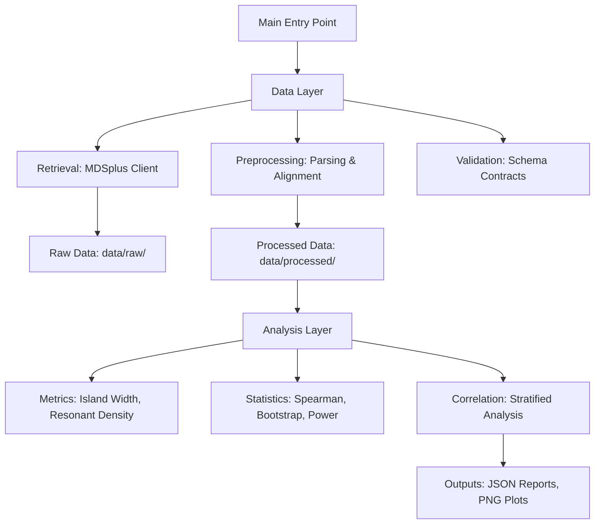

# Quantifying the Impact of Magnetic Field Topology on Plasma Confinement

**Project ID**: PROJ-332
**Status**: Active Research Pipeline
**Objective**: Analyze DIII-D tokamak discharge data to quantify the correlation between magnetic island width (topology) and energy confinement time (tau_e), specifically investigating the hypothesis that larger magnetic islands degrade confinement.

---

## 📖 Overview

This project implements an automated scientific pipeline to retrieve, process, and analyze experimental fusion data from the DIII-D National Fusion Facility. The core research question is whether magnetic field topology—specifically the width of magnetic islands and the density of resonant surfaces—has a statistically significant impact on plasma energy confinement.

The pipeline adheres to strict scientific reproducibility standards:
- **Real Data Only**: No synthetic data fallbacks. The pipeline fails loudly if real data from the MDSplus archive cannot be retrieved.
- **Reproducibility**: Fixed random seeds for all stochastic processes (bootstrap resampling).
- **Statistical Rigor**: Includes power analysis, multicollinearity checks, and bootstrap confidence intervals.
- **Validation**: Strict schema validation against defined contracts.

---

## 🏗 Architecture

The project follows a modular, layered architecture designed for maintainability and independent testing of user stories.



### Directory Structure

- `code/`: Source code for the pipeline.
 - `data/`: Retrieval, preprocessing, and validation logic.
 - `analysis/`: Metric calculation, statistical analysis, and reporting.
 - `viz/`: Visualization generation.
 - `utils/`: Logging, timeouts, and shared utilities.
- `data/`: Data artifacts.
 - `raw/`: Original data fetched from MDSplus (if cached).
 - `processed/`: Unified analysis-ready CSVs and metrics.
- `outputs/`: Final reports, plots, and summary statistics.
- `contracts/`: Schema definitions (YAML) for input/output validation.
- `tests/`: Unit and integration tests.
- `specs/`: Feature specifications and design documents.

---

## 🚀 Quick Start

### Prerequisites

- Python 3.9+
- Access to the DIII-D MDSplus public archive (network required)
- `pip` for dependency management

### Installation

1. **Clone the repository**:
 ```bash
 git clone <repo-url>
 cd PROJ-332-quantifying-the-impact-of-magnetic-field
 ```

2. **Create a virtual environment**:
 ```bash
 python -m venv venv
 source venv/bin/activate # On Windows: venv\Scripts\activate
 ```

3. **Install dependencies**:
 ```bash
 pip install -r requirements.txt
 ```

4. **Install MDSplus** (Required for data retrieval):
 - Follow the official installation guide: certificate verify failed: unable to get local issuer certificate (_ssl.c:1016)')))]
 - Ensure `mdsplus` Python bindings are available in your environment.

### Execution

Run the full pipeline with a list of DIII-D discharge IDs:

```bash
python code/main.py --discharges 123456 123457 123458 --timeout 3600
```

**Arguments**:
- `--discharges`: Space-separated list of DIII-D discharge numbers.
- `--timeout`: Execution timeout in seconds (default: 3600).

**Outputs**:
- `data/processed/unified_analysis.csv`: The curated dataset.
- `outputs/summary_report.json`: Statistical results (correlation, p-value, power).
- `outputs/topology_vs_confinement.png`: Diagnostic scatter plot.

---

## 🔬 Scientific Methodology

### 1. Data Retrieval (User Story 1)
- Connects to the public MDSplus archive.
- Fetches EFIT equilibrium data, magnetic island metrics, and confinement times (`tau_e`, `h98y2`).
- **Fallback**: If pre-calculated island width is missing, the pipeline attempts derivation using the Rutherford equation (requires local magnetic shear and perturbation amplitude). If derivation inputs are missing, the discharge is excluded.

### 2. Metric Calculation (User Story 2)
- **Resonant Surface Density**: Counts rational surfaces ($q = m/n$) per unit normalized minor radius ($\rho_{tor}$) with $m, n \in [1, 10]$ and tolerance $|q - m/n| < 0.01$.
- **Outlier Detection**: Flags discharges where island width exceeds the minor radius.
- **Power Analysis**: Calculates statistical power *before* correlation. If power < 20% to detect $|r|=0.5$, results are flagged as "Inconclusive".
- **Multicollinearity Check**: Checks correlation between $q_{max} - q_{min}$ and resonant surface density. If $> 0.95$, the density metric is excluded from multivariate analysis.

### 3. Statistical Correlation (User Story 3)
- **Stratification**: If $N \ge 3$ for both L-mode and H-mode, correlations are calculated separately. Otherwise, a global correlation is computed with a warning.
- **Method**: Spearman rank correlation with **Bootstrap Resampling** ($N=1000$, seed=42) for confidence intervals.
- **Hypothesis Testing**:
 - $H_0$: No correlation ($r = 0$).
 - $H_1$: Negative correlation ($r < -0.5$).
- **Output**: Reports effect size ($|r|$), p-value, 95% CI, and hypothesis status.

---

## 📊 Data Contracts

The pipeline enforces strict schemas defined in `contracts/`:

- **Input Schema** (`dataset.schema.yaml`): Defines required columns for the unified dataset (e.g., `discharge_id`, `island_width`, `tau_e`, `te_profile`).
- **Output Schema** (`output.schema.yaml`): Defines the structure of the final statistical report (e.g., `p_value`, `ci_lower`, `hypothesis_status`).

Validation occurs automatically after parsing and before analysis.

---

## 🧪 Testing

Run the test suite:

```bash
pytest tests/ -v
```

- **Unit Tests**: Verify individual functions (e.g., `calculate_resonant_surface_density`, `stratify_by_mode`).
- **Integration Tests**: Verify end-to-end data flow against known DIII-D discharges (if network available) or mock data structures.

---

## 🛠 Development

### Code Quality
- **Linting**: `flake8` (max-line-length: 88)
- **Formatting**: `black` (line-length: 88)
- **Pre-commit**: Recommended to run `black` and `flake8` before committing.

### Adding New Discharges
To add new discharges to the analysis, simply update the `--discharges` argument in `code/main.py` or the configuration file. The pipeline will automatically fetch and process them.

---

## 📄 License & Citation

This project is part of the **llmXive automated science pipeline**.
Data sourced from the **DIII-D National Fusion Facility** (managed by General Atomics for the U.S. Department of Energy).

---

## 📞 Contact

For questions regarding the pipeline implementation or scientific methodology, refer to the `specs/` directory or the project lead.