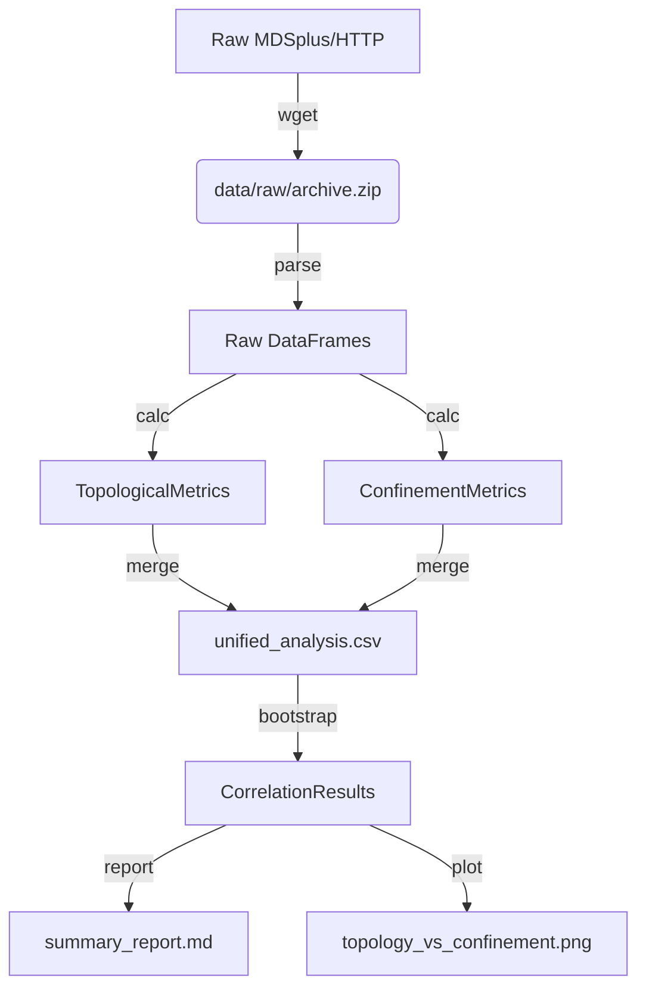

# Data Model: Quantifying the Impact of Magnetic Field Topology on Plasma Confinement

## Overview

This document defines the data structures for the pipeline: raw inputs, processed analysis data, and final outputs. All data flows from `data/raw/` to `data/processed/`.

## Entities

### 1. Discharge
A single tokamak shot.
*   **Attributes**: `discharge_id` (int), `timestamp` (datetime), `mode` (str: L-mode/H-mode), `status` (str: valid/invalid).

### 2. TopologicalMetric
Derived metrics for a discharge.
*   **Attributes**: `island_width` (float, meters), `resonant_surface_density` (float, surfaces/m), `q_min` (float), `q_max` (float).

### 3. ConfinementMetric
Derived confinement data.
*   **Attributes**: `tau_e` (float, seconds), `w_mhd` (float, Joules), `p_input` (float, Watts).

### 4. AnalysisResult
Final statistical output.
*   **Attributes**: `metric_name` (str), `correlation_coefficient` (float), `p_value` (float), `ci_lower` (float), `ci_upper` (float), `effect_size_magnitude` (float), `hypothesis_supported` (bool).

## Data Flow Diagram

## File Specifications

### Input: `data/raw/*.zip`
*   **Format**: Compressed archive containing MDSplus dumps or EFIT files.
*   **Checksum**: SHA-256 recorded in `state/...yaml`.

### Processed: `data/processed/unified_analysis.csv`
*   **Format**: CSV (UTF-8).
*   **Columns**:
    *   `discharge_id`: Integer.
    *   `island_width`: Float (m).
    *   `resonant_surface_density`: Float (1/m).
    *   `tau_e`: Float (s).
    *   `mode`: String.
    *   `valid`: Boolean.
    *   `confinement_deviation`: Float - Normalized confinement time using IPB98(y,2) scaling law

### Output: `data/processed/correlation_results.json`
*   **Format**: JSON.
*   **Structure**: Array of `AnalysisResult` objects.

### Output: `data/processed/topology_vs_confinement.png`
*   **Format**: PNG (300 DPI).
*   **Content**: Scatter plot of `island_width` (x) vs `tau_e` (y) with regression line and confidence interval shading.

## Data Hygiene Rules

1.  **Immutability**: Raw files in `data/raw/` are never modified.
2.  **Derivation**: `unified_analysis.csv` is derived from raw files via `parsing.py` and `topology.py`.
3.  **Checksums**: Every file written to `data/` is checksummed and logged.
4.  **Missing Data**: Rows with missing `island_width` or `tau_e` are excluded from the analysis CSV but logged in `data/processed/exclusions.log`.
