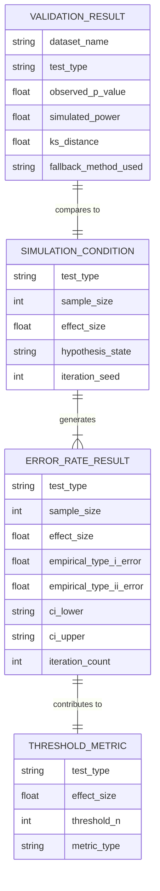

# Data Model: Evaluating the Sensitivity of Common Statistical Tests to Dataset Size

## Overview

This document defines the data structures, schemas, and storage formats used in the project. All data is stored in `data/` with checksums recorded in the project state.

## Entity-Relationship Diagram (Conceptual)



## Data Files & Schemas

### 1. Simulation Metadata (`data/simulation_metadata.json`)

Stores configuration and seeds for reproducibility.

```yaml
# Contract: contracts/simulation_metadata.schema.yaml
$schema: "http://json-schema.org/draft-07/schema#"
type: object
properties:
  project_id:
    type: string
  timestamp:
    type: string
    format: date-time
  config:
    type: object
    properties:
      sample_sizes:
        type: array
        items:
          type: integer
      effect_sizes:
        type: array
        items:
          type: number
      iterations_per_condition:
        type: integer
      seed:
        type: integer
      tests:
        type: array
        items:
          type: string
  checksums:
    type: object
    additionalProperties:
      type: string
```

### 2. Error Rate Results (`data/simulation/error_rates.csv`)

Aggregated results for each condition.

```yaml
# Contract: contracts/error_rates.schema.yaml
$schema: "http://json-schema.org/draft-07/schema#"
type: object
properties:
  type:
    type: string
    const: "FeatureCollection"
  features:
    type: array
    items:
      type: object
      properties:
        test_type:
          type: string
          enum: ["t-test", "anova", "chi-squared"]
        sample_size:
          type: integer
        effect_size:
          type: number
        hypothesis_state:
          type: string
          enum: ["null", "alternative"]
        empirical_error_rate:
          type: number
          minimum: 0
          maximum: 1
        ci_lower:
          type: number
        ci_upper:
          type: number
        iteration_count:
          type: integer
      required:
        - test_type
        - sample_size
        - effect_size
        - hypothesis_state
        - empirical_error_rate
        - ci_lower
        - ci_upper
        - iteration_count
```

### 3. Threshold Metrics (`data/simulation/thresholds.json`)

Identified reliability thresholds.

```yaml
# Contract: contracts/thresholds.schema.yaml
$schema: "http://json-schema.org/draft-07/schema#"
type: object
properties:
  threshold_type:
    type: string
    enum: ["type_i_reliability", "power_reliability"]
  test_type:
    type: string
  effect_size:
    type: number
  threshold_sample_size:
    type: integer
  confidence_interval:
    type: object
    properties:
      lower:
        type: number
      upper:
        type: number
    required:
      - lower
      - upper
  description:
    type: string
```

### 4. Validation Results (`data/validation/results.csv`)

Comparison of simulation vs. real-world data.

```yaml
# Contract: contracts/validation_results.schema.yaml
$schema: "http://json-schema.org/draft-07/schema#"
type: object
properties:
  dataset_name:
    type: string
  test_type:
    type: string
  sample_size:
    type: integer
  observed_p_value:
    type: number
  simulated_power:
    type: number
  ks_distance:
    type: number
  alignment_status:
    type: string
    enum: ["aligned", "deviated", "inconclusive"]
  fallback_method_used:
    type: string
    enum: ["none", "yates_correction", "fisher_exact"]
```

## Data Flow

1.  **Generation**: `simulation/data_generator.py` creates synthetic data based on `SIMULATION_CONDITION`.
2.  **Testing**: `simulation/test_runner.py` applies statistical tests and calculates p-values.
3.  **Aggregation**: `analysis/threshold_finder.py` aggregates p-values into `ERROR_RATE_RESULT` and identifies `THRESHOLD_METRIC`.
4.  **Validation**: `analysis/validator.py` loads public datasets, runs tests, and generates `VALIDATION_RESULT`.
5.  **Visualization**: `visualization/plotter.py` reads `ERROR_RATE_RESULT` and `THRESHOLD_METRIC` to generate plots.