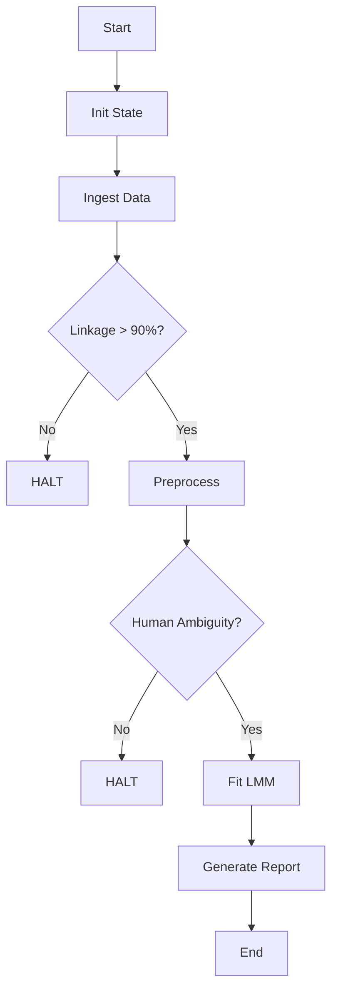

# Architecture Overview

## Design Principles

### Principle V: Versioning
All significant artifacts (data, models, reports) are recorded in `state/projects/PROJ-345/state.yaml`.
- `project_id`: Unique identifier.
- `created_at`: ISO timestamp.
- `artifact_hashes`: Dictionary of file paths to SHA-256 checksums.

### Principle VI: Distinct Stimulus Sets
The `code/data/integrity.py` module ensures primes and targets are never merged prematurely.
- `validate_distinct_stimulus_sets()`: Checks for overlap in stimulus IDs.
- `prevent_premature_merge()`: Enforces separation during ingestion.

## Module Dependencies

1. **Ingestion** (`code/data/ingest.py`)
 - Downloads raw CSVs and images.
 - Validates image presence.
 - Outputs `linked_trials.csv`.

2. **Preprocessing** (`code/data/preprocess.py`)
 - Runs VAD inference on prime images.
 - Validates human-rated ambiguity.
 - Checks for confounding variables.

3. **Modeling** (`code/models/lmm.py`)
 - Aggregates data to stimulus level.
 - Fits LMM with retry logic for convergence.
 - Applies FDR correction.

4. **Reporting** (`code/reports/generate_report.py`)
 - Generates PDF reports using `matplotlib` and `pandas` tables.
 - Includes sensitivity analysis and limitations.

## Configuration

Paths and seeds are managed in `code/config.py`.
- `Config.DATA_RAW`, `Config.DATA_PROCESSED`, etc.
- `Config.SEED`: Fixed random seed for reproducibility.

## Execution Flow

