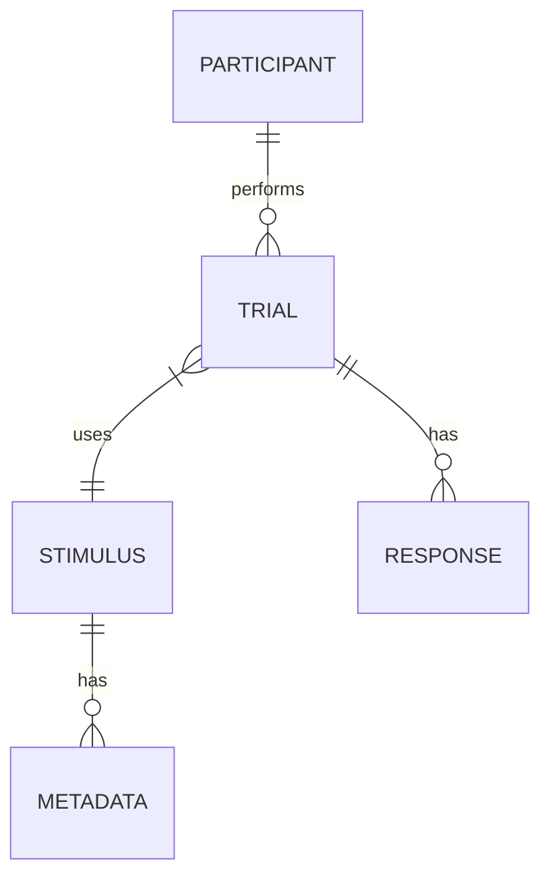

# Data Model: The Influence of Visual Priming on Implicit Attitudes Towards Ambiguous Social Stimuli

## 1. Entity Relationship Diagram (Conceptual)

## 2. Schema Definitions

### Participant
- `participant_id`: String (Unique ID)
- `demographics`: JSON (Optional: age, gender, etc., if available in source)

### Stimulus
- `stimulus_id`: String (Unique ID)
- `stimulus_type`: Enum ('image', 'word')
- `stimulus_path`: String (Relative path to file in `data/primes/` or `data/targets/`)
- `valence_score`: Float (Derived: -1 to 1, via VAD regression model)
- `ambiguity_score`: Float (Derived: 0 to 1, 1 = high ambiguity) - **Source: Human-rated or external validated metric ONLY**
- `source_dataset`: String (URL of origin)

### Trial
- `trial_id`: String (Unique ID)
- `participant_id`: String (FK)
- `stimulus_id`: String (FK)
- `prime_condition`: Enum ('positive', 'negative', 'neutral')
- `response_time_ms`: Float (Primary outcome)
- `correct`: Boolean (Accuracy of response)
- `timestamp`: DateTime

### Metadata (Derived) - **Single Source of Truth**
- **Storage**: `data/processed/stimulus_metadata.csv`
- `linkage_status`: Enum ('verified', 'derived', 'missing')
- `derivation_method`: String (e.g., "vad_model_affectnet", "human_rating_source_x")
- `valence_confidence`: Float (Optional: model confidence for valence)
- `ambiguity_source`: String (e.g., "human_rated", "external_dataset_y")

## 3. Data Flow

1. **Ingestion**: Raw CSV/Parquet -> `data/raw/`
2. **Validation**: 
   - Check for visual stimuli files (halt if missing).
   - Check for human-rated ambiguity or flag for fallback.
   - Check for prime confounding (trial order/block).
3. **Derivation**:
   - Images -> VAD Model -> `valence_score`.
   - Human Ratings -> `ambiguity_score`.
4. **Cleaning**: Filter trials with missing linkage > 10% (US-1, Scenario 3).
5. **Aggregation**: Aggregate trials to `participant_id` x `stimulus_id` to calculate `mean_response_time`.
6. **Modeling**: Aggregated data -> LMM (without stimulus random effect).
7. **Reporting**: Aggregated results -> PDF.

## 4. Constraints & Hygiene

- **No PII**: `participant_id` must be anonymized.
- **Immutability**: Raw files in `data/raw/` are never modified.
- **Checksums**: All files in `data/` must have corresponding SHA-256 hashes in `state/`.
- **Separation**: `data/primes/` and `data/targets/` must remain distinct until the final merge for modeling.
- **Single Source**: `data/processed/stimulus_metadata.csv` is the authoritative source for all derived metrics.
