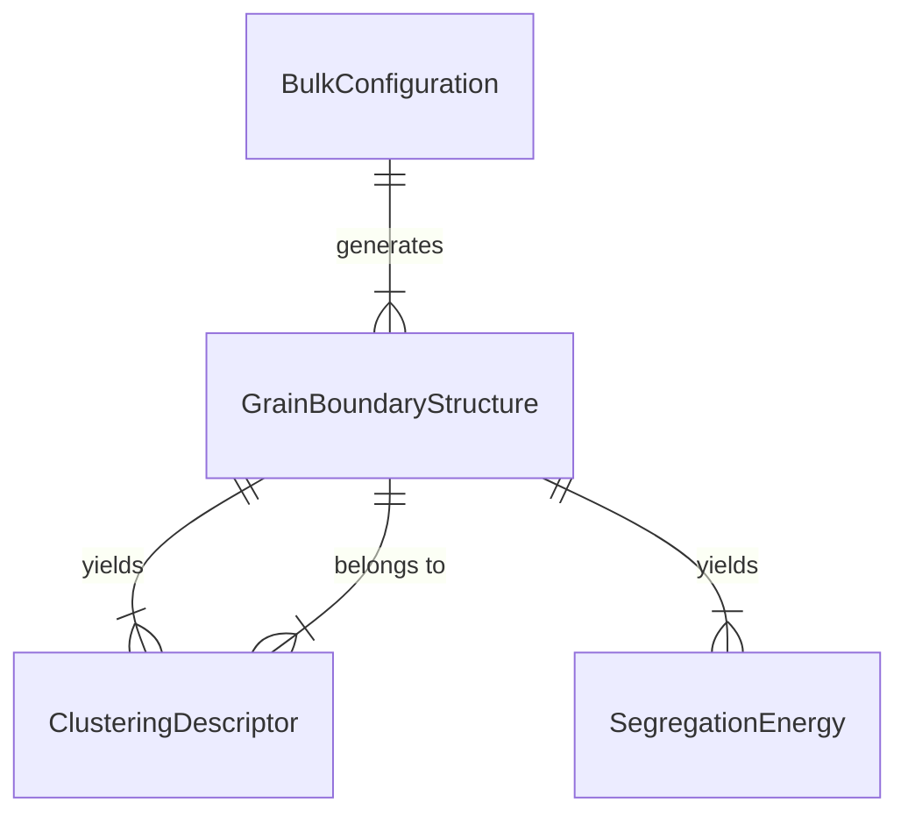

# Data Model: Predicting the Impact of Impurity Clustering on Grain Boundary Segregation

## 1. Entity Relationship Overview

The data model connects bulk material properties to grain boundary (GB) specific features and resulting thermodynamic outcomes.

## 2. Entity Definitions

### BulkConfiguration
Represents the initial state of the material before GB construction.
- **Attributes**:
  - `material_id` (string): Unique identifier from OQMD/MP.
  - `composition` (dict): {Element: Count}.
  - `lattice_params` (list[float]): [a, b, c, alpha, beta, gamma].
  - `structure_type` (string): e.g., "FCC", "BCC".
  - `download_source` (string): URL of origin.

### GrainBoundaryStructure
Represents the constructed GB supercell.
- **Attributes**:
  - `gb_id` (string): Unique hash of the configuration.
  - `bulk_config_id` (string): FK to `BulkConfiguration`.
  - `boundary_plane` (list[int]): Miller indices (h k l).
  - `misorientation_angle` (float): Degrees.
  - `supercell_atoms` (int): Total atom count.
  - `interface_region_mask` (list[int]): Indices of atoms within the interface zone.

### ClusteringDescriptor
Quantitative metrics of impurity arrangement at the interface.
- **Attributes**:
  - `descriptor_id` (string): Unique ID.
  - `gb_id` (string): FK to `GrainBoundaryStructure`.
  - `impurity_species` (string): Element symbol.
  - `descriptor_type` (string): "RDF_peak", "pair_correlation", "voronoi_count".
  - `value` (float): Numeric result.
  - `radius_bin` (float): For RDF/pair correlation.

### SegregationEnergy
The target thermodynamic variable.
- **Attributes**:
  - `energy_id` (string): Unique ID.
  - `gb_id` (string): FK to `GrainBoundaryStructure`.
  - `energy_value` (float): Segregation energy in eV.
  - `reference_state` (string): Definition of the reference energy.
  - `simulation_method` (string): e.g., "EAM", "DFT".

## 3. Data Flow

1.  **Ingestion**: `BulkConfiguration` created from OQMD CSV/Parquet.
2.  **Transformation**: `BulkConfiguration` $\to$ `GrainBoundaryStructure` (via `gb_builder`).
3.  **Feature Extraction**: `GrainBoundaryStructure` $\to$ `ClusteringDescriptor` (via `descriptors`).
4.  **Labeling**: `GrainBoundaryStructure` $\to$ `SegregationEnergy` (via `simulate_energy`).
5.  **Aggregation**: All entities merged into a single DataFrame for modeling.

## 4. Storage Strategy

- **Raw Data**: `data/raw/` (CSV/JSON/Structure files).
- **Processed Data**: `data/processed/descriptors.csv`, `data/processed/energies.csv`.
- **Final Dataset**: `data/processed/final_dataset.parquet` (merged for modeling).
- **Checksums**: `state/.../artifact_hashes` maps file paths to SHA256 hashes.
