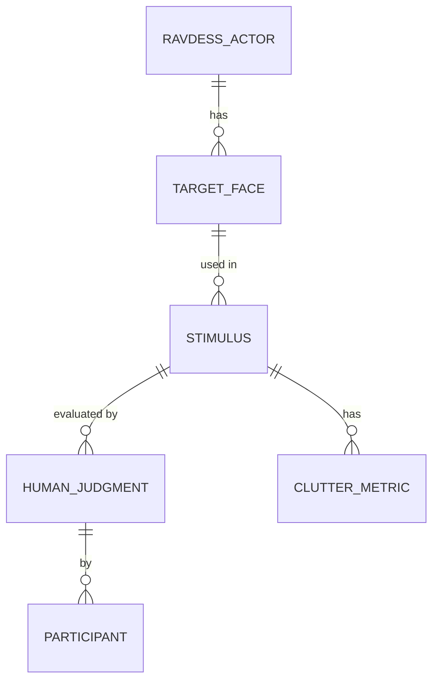

# Data Model: The Impact of Visual Crowding on Facial Emotion Recognition Accuracy

## Entity Relationship Diagram (Conceptual)

## Core Entities

### 1. RAVDESS_ACTOR (Derived from Source)
*Metadata about the actors in the RAVDESS dataset.*
- `actor_id`: String (Unique identifier from RAVDESS)
- `gender`: String (Male/Female)
- `age_group`: String (Adult/Child)
- `emotion_category`: String (One of 8 categories)

### 2. STIMULUS (Generated)
*A generated image combining a target face with flankers.*
- `stimulus_id`: String (UUID or hash)
- `target_face_path`: String (Relative path to source image)
- `flanker_count`: Integer (1, 3, 5)
- `eccentricity_deg`: Float (2.0, 4.0, 6.0)
- `emotion_label`: String (Target emotion)
- `file_path`: String (Path to generated image)
- `created_at`: Timestamp
- `is_valid`: Boolean (True if no overlap errors)
- `exclusion_reason`: String (Nullable, e.g., "Overlap detected")

### 3. CLUTTER_METRIC (Computed)
*Numerical measures of visual crowding intensity.*
- `metric_id`: String (UUID)
- `stimulus_id`: String (FK to STIMULUS)
- `local_contrast_variance`: Float
- `spatial_frequency_energy`: Float
- `computation_timestamp`: Timestamp

### 4. PARTICIPANT (Human Subject)
*Identifier for human observers.*
- `participant_id`: String (Anonymized ID, e.g., "P001")
- `demographics`: JSON (Optional, e.g., age, gender) - *PII must be excluded*

### 5. HUMAN_JUDGMENT (Outcome Data)
*Participant response to a stimulus.*
- `judgment_id`: String (UUID)
- `stimulus_id`: String (FK to STIMULUS)
- `participant_id`: String (FK to PARTICIPANT)
- `true_emotion`: String (From STIMULUS)
- `response_emotion`: String (Participant's choice)
- `accuracy`: Boolean (True if response == true_emotion)
- `response_time_ms`: Integer (Optional)
- `timestamp`: Timestamp

### 6. REGRESSION_RESULT (Model Output)
*Output of the GLMM analysis.*
- `result_id`: String
- `model_type`: String ("GLMM" or "FixedEffects")
- `coefficient_clutter`: Float
- `coefficient_emotion_[level]`: Float (Multiple)
- `interaction_clutter_emotion_[level]`: Float (Multiple)
- `p_value_clutter`: Float
- `p_value_interaction`: Float
- `fdr_corrected_p_value`: Float
- `convergence_status`: String ("Converged", "Failed")
- `model_config_hash`: String

## Data Flow

1.  **Ingestion**: `RAVDESS_ACTOR` data extracted from raw zip.
2.  **Generation**: `STIMULUS` created from `RAVDESS_ACTOR` + parameters.
3.  **Computation**: `CLUTTER_METRIC` computed from `STIMULUS`.
4.  **Collection**: `HUMAN_JUDGMENT` recorded from `PARTICIPANT` viewing `STIMULUS`.
5.  **Analysis**: `REGRESSION_RESULT` derived from `HUMAN_JUDGMENT` + `CLUTTER_METRIC`.

## Storage Format

- **Raw Data**: ZIP archive (RAVDESS).
- **Stimuli**: PNG/JPG images in `data/interim/stimuli/`.
- **Manifests**: JSON files (`stimulus_manifest.json`) linking `stimulus_id` to parameters.
- **Metrics**: CSV (`clutter_metrics.csv`).
- **Human Data**: CSV (`human_judgments.csv`).
- **Results**: YAML/JSON (`regression_results.yaml`).
