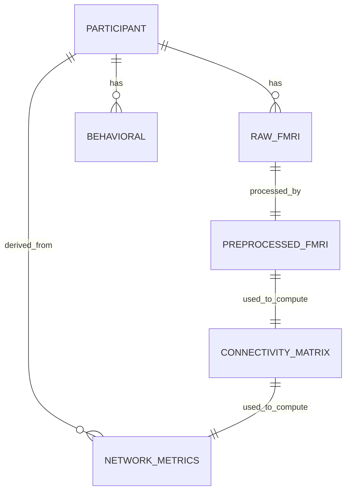

# Data Model: Investigating the Relationship Between Brain Network Dynamics and Response to Cognitive Training (Pivoted: Baseline Association)

## 1. Entity Relationship Overview

The project revolves around the `Participant` entity, linking raw imaging data, derived network metrics, and baseline behavioral outcomes.

## 2. Entity Definitions

### Participant
Unique identifier for a study subject.
- `participant_id` (string): e.g., "sub-01".
- `age` (integer): Years.
- `sex` (string): "M" or "F".
- `baseline_wm` (float): Baseline working memory score (Outcome variable).
- `included` (boolean): True if passed motion and data completeness checks.
- `exclusion_reason` (string): "motion", "missing_fMRI", "missing_behav", or null.

*Note: `post_wm` and `wm_gain` are NOT included as they do not exist in the dataset.*

### Raw_FMRI
Raw NIfTI file metadata.
- `participant_id` (string).
- `filepath` (string): Path to raw NIfTI.
- `checksum` (string): MD5/SHA256.
- `acquisition_date` (date): Optional.

### Preprocessed_FMRI
Output from fMRIPrep.
- `participant_id` (string).
- `filepath` (string): Path to preprocessed NIfTI.
- `mean_fd` (float): Mean Framewise Displacement.
- `max_fd` (float): Maximum Framewise Displacement.
- `status` (string): "success", "failed".

### ConnectivityMatrix
Derived 400x400 matrix.
- `participant_id` (string).
- `matrix_path` (string): Path to CSV/NumPy file.
- `method` (string): "pearson".
- `parcellation` (string): "schaefer_400".

### NetworkMetrics
Aggregated network statistics.
- `participant_id` (string).
- `global_efficiency` (float).
- `modularity_q` (float).
- `fpn_strength` (float): Average weight of edges within FPN.
- `dmn_strength` (float): Average weight of edges within DMN.
- `vif_fpn` (float): Variance Inflation Factor for FPN (calculated during regression prep).
- `vif_dmn` (float): Variance Inflation Factor for DMN.

### RegressionResult
Model output.
- `predictor` (string): e.g., "fpn_strength".
- `coefficient` (float).
- `std_error` (float).
- `p_value_perm` (float): Permutation p-value.
- `p_value_adjusted` (float): Holm-Bonferroni adjusted.
- `ci_lower` (float): 95% CI lower bound.
- `ci_upper` (float): 95% CI upper bound.
- `effect_size` (float): Standardized beta.

## 3. Data Flow

1. **Ingestion**: `download.py` fetches `ds000277`.
2. **Preprocessing**: `preprocess.py` runs fMRIPrep, outputs `Preprocessed_FMRI` and calculates `mean_fd`.
3. **Filtering**: Participants with `mean_fd > 0.3` are marked `excluded` with reason "motion". (Corrected from 3.0).
4. **Feature Extraction**: `metrics.py` computes `ConnectivityMatrix` and `NetworkMetrics`.
5. **Join**: `regression.py` joins `NetworkMetrics` with `Behavioral` data. Participants with missing `baseline_wm` are excluded.
6. **Modeling**: Regression is fitted; `RegressionResult` is generated.
7. **Output**: Results saved to `data/derived/model_summary.csv` and `data/derived/effect_sizes.pdf`.

## 4. Constraints & Validations

- **Motion Threshold**: `mean_fd` must be ≤ 0.3 for inclusion. (Corrected from 3.0).
- **Data Completeness**: `baseline_wm` must be non-null.
- **Matrix Symmetry**: Connectivity matrices must be symmetric (checked in `metrics.py`).
- **Parcellation**: Must use Schaefer 400 (checked in `metrics.py`).
- **ID Validation**: Participant IDs must exist in both rs-fMRI and behavioral data (FR-009).
