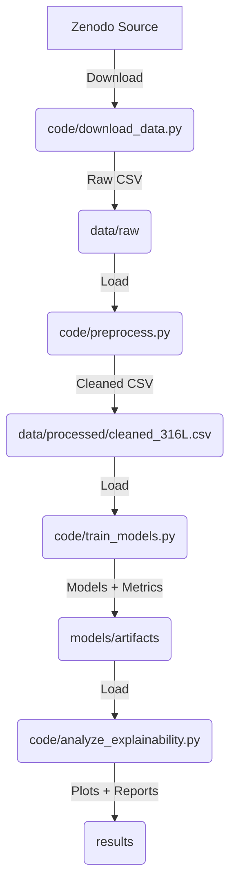

# Architecture Documentation

## Overview

This document outlines the architectural decisions, data flow, and module responsibilities for the 316L Porosity Prediction Pipeline.

## Design Principles

1. **Modularity**: Each stage of the pipeline is a standalone script.
2. **Reproducibility**: Fixed random seeds and explicit state tracking.
3. **Data Integrity**: Strict schema validation at every stage.
4. **Fail-Loud**: Scripts exit immediately on data or configuration errors.

## Data Flow

## Module Responsibilities

### `code/download_data.py`
- **Input**: Zenodo ID (env/config).
- **Process**: Fetch metadata, verify material type, download file, compute SHA-256.
- **Output**: Raw CSV, state update.

### `code/preprocess.py`
- **Input**: Raw CSV, Schema contract.
- **Process**:
 - Validate schema.
 - Map column names.
 - Handle missing values (median imputation).
 - Calculate Volumetric Energy Density (with fallback logic).
 - Normalize features.
 - Detect degenerate datasets.
- **Output**: Cleaned CSV, state update.

### `code/train_models.py`
- **Input**: Cleaned CSV.
- **Process**:
 - Split data (train/test or CV).
 - Train Gradient Boosting and MLP.
 - Compute baseline (DummyRegressor).
 - Evaluate metrics (RMSE, R²).
- **Output**: Pickled models, metrics JSON, state update.

### `code/analyze_explainability.py`
- **Input**: Best model, Cleaned CSV.
- **Process**:
 - Compute SHAP values.
 - Generate summary plots.
 - Permutation importance (1000 iterations).
 - Bootstrap confidence intervals (1000 iterations).
 - Statistical significance testing.
- **Output**: Plots, significance report, state update.

### `code/utils.py`
- **Role**: Shared utilities.
- **Functions**:
 - `setup_logging`: Configures logging to file and console.
 - `set_seed`: Ensures reproducibility.
 - `compute_file_hash`: SHA-256 for artifact versioning.
 - `load_state`/`update_state`: Manages `state.yaml`.

## State Management

The `state.yaml` file acts as a manifest for the pipeline's artifacts. It records:
- File paths of generated artifacts.
- SHA-256 hashes of those files.
- Timestamps of creation.

This allows the pipeline to detect changes in input data or code and re-run necessary stages.

## Error Handling Strategy

- **Data Errors**: Raise specific exceptions (e.g., `DegenerateDatasetError`) or exit with code 1.
- **Configuration Errors**: Fail early if environment variables or config files are missing.
- **Runtime Errors**: Log stack traces and exit cleanly.

## Dependencies

- **Core**: `pandas`, `numpy`, `scikit-learn`, `shap`, `matplotlib`, `seaborn`.
- **Utilities**: `pyyaml`, `jsonschema`.
- **Data Fetching**: `requests` (via Zenodo API).

## Future Considerations

- **Parallelization**: Potential for parallelizing cross-validation folds.
- **Hyperparameter Tuning**: Integration of Optuna or GridSearchCV.
- **Deployment**: Containerization via Docker for consistent execution environments.
