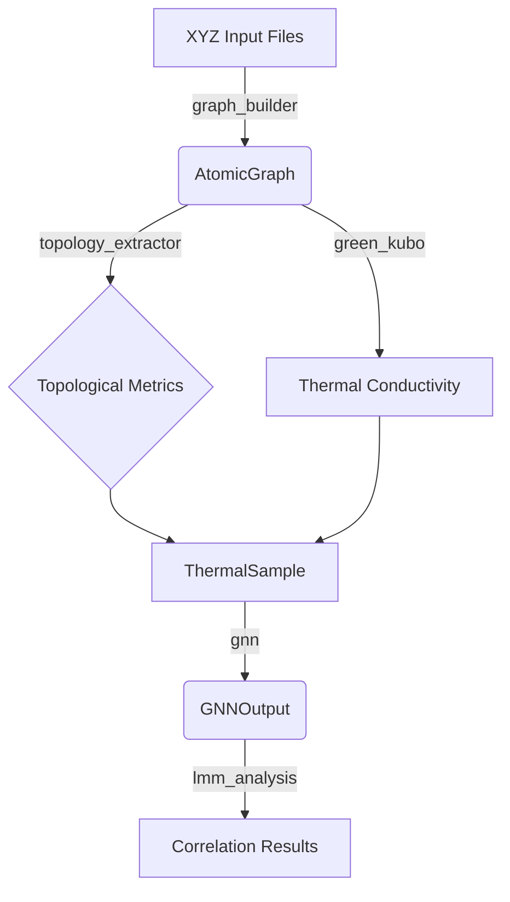

# Contracts and Data Models Documentation

This document provides a comprehensive overview of the data schemas and models
used throughout the `llmXive` automated science pipeline for quantifying the
influence of network topology on thermal conductivity in amorphous silicon.

## Overview

The project relies on strict schema validation to ensure data integrity across
the ingestion, simulation, and analysis stages. All data artifacts produced by
the pipeline must conform to the schemas defined in the `contracts/` directory.

## Schema Definitions

### 1. `atomic_graph.schema.yaml`

**Purpose**: Defines the structure of the atomic graph representation derived
from XYZ input files. This is the core data structure used for topological
analysis and GNN training.

**Key Fields**:
- `sample_id`: Unique identifier for the sample (string).
- `nodes`: List of atomic nodes.
 - `atomic_number`: Integer (e.g., 14 for Silicon).
 - `position`: List of 3 floats (x, y, z coordinates in Å).
 - `properties`: Dictionary of node-level features (e.g., `coordination_number`).
- `edges`: List of edges representing bonds.
 - `source`: Integer index of the source node.
 - `target`: Integer index of the target node.
 - `distance`: Float (bond length in Å).
- `metadata`:
 - `cutoff_distance`: Float (bond cutoff used, default 3.0 Å).
 - `num_atoms`: Integer.
 - `num_bonds`: Integer.
 - `graph_checksum`: String (SHA-256).

**Usage**:
- Generated by: `code/ingest/graph_builder.py`
- Consumed by: `code/metrics/topology_extractor.py`, `code/model/gnn.py`

### 2. `thermal_sample.schema.yaml`

**Purpose**: Defines the structure of a thermal sample, which couples an atomic
graph with its corresponding thermal conductivity measurement (ground truth)
and simulation metadata.

**Key Fields**:
- `sample_id`: Unique identifier (string).
- `graph_data`: Reference to the serialized `AtomicGraph` (or embedded structure).
- `conductivity`:
 - `value`: Float (W/m·K).
 - `uncertainty`: Float.
 - `method`: String (e.g., "Green-Kubo").
- `simulation_metadata`:
 - `converged`: Boolean.
 - `timesteps`: Integer.
 - `temperature`: Float (K).
 - `potential`: String (e.g., "Stillinger-Weber").
- `topological_metrics`: Dictionary of computed metrics (e.g., `mean_degree`, `clustering_coeff`).
- `excluded`: Boolean (True if outlier detection flagged this sample).
- `exclusion_reason`: String (optional).

**Usage**:
- Generated by: `code/simulation/thermal_sample_saver.py`
- Consumed by: `code/analysis/lmm_analysis.py`, `code/analysis/pearson_correlation.py`

### 3. `gnn_output.schema.yaml`

**Purpose**: Defines the structure of the output produced by the Graph Neural
Network model. This includes predictions and feature importance scores.

**Key Fields**:
- `sample_id`: Unique identifier (string).
- `prediction`:
 - `value`: Float (Predicted Static Scattering Potential or proxy).
 - `confidence`: Float.
- `feature_importance`:
 - `method`: String (e.g., "SHAP").
 - `scores`: List of floats corresponding to input feature indices.
 - `top_features`: List of dictionaries (feature_name, score).
- `training_metadata`:
 - `model_version`: String.
 - `epoch`: Integer.
 - `loss`: Float.

**Usage**:
- Generated by: `code/model/feature_importance.py`
- Consumed by: `code/analysis/pearson_correlation.py`

## Validation and Contract Testing

All schemas are validated using the contract test framework located in
`tests/contract/test_schemas.py`. This framework ensures that any data written
to disk matches the expected structure before it is passed to downstream
components.

### Running Contract Tests

```bash
pytest tests/contract/test_schemas.py -v
```

### Schema Files Location

- `contracts/atomic_graph.schema.yaml`
- `contracts/thermal_sample.schema.yaml`
- `contracts/gnn_output.schema.yaml`

## Data Flow Diagram



## Versioning

- **Schema Version**: 1.0.0
- **Last Updated**: 2023-10-27
- **Maintainer**: llmXive Automated Science Pipeline Team

## Notes on Implementation

- All numeric fields should use standard IEEE 754 double precision.
- Coordinate systems are Cartesian (Ångströms).
- Graphs are undirected; edges should be stored once per pair.
- Checksums are calculated using SHA-256 on the serialized (pickle) representation.
