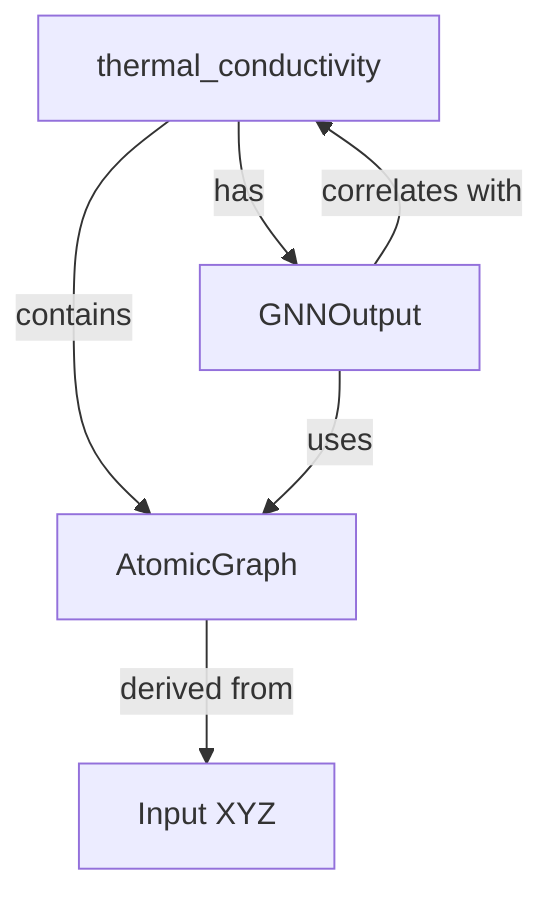

# Data Model: Quantifying the Influence of Network Topology on Thermal Conductivity in Amorphous Silicon

## Overview

This document defines the data structures used throughout the pipeline: `AtomicGraph`, `ThermalSample`, and `GNNOutput`. All data is stored in `data/processed/` with checksums recorded in `data/checksums.json`.

## Entities

### 1. AtomicGraph

**Description**: A graph representation of an amorphous silicon configuration. Nodes represent atoms; edges represent bonds within a 3.0 Å cutoff.

**Attributes**:
- `node_id`: Unique identifier for each atom (integer).
- `x, y, z`: Cartesian coordinates (float, Å).
- `degree`: Node degree (integer).
- `clustering_coefficient`: Local clustering coefficient (float, 0–1).
- `shortest_path_mean`: Mean shortest path length to all other nodes (float).
- `shortest_path_std`: Standard deviation of shortest path lengths (float).

**Constraints**:
- Number of nodes ≥ 1000.
- Edge cutoff: 3.0 Å (exact).
- No isolated nodes (degree ≥ 1).

**Storage Format**: Pickle (`.pkl`) or Parquet (`.parquet`).

### 2. ThermalSample

**Description**: A dataset entry containing the `AtomicGraph`, computed thermal conductivity, and simulation metadata. Includes sample-level statistics for LMM analysis.

**Attributes**:
- `sample_id`: Unique identifier (string).
- `atomic_graph`: Reference to `AtomicGraph` object (or file path).
- `thermal_conductivity`: Global thermal conductivity (W/m·K, float).
- `simulation_time`: Duration of Green-Kubo simulation (ps, float).
- `temperature`: Simulation temperature (K, float).
- `convergence_flag`: Boolean indicating HCACF convergence (<1% change in final [deferred]).
- `exclusion_flag`: Boolean indicating if sample was excluded due to defects or non-convergence.
- `degree_variance`: Variance of node degree across all atoms in the sample (float).
- `clustering_variance`: Variance of clustering coefficient across all atoms in the sample (float).
- `path_variance`: Variance of shortest path statistics across all atoms in the sample (float).

**Constraints**:
- `thermal_conductivity` must be within literature range for a-Si (1–2 W/m·K).
- `convergence_flag` = True for inclusion in analysis.
- `exclusion_flag` = True if >15% atoms have coordination <3 or >6.

**Storage Format**: JSON (`.json`) or CSV (`.csv`).

### 3. GNNOutput

**Description**: Output from the GNN training and LMM analysis.

**Attributes**:
- `sample_id`: Reference to `ThermalSample`.
- `scattering_potential`: Predicted static scattering potential values (N_atoms, float).
- `model_loss`: Training loss (MSE, float).
- `validation_loss`: Validation loss (MSE, float).
- `lmm_coefficients`: Dictionary of LMM fixed effect coefficients (metric_name -> coefficient).
- `lmm_p_values`: Dictionary of LMM p-values (metric_name -> p_value).

**Constraints**:
- `model_loss` < `baseline_loss` (linear regression) for inclusion.
- `lmm_coefficients` keys must match topological metrics used in `AtomicGraph`.

**Storage Format**: JSON (`.json`).

## Relationships

## Data Flow

1. **Ingestion**: `Input XYZ` → `AtomicGraph` (via `graph_builder.py`).
2. **Simulation**: `Input XYZ` → `ThermalSample` (via `green_kubo.py`).
3. **Metrics**: `AtomicGraph` → `ThermalSample` (via `topology_extractor.py`; computes variance).
4. **Modeling**: `ThermalSample` → `GNNOutput` (via `trainer.py` + `lmm_analysis.py`).
5. **Analysis**: `GNNOutput` + `ThermalSample` → Correlation results (via `lmm_analysis.py`).

## Validation Rules

- All numeric fields must be finite (no NaN/Inf).
- `thermal_conductivity` must be positive.
- `clustering_coefficient` must be in [0, 1].
- `exclusion_flag` = True samples are excluded from correlation analysis.