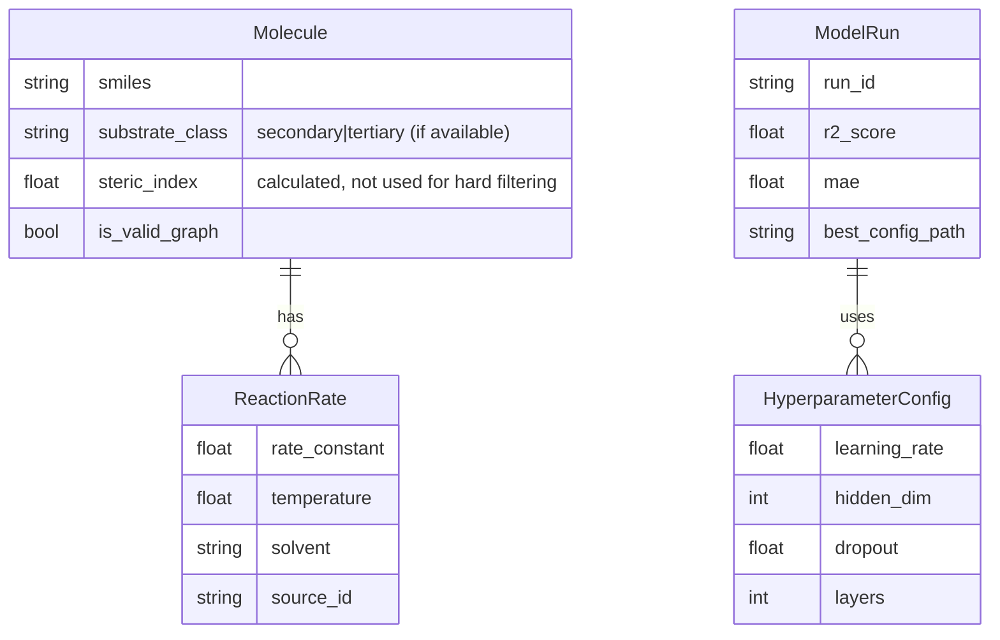

# Data Model: Predicting Rate Constants of SN1 Reactions from Molecular Structure

## Entity Relationship Diagram (Conceptual)



## Data Schemas

### Input Schema (Raw)
- **Source**: HuggingFace JSONL/Parquet
- **Fields**: `smiles`, `rate` (or `rate_constant`), `temperature`, `solvent`, `substrate_class` (if available).

### Intermediate Schema (Processed)
- **File**: `data/processed/cleaned_dataset.csv`
- **Columns**:
  - `smiles`: Canonical SMILES string.
  - `rate_log`: Natural log of rate constant (normalized).
  - `substrate_class`: Derived or original (secondary/tertiary) if available. **Requirement**: Must be present in source; if missing, dataset is excluded.
  - `steric_index`: Calculated proxy (LogP + Rotatable Bonds) for logging only (no hard filter).
  - `gasteiger_charges`: Array of floats (atomic charges).
  - `topological_indices`: Array of floats (Morgan fingerprints).
  - `exclusion_reason`: String (if row was filtered).

### Output Schema (Model)
- **File**: `artifacts/metrics.json`
- **Structure**:
  ```json
  {
    "run_id": "uuid",
    "timestamp": "ISO8601",
    "dataset_size": 8000,
    "model_type": "MPNN",
    "hyperparameters": { ... },
    "metrics": {
      "train": { "r2": 0.0, "mae": 0.0 },
      "validation": { "r2": 0.0, "mae": 0.0 },
      "test": { "r2": 0.0, "mae": 0.0 }
    },
    "baselines": {
      "random": { "r2": 0.0, "mae": 0.0 },
      "linear": { "r2": 0.0, "mae": 0.0 },
      "null": { "r2": 0.0, "mae": 0.0 }
    },
    "significance": {
      "mpnn_vs_linear": { "p_value": 0.0, "significant": true, "corrected": true }
    }
  }
  ```

## Data Flow

1. **Ingestion**: Raw JSONL/Parquet → `data/raw/`.
2. **Cleaning**:
   - Parse SMILES with RDKit.
   - **Filter**: Remove rows with missing rate or unparseable SMILES.
   - **Filter**: Remove rows if `substrate_class` is required but missing (if dataset lacks explicit labels, the dataset is excluded).
   - **Log**: Exclusions to `data/processed/exclusion_report.csv`.
   - **Note**: No hard filtering based on steric index > 2.0. The steric index is calculated and logged for distribution analysis.
3. **Featurization**:
   - Compute Gasteiger charges.
   - Compute topological indices.
   - Normalize features (Z-score).
   - Output: `data/processed/cleaned_dataset.csv`.
4. **Splitting**: Scaffold split with a majority training portion by Murcko Scaffolds. If `substrate_class` is available, stratify within scaffolds.
5. **Training**: MPNN → `artifacts/model_weights.pt`.
6. **Analysis**: SHAP, VIF, Sensitivity → `artifacts/reports/`.