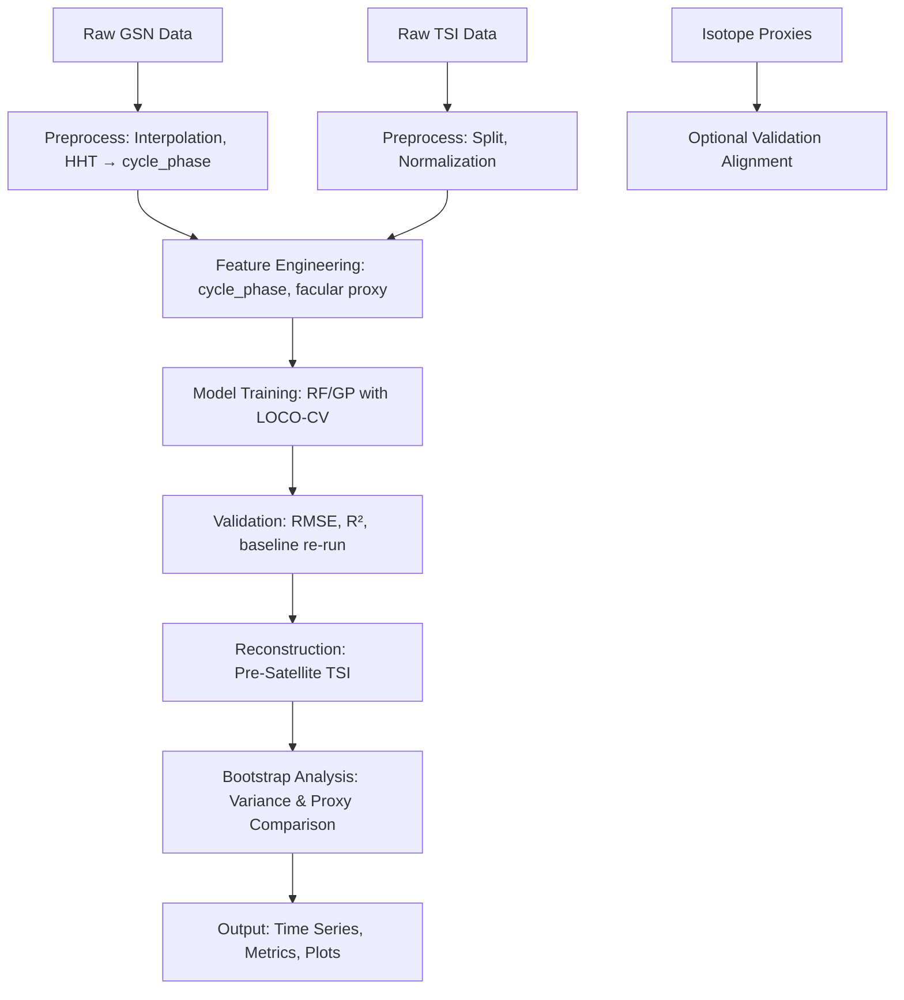

# Data Model: Reconstructing Solar Irradiance from Historical Sunspot Records

## Overview

This document defines the data model for the solar irradiance reconstruction project. It includes the schema for raw and processed datasets, the feature engineering pipeline, and the output structures for model predictions and statistical analyses.

## Raw Data Schema

### GSN (Group Sunspot Number)

| Column | Type | Description | Source |
|--------|------|-------------|--------|
| date | datetime | Date of observation | SILSO (canonical URL) |
| sunspot_number | float | Group Sunspot Number value | SILSO |
| is_missing | boolean | Flag for missing values before interpolation | Derived |

### SORCE/TIM TSI

| Column | Type | Description | Source |
|--------|------|-------------|--------|
| date | datetime | Date of observation | SORCE/TIM (canonical URL) |
| tsi_value | float | Total Solar Irradiance value | SORCE/TIM |
| instrument | string | Instrument name (SORCE or TIM) | SORCE/TIM |
| uncertainty | float | Measurement uncertainty | SORCE/TIM |

### CMIP6 v3.2

| Column | Type | Description | Source |
|--------|------|-------------|--------|
| date | datetime | Date of observation | CMIP6 (canonical URL) |
| tsi_value | float | Total Solar Irradiance value from CMIP6 | CMIP6 |
| model | string | Climate model name | CMIP6 |
| scenario | string | Emission scenario (e.g., SSP370) | CMIP6 |

### Cosmogenic Isotope Proxies (Optional)

| Column | Type | Description | Source |
|--------|------|-------------|--------|
| date | datetime | Date of observation | NOAA Paleoclimate (canonical URL) |
| c14_delta14C | float | Δ14C value (per mil) | NOAA |
| be10_concentration | float | 10Be concentration (atoms g⁻¹) | NOAA |

## Processed Data Schema

### Training/Validation Split

| Column | Type | Description |
|--------|------|-------------|
| date | datetime | Date of observation |
| sunspot_number | float | Group Sunspot Number (interpolated) |
| cycle_phase | float | Fractional position within the solar cycle (0‑1) derived from HHT |
| facular_proxy | float | Mg II or Ca II K index (if available) |
| tsi_value | float | Total Solar Irradiance (target) |
| split | string | "train" (2003–2015) or "validation" (2016–present) |

### Pre‑Satellite Reconstruction

| Column | Type | Description |
|--------|------|-------------|
| date | datetime | Date of observation (1610–2002) |
| sunspot_number | float | Group Sunspot Number (interpolated) |
| cycle_phase | float | Fractional cycle position |
| tsi_reconstructed | float | Reconstructed TSI value |
| tsi_lower | float | Lower bound of uncertainty band (CV + isotope adjusted) |
| tsi_upper | float | Upper bound of uncertainty band (CV + isotope adjusted) |

### Bootstrap Results

| Column | Type | Description |
|--------|------|-------------|
| solar_minimum | string | Name of solar minimum (Maunder, Dalton, Modern) |
| variance_mean | float | Mean variance estimate |
| variance_lower | float | Lower bound of 95 % CI |
| variance_upper | float | Upper bound of 95 % CI |
| p_value | float | Corrected p‑value for variance difference test (vs. proxy) |

## Feature Engineering Pipeline

1.  **Missing Value Handling**: Linear interpolation for missing GSN values.  
2.  **Cycle Detection**: Apply Hilbert‑Huang Transform (HHT) via `pyhht` to obtain instantaneous frequency; derive cycle boundaries and compute **cycle_phase** (fractional progression within each cycle, 0-1). *No fallback to peak detection*.  
3.  **Facular Proxy Integration**: Load Mg II or Ca II K indices when available; otherwise, proceed with GSN + cycle_phase only (documented justification).  
4.  **Training/Validation Split**: Split satellite‑era data into 2003–2015 (train) and 2016–present (validation).  
5.  **One‑Hot Encoding**: Encode `cycle_phase` into 10 bins for model input.  
6.  **Normalization**: Scale numerical features (sunspot_number, facular_proxy) to zero mean and unit variance.

## Output Structures

### Model Predictions

- **Time Series**: Reconstructed TSI values with uncertainty bands for 1610–present.  
- **Metrics**: RMSE, R² for training, validation, LOCO‑CV, and baseline; correlation with CMIP6; RMSE reduction percentage.  
- **Baseline Comparison**: Percentage reduction in RMSE vs. 2007 baseline (fixed reference, no re-tuning).  

### Statistical Analysis

- **Variance Differences**: Table of corrected p‑values for variance differences between solar minima (reconstruction vs. proxy).  
- **Confidence Intervals**: Visualization of 95 % CI for variance estimates (reconstruction vs. isotope proxies).  
- **Correlation Coefficient**: Correlation between new reconstruction and CMIP6 v3.2 for overlapping period.

## Data Flow

