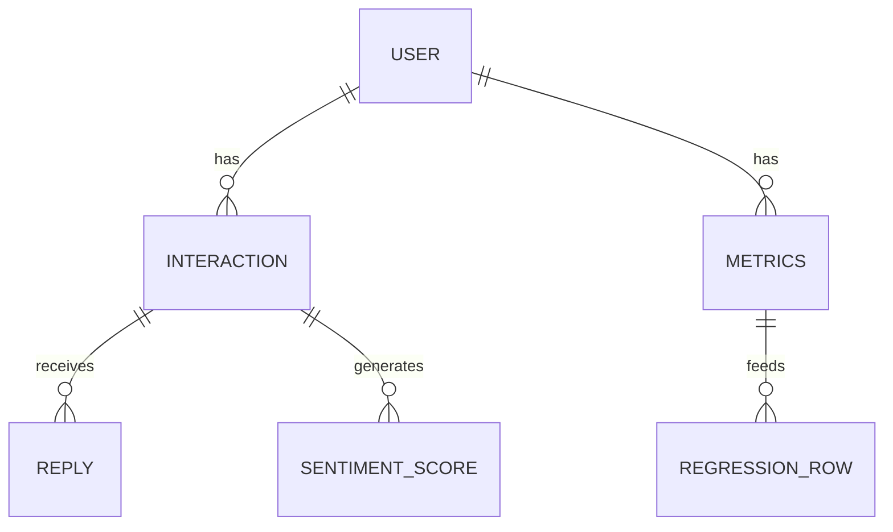

# Data Model: The Impact of Simulated Social Feedback on Self-Esteem Fluctuations

## 1. Entity Relationship Overview

The data model transforms raw interaction logs into a structured dataset suitable for regression analysis.

## 2. Schema Definitions

### 2.1 Raw Input Schema (Pushshift Reddit)
*Source*: `data/raw/pushshift_reddit.parquet`
*Columns*:
- `user_id`: String (Unique identifier)
- `timestamp`: DateTime (ISO 8601)
- `post_text`: String (Content of the user's post)
- `reply_text`: String (Content of the reply, may be null)
- `reply_timestamp`: DateTime (Optional, for ordering)

### 2.2 Intermediate Processed Schema
*File*: `data/processed/interactions_sentiment.csv`
*Columns*:
- `user_id`: String
- `timestamp`: DateTime
- `post_text`: String
- `reply_text`: String
- `post_valence`: Float [-1.0, 1.0] (Sentiment of post)
- `reply_valence`: Float [-1.0, 1.0] (Sentiment of reply, or -999.0 if missing)
- `interaction_id`: String (Unique hash)

### 2.3 Aggregated User Metrics Schema
*File*: `data/processed/user_metrics.csv`
*Columns*:
- `user_id`: String
- `interaction_count`: Integer
- `mean_reply_valence`: Float (Average of `reply_valence`, excluding -999.0)
- `reply_volatility_std`: Float (Rolling SD of reply valence)
- `reply_volatility_sign_change`: Float (Frequency of sign changes in replies)
- `mean_post_valence`: Float (Average of `post_valence`, **Control Variable**)
- `self_esteem_indicator`: Float (Lexicon-derived score from `post_text` - **Outcome**)
- `post_length_avg`: Float (Average character count of posts)
- `reply_volatility_std_window_3`: Float (Sensitivity analysis)
- `reply_volatility_std_window_7`: Float (Sensitivity analysis)

### 2.4 Final Regression Schema
*File*: `data/processed/regression_input.csv`
*Columns*:
- `self_esteem_indicator`: Dependent Variable (Float)
- `mean_reply_valence`: Independent Variable (Float)
- `reply_volatility_std`: Independent Variable (Float)
- `mean_post_valence`: Covariate (Float)
- `post_length_avg`: Covariate (Float)
- `interaction_count`: Covariate (Float)

## 3. Data Transformation Logic

1.  **Ingestion**: Load parquet -> Filter null timestamps -> Sort by `user_id`, `timestamp`.
2.  **Sentiment**:
    -   Input: `post_text`, `reply_text`.
    -   Process: Run RoBERTa.
    -   Output: Normalize to [-1, 1].
    -   Edge Case: If `reply_text` is empty/null, set `reply_valence` = -999.0.
3.  **Self-Esteem Indicator Calculation**:
    -   Input: `post_text`.
    -   Process: Apply Rosenberg-derived lexicon (word count / total words * scaling factor).
    -   Output: `self_esteem_indicator`.
4.  **Volatility Calculation**:
    -   Group by `user_id`.
    -   Sort by `timestamp`.
    -   Compute rolling SD (window=5) and sign changes for `reply_valence`.
    -   Handle small N: If $N < 2$, set metric = -999.0.
5.  **Aggregation**:
    -   Drop rows where `self_esteem_indicator` is invalid (if lexicon fails).
    -   Compute mean valence (excluding -999.0).
    -   **Distinct Actor Separation**: Ensure `mean_reply_valence` and `reply_volatility_std` are calculated *only* from `reply_valence` and do not include `post_valence`.
    -   **Reciprocity Control**: `mean_post_valence` is calculated separately and included as a control.

## 4. Data Constraints & Validation

-   **Valence Range**: Must be in [-1.0, 1.0] or exactly -999.0.
-   **Missing Data**: No nulls in `user_id`, `timestamp`, `calculated_valence`.
-   **Uniqueness**: `interaction_id` must be unique.
-   **Ordering**: Data must be sorted by `timestamp` within each `user_id` before volatility calculation.
-   **Schema Validation**: `01_ingest.py` MUST validate against `contracts/interaction_schema.schema.yaml` at runtime.