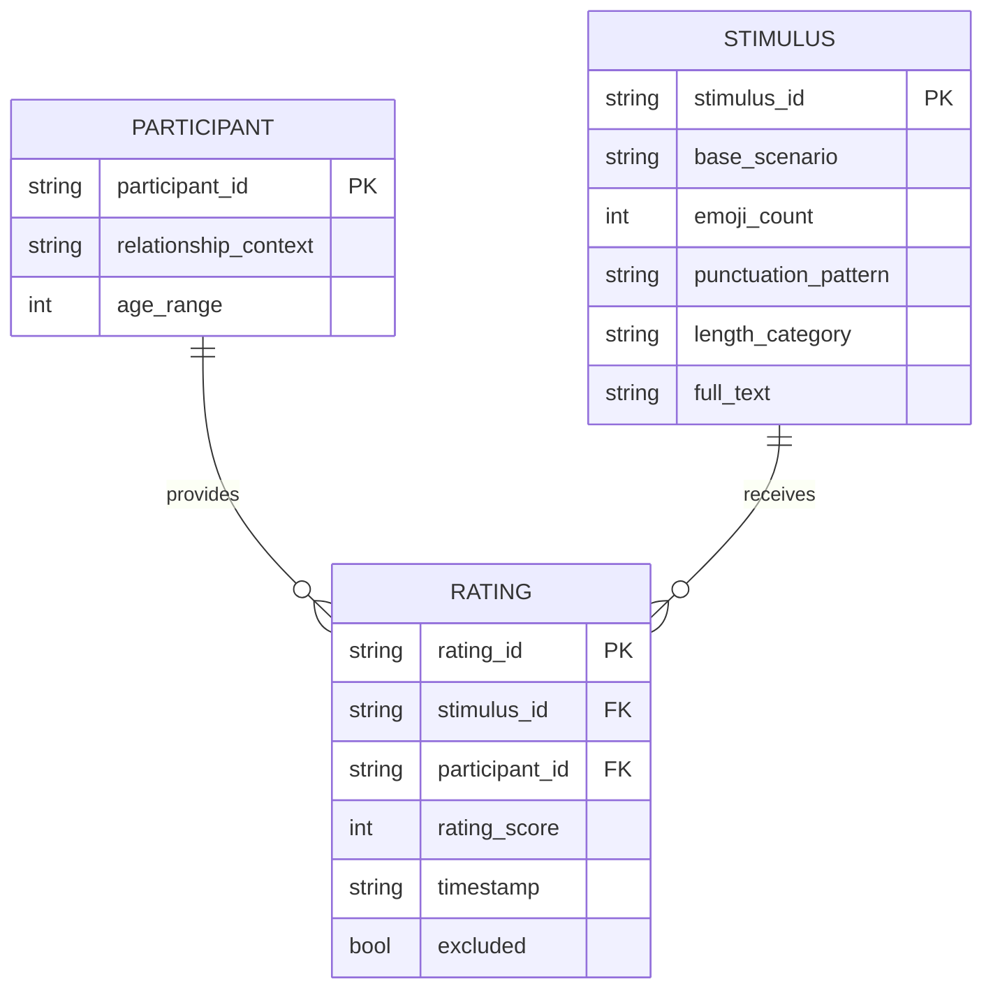

# Data Model: The Impact of Text Message Tone on Perceived Emotional Support

## Overview

This document defines the data structures, schemas, and relationships required for the project. It ensures that the data generated, collected, and analyzed adheres to the project's reproducibility and hygiene principles.

## Entity Relationship Diagram (Conceptual)

## Data Files

### 1. Stimuli File (`data/raw/stimuli.csv`)

Generated by `01_generate_stimuli.py`. Contains the unique text variants.

| Column | Type | Description | Constraints |
| :--- | :--- | :--- | :--- |
| `stimulus_id` | string | Unique identifier (e.g., `S001`) | PK, Non-null |
| `base_scenario` | string | The core message (e.g., "I had a rough day") | Non-null |
| `emoji_count` | int | Number of emojis (0, 1, 2+) | Enum: {0, 1, 2} |
| `punctuation_pattern` | string | Pattern type | Enum: {Standard, Excessive} |
| `length_category` | string | Word count category | Enum: {Short, Long} |
| `full_text` | string | The final generated message | Non-null |
| `cue_intensity_score` | float | Calculated score (0-1) | Computed |

### 2. Raw Ratings File (`data/raw/real_ratings.csv`)

Collected via Prolific. Contains human ratings.

| Column | Type | Description | Constraints |
| :--- | :--- | :--- | :--- |
| `rating_id` | string | Unique identifier | PK |
| `participant_id` | string | Anonymized Prolific ID | Non-null |
| `stimulus_id` | string | Reference to stimuli | FK |
| `relationship_context` | string | Context provided to participant | Enum: {Close Friend, Acquaintance} |
| `rating_score` | int | Perceived support (1-7) | Range: [1, 7] |
| `timestamp` | datetime | Submission time | Non-null |
| `exclusion_flag` | bool | Flagged for exclusion (e.g., straight-lining) | Default: False |

### 3. Processed Ratings File (`data/processed/cleaned_ratings.csv`)

Output of `04_clean_data.py`. Excludes invalid records.

| Column | Type | Description |
| :--- | :--- | :--- |
| `rating_id` | string | Unique identifier |
| `participant_id` | string | Anonymized Prolific ID |
| `stimulus_id` | string | Reference to stimuli |
| `relationship_context` | string | Context |
| `rating_score` | int | Rating |
| `cue_intensity` | float | Calculated intensity for the model |
| `weighting_scheme` | string | Which sensitivity scheme was used (if applicable) |

## Data Hygiene & Security

*   **PII Handling**: `participant_id` in `real_ratings.csv` will be a hash of the original Prolific ID. The mapping key is stored in `data/consent/` (encrypted) and never committed.
*   **Checksums**: SHA-256 checksums of `stimuli.csv` and `real_ratings.csv` will be recorded in the project state file upon creation.
*   **Immutability**: Raw files are never overwritten. Derivations (cleaned data) are written to new files.

## Validation Rules

1.  **Stimulus Uniqueness**: No two rows in `stimuli.csv` can have the same combination of `emoji_count`, `punctuation_pattern`, and `length_category`.
2.  **Rating Range**: `rating_score` must be an integer between 1 and 7.
3.  **Context Validity**: `relationship_context` must be either "Close Friend" or "Acquaintance".
4.  **Completeness**: All required columns must be present and non-null.