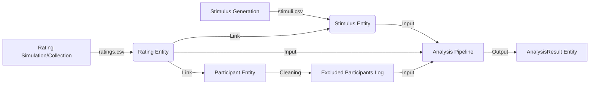

# Data Model: The Impact of Text Message Tone on Perceived Emotional Support

This document defines the core data entities used throughout the research pipeline,
ensuring consistency between data generation, collection, cleaning, and analysis phases.

## Overview

The study investigates how text message tone (specifically emoji usage and punctuation)
affects perceived emotional support. The data model consists of four primary entities:
`Stimulus`, `Participant`, `Rating`, and `AnalysisResult`.

---

## Entity: Stimulus

Represents a unique text message variant presented to participants for rating.
Stimuli are generated using a factorial design varying in emoji count, punctuation type,
and message length.

### Attributes

| Field | Type | Description | Constraints |
|:--- |:--- |:--- |:--- |
| `id` | string | Unique identifier for the stimulus | Primary Key, Format: `S{N}` (e.g., `S001`) |
| `scenario_id` | string | Identifier for the base scenario | Foreign Key to Scenario (implicit) |
| `text` | string | The actual text message content | Non-empty, max 280 chars |
| `emoji_count` | integer | Number of emojis in the message | >= 0 |
| `punctuation_type` | string | Type of punctuation used | Enum: `["standard", "exclamation", "ellipsis", "question"]` |
| `length_category` | string | Categorized length of the message | Enum: `["short", "medium", "long"]` |
| `cue_intensity` | float | Calculated intensity score | Derived metric (optional in raw, required in processed) |

### Generation Source
- Generated by: `code/01_generate_stimuli.py`
- Output File: `data/raw/stimuli.csv`

---

## Entity: Participant

Represents a unique individual who provided ratings. In the mock simulation,
these are synthetic IDs following Prolific ID formats. In real data collection,
these correspond to verified Prolific IDs.

### Attributes

| Field | Type | Description | Constraints |
|:--- |:--- |:--- |:--- |
| `participant_id` | string | Unique identifier for the participant | Primary Key |
| `prolific_id` | string | Original Prolific ID (hashed for real data) | Format: Alphanumeric, 10-12 chars |
| `status` | string | Current status in the pipeline | Enum: `["active", "excluded"]` |
| `exclusion_reason` | string | Reason for exclusion if applicable | Enum: `["straight_lining", "missing_data", "incomplete_ratings"]` |
| `timestamp_created` | datetime | When the participant record was created | ISO-8601 |

### Processing Source
- Generated/Updated by: `code/02_simulate_ratings.py`, `code/03_clean_data.py`
- Output File: Implicitly tracked in `data/raw/ratings.csv` and `data/processed/cleaning_log.csv`

---

## Entity: Rating

Represents a single rating given by a participant for a specific stimulus.
This is the core observational unit for the analysis.

### Attributes

| Field | Type | Description | Constraints |
|:--- |:--- |:--- |:--- |
| `participant_id` | string | ID of the participant giving the rating | Foreign Key to Participant |
| `stimulus_id` | string | ID of the stimulus being rated | Foreign Key to Stimulus |
| `relationship` | string | Relationship context provided to participant | Enum: `["friend", "acquaintance"]` |
| `rating` | integer | Perceived emotional support score | Range: 1 to 7 (Likert scale) |
| `timestamp` | datetime | When the rating was recorded | ISO-8601 |

### Collection Source
- Generated by: `code/02_simulate_ratings.py` (Mock) or `code/04_collect_real_data.py` (Real)
- Output File: `data/raw/ratings.csv`

### Validation Rules
- Each participant must rate every stimulus (complete block design).
- Missing ratings result in listwise deletion of the participant.
- Relationship context must be randomized per stimulus-participant pair.

---

## Entity: AnalysisResult

Represents the output of the statistical modeling phase (Linear Mixed-Effects Models).
This entity aggregates model parameters, significance tests, and post-hoc comparisons.

### Attributes

| Field | Type | Description | Constraints |
|:--- |:--- |:--- |:--- |
| `model_id` | string | Unique identifier for the model run | Primary Key |
| `model_type` | string | Type of statistical model | Enum: `["primary_lmm", "sensitivity_lmm"]` |
| `cue_definition` | string | Operationalization of cue intensity used | Reference to `sensitivity_definitions.json` |
| `fixed_effects` | object | Dictionary of fixed effect estimates | Contains `estimate`, `std_error`, `t_value`, `p_value` |
| `random_effects` | object | Variance components for random intercepts | Keys: `participant`, `stimulus` |
| `interaction_significant` | boolean | Whether the interaction term is significant | p < 0.05 |
| `post_hoc_results` | list | Tukey-corrected pairwise comparisons | List of comparison objects |
| `exclusion_summary` | object | Summary of excluded participants | Count and reasons |
| `timestamp` | datetime | When the analysis was run | ISO-8601 |

### Analysis Source
- Generated by: `code/04_run_lmm.py`, `code/05_sensitivity_analysis.py`
- Output File: `data/processed/analysis_results.json`

---

## Data Flow Diagram

---

## Compliance Notes

1. **Constitution Principle IV (Single Source of Truth)**: All exclusion data and final analysis metrics must be consolidated in `analysis_results.json`.
2. **Constitution Principle VI (Consent)**: Real participant data must be accompanied by anonymized consent records in `data/consent/`.
3. **Data Integrity**: `stimuli.csv` and `ratings.csv` are the raw sources of truth; all derived metrics must be traceable back to these files.