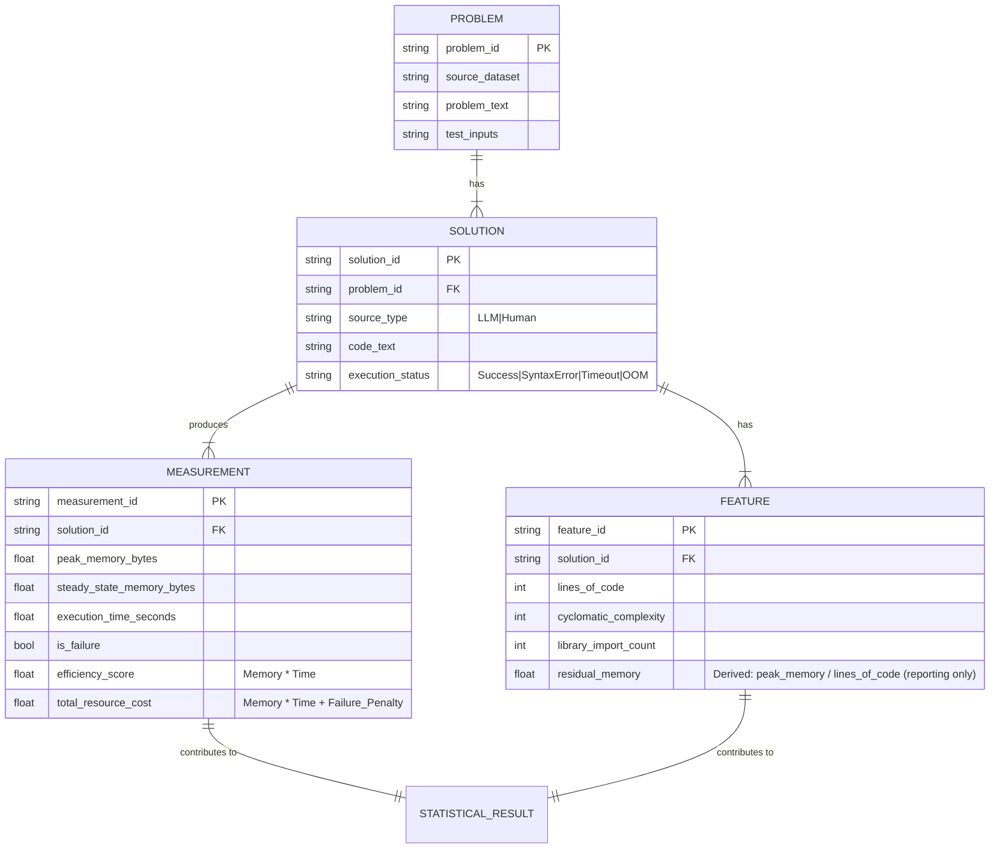

# Data Model: Evaluating the Impact of LLM-Generated Code on Memory Usage

## Overview

This document defines the data structures, schemas, and relationships for the project. All data artifacts are stored in `data/processed/` and `data/raw/`.

## Entity Relationship Diagram (Conceptual)



## Data Schemas

### 1. Raw Dataset Manifest (`data/dataset_manifest.yaml`)
Records the exact source of the benchmark data.

```yaml
dataset_id: "openai/humaneval"
revision: "main"
split: "test"
url: "https://huggingface.co/datasets/openai/humaneval"
checksum: "[computed_sha256]"
downloaded_at: "ISO8601"
join_logic: "None (HumanEval only)"
```

### 2. Processed Results (`data/processed/results.csv`)
The primary analysis table.

| Column | Type | Description |
|--------|------|-------------|
| `problem_id` | string | Unique identifier for the benchmark problem. |
| `source_type` | string | "LLM" or "Human". |
| `solution_status` | string | "Success", "SyntaxError", "Timeout", "OOM". |
| `peak_memory_bytes` | float | Peak memory usage (bytes). |
| `steady_state_memory_bytes` | float | Steady‑state memory (bytes). |
| `execution_time_seconds` | float | Execution duration (seconds). |
| `total_resource_cost` | float | Descriptive metric: `Memory * Time + Failure_Penalty`. |
| `efficiency_score` | float | Primary metric for paired test: `Memory * Time` (only for Success). |
| `is_failure` | boolean | True if `solution_status` != "Success". |

### 3. Features Table (`data/processed/features.csv`)
Static code features.

| Column | Type | Description |
|--------|------|-------------|
| `solution_id` | string | Foreign key to solution. |
| `lines_of_code` | int | Total lines of code. |
| `cyclomatic_complexity` | int | McCabe complexity. |
| `library_import_count` | int | Number of import statements. |
| `residual_memory` | float | **Optional**: `peak_memory_bytes / lines_of_code` (derived for reporting only). |

### 4. Statistical Results (`data/processed/statistical_results.json`)
Output of the analysis script.

- `test_name`: String (e.g., "Permutation_Efficiency", "ChiSquare_Reliability").
- `p_value_raw`: Float.
- `p_value_corrected`: Float (if applicable).
- `effect_size`: Float.
- `confidence_interval`: List of two floats.
- `n_sample`: Integer.
- `method`: String (`Permutation`, `ChiSquare`, `Regression`).
- `metric_type`: String (`Efficiency`, `Reliability`).

## Data Flow

1. **Download**: `download_data.py` → `data/raw/`.
2. **Generate**: `generate_llm.py` → `data/processed/solutions_llm.jsonl`.
3. **Profile**: `profile_memory.py` → `data/processed/results.csv`.
4. **Extract**: `extract_features.py` → `data/processed/features.csv`.
5. **Analyze**: `analyze_stats.py` → `data/processed/statistical_results.json`.
