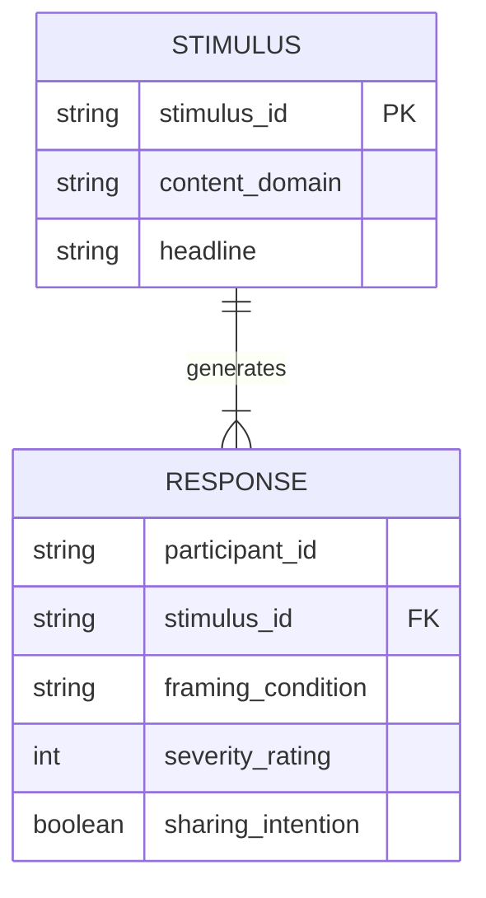

# Data Model: Simulation-Based Sensitivity Analysis

## 1. Entity Relationship Diagram (Conceptual)

## 2. Data Dictionary

### 2.1 Stimulus (Source/Synthetic)
| Field | Type | Description | Constraints |
| :--- | :--- | :--- | :--- |
| `stimulus_id` | string | Unique identifier for the misinformation headline. | Primary Key, Unique |
| `content_domain` | string | Category of the misinformation (Health, Politics, Science). | Enum: ['Health', 'Politics', 'Science'] |
| `headline` | string | The text of the misinformation. | Not Null |

### 2.2 Response (Synthetic)
| Field | Type | Description | Constraints |
| :--- | :--- | :--- | :--- |
| `participant_id` | string | Unique identifier for the simulated participant. | Not Null (Unique per row in between-subjects design) |
| `stimulus_id` | string | Foreign key to Stimulus. | Not Null |
| `framing_condition` | string | Experimental condition. | Enum: ['harm', 'fact'] |
| `severity_rating` | integer | Perceived severity (1-7 Likert). | Range: 1-7 |
| `sharing_intention` | boolean | Willingness to share (0=No, 1=Yes). | Binary |

## 3. Data Flow

1.  **Ingest**: Fetch source data (if available) or generate synthetic stimuli.
2.  **Transform**:
    - Assign `participant_id` (N=15 per stimulus per condition).
    - Assign `framing_condition` (balanced 'harm' and 'fact' per stimulus).
    - Generate `severity_rating` and `sharing_intention` based on parametric models (varying delta for sensitivity).
3.  **Store**: Save to `data/processed/synthetic_dataset.csv`.
4.  **Analyze**: Load CSV, fit models, generate results.
5.  **Export**: Write `results.md` and plots.

## 4. Validation Rules

- **Completeness**: No missing values in `framing_condition`, `severity_rating`, or `sharing_intention`.
- **Range**: `severity_rating` must be integer between 1 and 7.
- **Distribution**: `framing_condition` must have equal counts (/15) per stimulus.
- **Consistency**: `content_domain` in Response must match `content_domain` in Stimulus.
