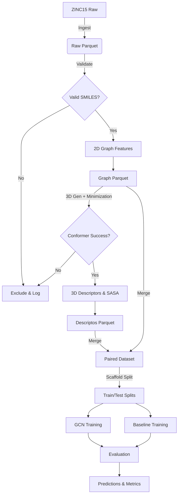

# Data Model: Predicting Molecular Surface Area from Graph Convolutional Networks

## Overview

This document defines the data schemas for the molecular surface area prediction pipeline. It ensures data integrity, type safety, and reproducibility across the ingestion, preprocessing, and evaluation stages. All data is stored in Parquet format (for tabular data) or JSON (for configuration).

## Entity Definitions

### 1. Raw Molecule (Ingestion)
- **Source**: ZINC15 HuggingFace dataset (`zhangh1990/zinc`).
- **Format**: Parquet (streamed).
- **Key Fields**:
  - `smiles`: String (SMILES notation).
  - `molecular_weight`: Float (computed by RDKit).
  - `scaffold_id`: String (Bemis-Murcko scaffold for splitting).

### 2. Graph Features (2D)
- **Source**: Derived from `smiles` via RDKit.
- **Format**: Parquet (`data/processed/graphs_with_features.parquet`).
- **Structure**:
  - `smiles`: String.
  - `node_features`: List[List[Float]] (N_atoms x D_features).
  - `edge_index`: List[List[Int]] (2 x N_edges).
  - `edge_features`: List[List[Float]] (N_edges x D_edge_features).
  - `molecular_weight`: Float.
  - `num_atoms`: Int.
  - `excluded_reason`: String (if applicable, e.g., "invalid_smiles", "too_large").

### 3. 3D Conformers & Labels
- **Source**: RDKit 3D generation with MMFF94 minimization.
- **Format**: Parquet (`data/processed/conformers.parquet` and `data/processed/descriptors.parquet`).
- **Conformer Fields**:
  - `smiles`: String.
  - `conformer_id`: Int.
  - `sasa`: Float (Solvent Accessible Surface Area, computed from minimized conformer).
  - `volume`: Float.
  - `radius_of_gyration`: Float.
  - `generation_status`: String ("success", "failed").
  - `failure_reason`: String (if failed).
- **Descriptor Fields** (for Baseline):
  - `smiles`: String.
  - `num_atoms`: Int.
  - `num_bonds`: Int.
  - **Note**: The `sasa` value is **NOT** included as a feature for the baseline model to prevent tautological prediction. The baseline uses 2D descriptors only.

### 4. Paired Dataset (Training/Testing)
- **Source**: Merge of Graph Features and 3D Labels.
- **Format**: Parquet (`data/processed/paired_dataset.parquet`).
- **Fields**:
  - `smiles`: String.
  - `node_features`: List[List[Float]].
  - `edge_index`: List[List[Int]].
  - `edge_features`: List[List[Float]].
  - `target_sasa`: Float.
  - `split`: String ("train", "test").
  - `molecular_weight`: Float.
  - `scaffold_id`: String.

### 5. Evaluation Results
- **Source**: Model predictions vs. Ground Truth.
- **Format**: Parquet (`results/predictions/predictions.parquet`) and CSV (`results/reports/evaluation_results.csv`).
- **Fields**:
  - `smiles`: String.
  - `true_sasa`: Float.
  - `gcn_pred`: Float.
  - `baseline_pred`: Float.
  - `gcn_error`: Float.
  - `baseline_error`: Float.
  - `success_gcn`: Boolean (error < threshold).
  - `success_baseline`: Boolean (error < threshold).

## Data Flow Diagram

## Constraints & Invariants

1.  **No NaN in Target**: `target_sasa` must be non-null for all training samples.
2.  **Stratified & Scaffold Split**: The distribution of `molecular_weight` and `scaffold_id` in train/test must satisfy KS test p-value > 0.05 and ensure structural novelty.
3.  **Atom Limit**: Molecules with `num_atoms` > 100 are excluded (to fit RAM).
4.  **Checksum**: Raw data files must match the checksum in `data/raw/checksums.json`.
5.  **Feature Exclusion**: The `sasa` value is excluded from the feature set for the baseline model to prevent tautological prediction.
