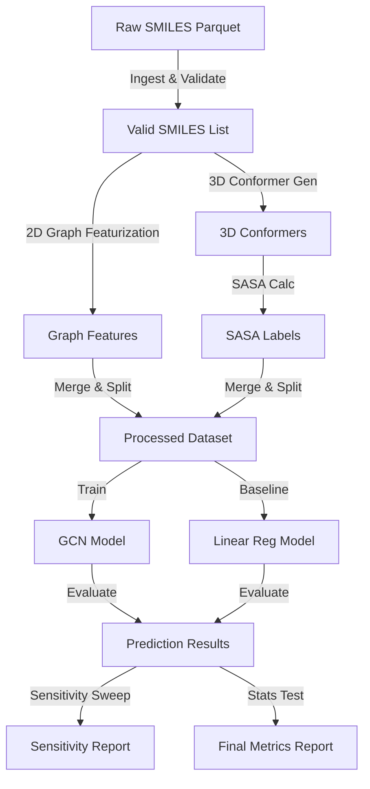

# Data Model: Predicting Molecular Surface Area from Graph Convolutional Networks

## Entity Definitions

### 1. Molecule
Represents a single chemical compound in the dataset.
- **Attributes**:
  - `smiles` (string): Canonical SMILES string.
  - `molecular_weight` (float): Calculated molecular weight (g/mol).
  - `num_atoms` (int): Number of atoms in the molecule.
  - `sasa_label` (float): Solvent Accessible Surface Area in Ų (computed via RDKit 3D).
  - `conformer_success` (bool): True if 3D conformer was successfully generated.
  - `exclusion_reason` (string, optional): Reason for exclusion (e.g., "Invalid SMILES", "Conformer Fail").

### 2. GraphFeature
Represents the 2D topological representation of a Molecule.
- **Attributes**:
  - `molecule_id` (string): Reference to Molecule SMILES.
  - `node_features` (array): Flattened array of atom features (type, hybridization, charge, etc.).
  - `edge_index` (array): Connectivity matrix (source, target).
  - `edge_features` (array): Bond features (type, conjugation, etc.).

### 3. PredictionResult
Represents the output of a model inference.
- **Attributes**:
  - `molecule_id` (string): Reference to Molecule SMILES.
  - `model_type` (string): "GCN" or "Baseline".
  - `predicted_sasa` (float): Predicted surface area.
  - `error` (float): Absolute error (`|predicted - actual|`).
  - `threshold_status` (string): "Pass" or "Fail" based on current threshold.

### 4. TrainingConfig
Represents the hyperparameters used for a specific run.
- **Attributes**:
  - `seed` (int): Random seed.
  - `epochs` (int): Max epochs.
  - `batch_size` (int): Batch size.
  - `learning_rate` (float).
  - `conformer_params` (dict): RDKit parameters used (attempts, energy minimization steps).

## Data Flow Diagram

## Storage Schema

### Raw Data (`data/raw/`)
- `zinc_processed.parquet`: Original downloaded file.
- `checksums.json`: SHA256 hashes of raw files.

### Processed Data (`data/processed/`)
- `graphs_with_features.parquet`: Merged SMILES, Graph Features, and SASA Labels.
- `conformer_params.json`: JSON file recording RDKit parameters used.
- `failure_report.csv`: Log of molecules excluded due to conformer failure.

### Splits (`data/splits/`)
- `train_indices.csv`: List of SMILES in training set.
- `test_indices.csv`: List of SMILES in test set.
- `split_report.json`: KS test p-value, distribution stats.

### Results (`results/`)
- `final_metrics.json`: MAE, RMSE, R², t-test p-value, effect size.
- `sensitivity_analysis.csv`: Success rates at each threshold.
- `runtime_verification.md`: Total pipeline runtime.
